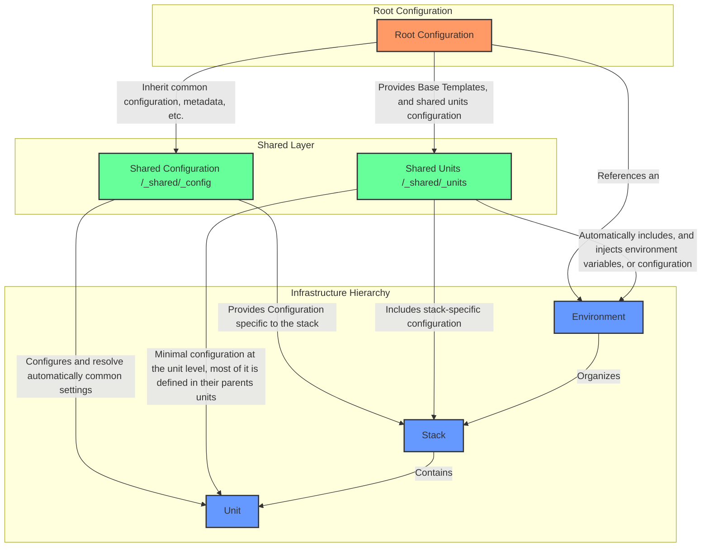

# Terragrunt Reference Architecture V3 🏗️

## 🌐 Overview

A cutting-edge, production-grade infrastructure management framework (or, just a reference architecture for infrrastructure-at-scale, with [Terragrunt](https://terragrunt.gruntwork.io/)) designed to be modular, flexible, and scalable. It's very opinionated, and it came from years of experience building infrastructure at scale. Use it, adapt it to your needs, and make it your own.

## ✨ Key Features

| Feature                                   | Description                                                                                                                                                                                                                                                                                                        |
| ----------------------------------------- | ------------------------------------------------------------------------------------------------------------------------------------------------------------------------------------------------------------------------------------------------------------------------------------------------------------------ |
| 🧩 Modular Architecture                   | Discrete, composable infrastructure units, that can inherit from shared unit's configurations, and from their parents in the hierarchy (stacks, or environments)                                                                                                                                                   |
| 🌈 Highly Hierarchical Flexible Overrides | Designed to support multiple environments (the most common abstraction), where each environment can hold many stacks, and each stack can hold many units                                                                                                                                                           |
| 🚀 Multi-Provider Compatibility           | Support for diverse cloud and infrastructure providers. Dynamically set providers, versions and overrides. It passes the control of the providers, and versions (if applicable) to the units, which are the smallest components of the architecture that deals directly with the terraform abstractions (modules). |
| 🔧 Dynamic Environment Configuration      | Hierarchical, secure, and extensible environment variable management with a recursive .env file discovery, secure variable export with validation, automatic inheritance and override mechanisms, and comprehensive logging and tracing of environment setup                                                       |
| 🧼 Clean Code Configuration               | Strict separation of configuration logic, with clear distinctions between global settings, provider management, and Terragrunt generation rules in `config.hcl` and `root.hcl`. Implements comprehensive commenting and modular configuration design.                                                              |

## 📐 Architecture Overview

### Hierarchical Infrastructure Organization



### Project Structure

The project structure follows the pattern:

- **Environment**: A collection of stacks, and units. The most logical approach to organise the infrastructure is to group the infrastructure by environment.
  - **Stack**: A collection of units.
    - **Unit**: A collection of terraform modules.

> **NOTE**: Each layer is fully flexible, and can be changed to fit the needs of your project, or particular domain. E.g.: instead of environment, you could use a different layer to group the infrastructure by region, or by application.

The project structure is as follows:

```
infra/terragrunt
├── README.md
├── _shared
│   ├── _config
│   │   ├── README.md
│   │   ├── app.hcl
│   │   ├── remote_state.hcl
│   │   └── tags.hcl
│   └── _units
│       ├── README.md
│       ├── <unit>.hcl
│       ├── <unit-2>.hcl
├── _templates
├── config.hcl
├── default.tfvars
├── <environment>
│   ├── default.tfvars
│   ├── <stack>
│   │   ├── <unit>
│   │   │   ├── README.md
│   │   │   ├── terragrunt.hcl
│   │   │   ├── unit_cfg_providers.hcl
│   │   │   └── unit_cfg_versions.hcl
│   │   ├── <unit-2>
│   │   │   ├── README.md
│   │   │   ├── terragrunt.hcl
│   │   │   ├── unit_cfg_providers.hcl
│   │   │   └── unit_cfg_versions.hcl
│   │   └── stack.hcl
│   └── env.hcl
└── root.hcl
```

## Cool things inside? 🌟

### 🔐 Environment Variable Management with `.envrc`

A sophisticated, secure environment variable management system powered by [direnv](https://direnv.net/). It works by recursively loading `.env` files from parent directories, and then it will inherit the variables from the parent directories. There's a `.envrc` in each of these directories, or levels:

- `.envrc` in the root directory. Loads what's in the `.env` file in the root directory, if present.
- `infra/terragrunt/.envrc` in the environment directory. If there's a `.env` file in the environment directory, it will load it.
- `infra/terragrunt/<environment>/<stack>/.envrc` in the stack directory. If there's a `.env` file in the stack directory, it will load it.

> **NOTE**: If a given environment variable is set in any of the leaf directories, it will override the variable in the parent directories.

### 🔧 Supported Environment Variables

The reference architecture supports a comprehensive set of environment variables to configure and customize infrastructure deployment:

| Category                     | Variable Name                                          | Description                                 | Default Value                                             | Customization Level  |
| ---------------------------- | ------------------------------------------------------ | ------------------------------------------- | --------------------------------------------------------- | -------------------- |
| **Terragrunt Flags**         | `TG_STACK_FLAG_ENABLE_PROVIDERS_OVERRIDE`              | Controls provider file generation           | `"true"`                                                  | Global/Unit          |
|                              | `TG_STACK_FLAG_ENABLE_VERSIONS_OVERRIDE`               | Controls version file generation            | `"true"`                                                  | Global/Unit          |
|                              | `TG_STACK_FLAG_ENABLE_TERRAFORM_VERSION_FILE_OVERRIDE` | Controls .terraform-version file generation | `"false"`                                                 | Global               |
| **Deployment Configuration** | `TG_STACK_REGION`                                      | Deployment AWS region                       | `"us-east-1"`                                             | Global/Environment   |
| **Terraform Version**        | `TG_STACK_TF_VERSION`                                  | Enforced Terraform version                  | `"1.9.0"`                                                 | Global               |
| **Provider Credentials**     | `TG_STACK_PROVIDER_CREDENTIAL`                         | Provider authentication credentials         | `""` (empty)                                              | Unit-specific        |
| **Application Metadata**     | `TG_STACK_APP_PRODUCT_NAME`                            | Project/application name                    | `"my-app"`                                                | Global               |
|                              | `TG_STACK_APP_PRODUCT_VERSION`                         | Project/application version                 | `"0.0.0"`                                                 | Global               |
|                              | `TG_STACK_APP_AUTHOR`                                  | Configuration author                        | `""` (empty)                                              | Global               |
| **Environment**              | `TG_ENVIRONMENT`                                       | Current environment                         | `"development"`                                           | Environment-specific |
| **Remote State**             | `TG_STACK_REMOTE_STATE_BUCKET_NAME`                    | S3 bucket for remote state                  | `""` (empty)                                              | Global               |
|                              | `TG_STACK_REMOTE_STATE_LOCK_TABLE`                     | DynamoDB lock table                         | `""` (empty)                                              | Global               |
|                              | `TG_STACK_REMOTE_STATE_REGION`                         | Remote state storage region                 | `"us-east-1"`                                             | Global               |
|                              | `TG_STACK_REMOTE_STATE_OBJECT_BASENAME`                | Remote state file basename                  | `"terraform.tfstate.json"`                                | Global               |
|                              | `TG_STACK_REMOTE_STATE_BACKEND_TF_FILENAME`            | Backend configuration filename              | `"backend.tf"`                                            | Global               |
| **Terragrunt Configuration** | `TERRAGRUNT_DOWNLOAD_DIR`                              | Terragrunt cache directory                  | `"${HOME}/.terragrunt-cache/$(basename "$PROJECT_ROOT")"` | Global               |
|                              | `TERRAGRUNT_CACHE_MAX_AGE`                             | Terragrunt cache expiration                 | `"168h"` (7 days)                                         | Global               |
|                              | `TERRAGRUNT_LOG_LEVEL`                                 | Terragrunt logging verbosity                | `"info"`                                                  | Global               |
|                              | `TERRAGRUNT_DISABLE_CONSOLE_OUTPUT`                    | Console output control                      | `"false"`                                                 | Global               |
|                              | `TERRAGRUNT_AUTO_INIT`                                 | Automatic Terragrunt initialization         | `"true"`                                                  | Global               |
|                              | `TERRAGRUNT_AUTO_RETRY`                                | Automatic retry on failure                  | `"true"`                                                  | Global               |
| **Terraform Configuration**  | `TF_INPUT`                                             | Disable interactive Terraform input         | `"0"`                                                     | Global               |
| **Project-wide Variables**   | `PROJECT_ROOT`                                         | Project root directory                      | Current directory                                         | Global               |
|                              | `DEFAULT_REGION`                                       | Default AWS region                          | `"us-east-1"`                                             | Global               |
| **Locale Settings**          | `LANG`                                                 | Language setting                            | `"en_US.UTF-8"`                                           | Global               |
|                              | `LC_ALL`                                               | Locale setting                              | `"en_US.UTF-8"`                                           | Global               |
| **Debugging & Logging**      | `DIRENV_LOG_FORMAT`                                    | Direnv log format                           | `"[direnv] %s"`                                           | Global               |

Currently, there are 4 levels of environment variables:

- **Global**: Set in root `.envrc` or root-level configuration
- **Infra/Terragrunt**: Set in `infra/terragrunt/.envrc`
- **Environment**: Set in specific environment's `.envrc` E.g.: `infra/terragrunt/<environment>/.envrc`
- **Stack**: Set in individual stack's configuration E.g.: `infra/terragrunt/<environment>/<stack>/.envrc`

> **Pro Tip**: Use environment-specific `.env` files to override variables at different levels of the infrastructure hierarchy. This repository includes a `.env.example` file to get you started. Just edit it, change its name to `.env`, and start setting the variables you need.

### 🔧 Dynamic Provider and Version Management

Normally, using Terragrunt and depending on what type of Terraform modules your units are using, you might want to skip the generation, override if it was generated by terragrunt or just override these files from the terraform modules being used:

- `providers.tf`
- `versions.tf`

For that, this reference architecture support a very flexible approach to manage these scenarios, based on the following principle: the **unit** which interacts directly with the terraform (modules) interface is the one that defines the providers and versions (if applicable). At the unit level, a certain terraform module might require several providers, and versions, and at the same time, another terraform module might require a different set of providers and versions. This flexibility is achieved by using the `unit_cfg_providers.hcl` and `unit_cfg_versions.hcl` files, which are located in the unit directory.

At minimum, an unit in this architecture will have 4 files. Let's take a look at the following example:

```text
infra/terragrunt/global/dni/dni_generator
├── README.md
├── terragrunt.hcl
├── unit_cfg_providers.hcl
└── unit_cfg_versions.hcl
```

If a given unit requires a specific provider, and version, it will be defined in the `unit_cfg_providers.hcl` and `unit_cfg_versions.hcl` files. From there, the credentials (if applicable) and the providers, and versions shape can be defined in a reliable, and secure way. See the [unit_cfg_providers.hcl](infra/terragrunt/global/dni/dni_generator/unit_cfg_providers.hcl) and [unit_cfg_versions.hcl](infra/terragrunt/global/dni/dni_generator/unit_cfg_versions.hcl) files for a more real-world example.
When the providers, and versions are defined, they are reliably read automatically by terragrunt (the [config.hcl](infra/terragrunt/config.hcl) file) and used to generate the `providers.tf` and `versions.tf` files if the following conditions are met:

#### Providers Dynamic Generation

The `providers.tf` file is generated dynamically by terragrunt, and it's generated based on the following conditions:

- The `unit_cfg_providers.hcl` file is present in the unit directory (e.g.: `infra/terragrunt/<environment></environment>/<stack>/<unit>/unit_cfg_providers.hcl`)
- The `unit_cfg_providers.hcl` file is not empty.
- The `TG_STACK_FLAG_ENABLE_PROVIDERS_OVERRIDE` feature flag is set to `true` (default behavior)

#### Versions Dynamic Generation

The `versions.tf` file is generated dynamically by terragrunt, and it's generated based on the following conditions:

- The `unit_cfg_versions.hcl` file is present in the unit directory (e.g.: `infra/terragrunt/<environment></environment>/<stack>/<unit>/unit_cfg_versions.hcl`)
- The `unit_cfg_versions.hcl` file is not empty.
- The `TG_STACK_FLAG_ENABLE_VERSIONS_OVERRIDE` feature flag is set to `true` (default behavior)

## 📚 Documentation

Dive deep into our architecture with our detailed documentation:

1. [Infrastructure Configuration Management](infra/terragrunt/README.md)

   - Configuration strategies
   - Environment variable management
   - Best practices

2. [Shared Components Guide](infra/terragrunt/_shared/README.md)

   - Reusable configuration modules
   - Centralized resource management
   - Standardization techniques

3. [Stack Architecture Principles](infra/terragrunt/global/dni/README.md)

   - Modular stack design
   - Component interaction patterns
   - Scalability considerations

## 🚀 Getting Started

### Prerequisites

- [Terragrunt](https://terragrunt.gruntwork.io/)
- [Terraform](https://www.terraform.io/)
- (Optional) [JustFile](https://github.com/casey/just)
- (Optional) [direnv](https://direnv.net/)

### Running Terragrunt commands

This reference architecture already includes a stack implementation that simulates a DNI generation (showing the most common case, where units are orchestrated in an specific order, with dependencies between them, etc.), a `dni-generator` module that requires a `age-generator` module, `name-generator` module, and `lastname-generator` module. See the [terraform/modules](infra/terraform/modules/README.md) directory for more details.

Run a Terragrunt command on a specific unit:

```bash
# Run a Terragrunt command on a specific unit:
just tg-run global dni dni_generator plan

# or just tg-run since these are the default values.
just tg-run
```

Or, in this particular scenario, you can run the entire stack, and leave [Terragrunt](https://terragrunt.gruntwork.io/) to handle the dependencies between the units, ordering the execution of the units in the correct order, etc.:

```bash
# Running terragrunt run-all plan, in the environment 'global', and stack 'dni'
just tg-run-all-plan global dni

```

More recipes are available in the [justfile](justfile) file.

### Quick Setup

1. Clone the repository
2. Install prerequisites
3. Review documentation
4. Customize configurations

## 🤝 Contributing

Contributions are welcome! Please follow our guidelines:

## 📄 License

[MIT License](LICENSE)

## 📞 Contact

For questions, support, or collaboration:

- Open an [Issue](https://github.com/your-org/terragrunt-ref-arch-v3/issues)
- Just reach out to me on [Linkedin](https://www.linkedin.com/in/alextorresruiz/)
