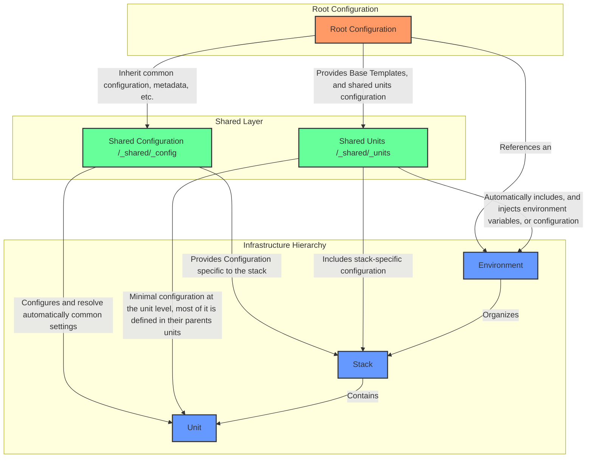

# Terragrunt Reference Architecture V3 🏗️

## 🌐 Overview

A cutting-edge, production-grade infrastructure management framework (or, just a reference architecture for infrrastructure-at-scale, with [Terragrunt](https://terragrunt.gruntwork.io/)) designed to be modular, flexible, and scalable. It's very opinionated, and it came from years of experience building infrastructure at scale. Use it, adapt it to your needs, and make it your own.

## ✨ Key Features

| Feature                                   | Description                                                                                                                                                                                                                                                                                                        |
| ----------------------------------------- | ------------------------------------------------------------------------------------------------------------------------------------------------------------------------------------------------------------------------------------------------------------------------------------------------------------------ |
| 🧩 Modular Architecture                   | Discrete, composable infrastructure units, that can inherit from shared unit's configurations, and from their parents in the hierarchy (stacks, or environments)                                                                                                                                                   |
| 🌈 Highly Hierarchical Flexible Overrides | Designed to support multiple environments (the most common abstraction), where each environment can hold many stacks, and each stack can hold many units                                                                                                                                                           |
| 🚀 Multi-Provider Compatibility           | Support for diverse cloud and infrastructure providers. Dynamically set providers, versions and overrides. It passes the control of the providers, and versions (if applicable) to the units, which are the smallest components of the architecture that deals directly with the terraform abstractions (modules). |
| 🔧 Dynamic Environment Configuration      | Utilizes `.env` files for straightforward environment variable management. Settings are typically defined in a `.env` file (copied from `.env.example`), which is automatically loaded by `just` recipes. See [Environment Variables Documentation](docs/environment-variables.md) for full details.                   |
| 🧼 Clean Code Configuration               | Strict separation of configuration logic, with clear distinctions between global settings, provider management, and Terragrunt generation rules in `config.hcl` and `root.hcl`. Implements comprehensive commenting and modular configuration design.                                                              |

## 📐 Architecture Overview

### Hierarchical Infrastructure Organization



### Project Structure

The project structure follows the pattern:

- **Environment**: A collection of stacks, and units. The most logical approach to organise the infrastructure is to group the infrastructure by environment.
  - **Stack**: A collection of units.
    - **Unit**: A collection of terraform modules.

> [!NOTE]
> Each layer is fully flexible, and can be changed to fit the needs of your project, or particular domain. E.g.: instead of environment, you could use a different layer to group the infrastructure by region, or by application.

The project structure is as follows:

```
infra/terragrunt
├── README.md
├── _shared
│   ├── _config
│   │   ├── README.md
│   │   ├── app.hcl
│   │   ├── remote_state.hcl
│   │   └── tags.hcl
│   └── _units
│       ├── README.md
│       ├── <unit>.hcl
│       ├── <unit-2>.hcl
├── _templates
├── config.hcl
├── default.tfvars
├── <environment>
│   ├── default.tfvars
│   ├── <stack>
│   │   ├── <unit>
│   │   │   ├── README.md
│   │   │   ├── terragrunt.hcl
│   │   │   ├── unit_cfg_providers.hcl
│   │   │   └── unit_cfg_versions.hcl
│   │   ├── <unit-2>
│   │   │   ├── README.md
│   │   │   ├── terragrunt.hcl
│   │   │   ├── unit_cfg_providers.hcl
│   │   │   └── unit_cfg_versions.hcl
│   │   └── stack.hcl
│   └── env.hcl
└── root.hcl
```

## Cool things inside? 🌟

### 🔐 Environment Variable Management with `.env` Files

This project uses a straightforward environment variable management system based on `.env` files:

- **`.env.example`**: A template file in the project root lists available environment variables and provides example values.
- **`.env`**: You create this file by copying `.env.example`. It's where you set your actual, local-specific or sensitive variable values. This file should be added to `.gitignore`.
- **Automatic Loading with `just`**: The `justfile` is configured with `set dotenv-load`, so any `just` command will automatically load variables from your `.env` file.

This approach simplifies environment setup and customization. For a comprehensive guide and list of all supported variables, please refer to the [Environment Variables Documentation](docs/environment-variables.md).

### 🔧 Environment Setup

To set up your development environment:

1.  **Install Prerequisites**: Ensure you have [Terraform](https://www.terraform.io/), [Terragrunt](https://terragrunt.gruntwork.io/), [mise](https://mise.jdx.dev/), and [Just](https://github.com/casey/just) installed.
2.  **Set up Environment Variables**:
    *   Copy the `.env.example` file to `.env` in the project root: `cp .env.example .env`
    *   Edit your `.env` file to set the appropriate values for your setup. Refer to `docs/environment-variables.md` for details on available variables.
3.  **Activate Development Environment**:
    *   Run `just dev`. This command will use `mise` to set up the shell with the correct tool versions defined in `mise.toml`. Variables from your `.env` file will also be available within `just` recipes.

### 🔧 Dynamic Environment Variable Management (Simplified)

Environment variables are managed using `.env` files, as detailed above and in the [Environment Variables Documentation](docs/environment-variables.md). This method allows for easy customization of settings like AWS regions, Terraform versions, and application-specific parameters.

#### Key Environment Variables (Examples)

The full list of supported environment variables, their descriptions, default values, and usage contexts can be found in the [Environment Variables Documentation](docs/environment-variables.md). Here are a few examples typically found in `.env.example`:

| Category                    | Variable Name                     | Example Value (in `.env.example`) |
|-----------------------------|-----------------------------------|-----------------------------------|
| **Cloud Provider & Region** | `DEFAULT_REGION`                  | `us-east-1`                       |
| **Terraform & Terragrunt**  | `TG_NON_INTERACTIVE`              | `true`                            |
|                             | `TG_STACK_TF_VERSION`             | `1.11.3`                          |
| **Remote State Config**     | `TG_STACK_REMOTE_STATE_BUCKET_NAME` | `your-tf-state-bucket`            |

> [!NOTE]
> Always refer to `docs/environment-variables.md` for the most current and comprehensive list of environment variables.

#### Quick Environment Setup

1.  Install prerequisites (Terraform, Terragrunt, mise, Just).
2.  Copy `.env.example` to `.env` and customize it.
3.  Run `just dev` to activate the mise environment. Variables from `.env` will be loaded for `just` commands.

For more detailed information, consult the [Environment Variables Documentation](docs/environment-variables.md).

### 🔧 Dynamic Provider and Version Management

Normally, using Terragrunt and depending on what type of Terraform modules your units are using, you might want to skip the generation, override if it was generated by terragrunt or just override these files from the terraform modules being used:

- `providers.tf`
- `versions.tf`

For that, this reference architecture support a very flexible approach to manage these scenarios, based on the following principle: the **unit** which interacts directly with the terraform (modules) interface is the one that defines the providers and versions (if applicable). At the unit level, a certain terraform module might require several providers, and versions, and at the same time, another terraform module might require a different set of providers and versions. This flexibility is achieved by using the `unit_cfg_providers.hcl` and `unit_cfg_versions.hcl` files, which are located in the unit directory.

At minimum, an unit in this architecture will have 4 files. Let's take a look at the following example:

```text
infra/terragrunt/global/dni/dni_generator
├── README.md
├── terragrunt.hcl
├── unit_cfg_providers.hcl
└── unit_cfg_versions.hcl
```

If a given unit requires a specific provider, and version, it will be defined in the `unit_cfg_providers.hcl` and `unit_cfg_versions.hcl` files. From there, the credentials (if applicable) and the providers, and versions shape can be defined in a reliable, and secure way. See the [unit_cfg_providers.hcl](infra/terragrunt/global/dni/dni_generator/unit_cfg_providers.hcl) and [unit_cfg_versions.hcl](infra/terragrunt/global/dni/dni_generator/unit_cfg_versions.hcl) files for a more real-world example.
When the providers, and versions are defined, they are reliably read automatically by terragrunt (the [config.hcl](infra/terragrunt/config.hcl) file) and used to generate the `providers.tf` and `versions.tf` files if the following conditions are met:

#### Providers Dynamic Generation

The `providers.tf` file is generated dynamically by terragrunt, and it's generated based on the following conditions:

- The `unit_cfg_providers.hcl` file is present in the unit directory (e.g.: `infra/terragrunt/<environment></environment>/<stack>/<unit>/unit_cfg_providers.hcl`)
- The `unit_cfg_providers.hcl` file is not empty.
- The `TG_STACK_FLAG_ENABLE_PROVIDERS_OVERRIDE` feature flag is set to `true` (default behavior)

#### Versions Dynamic Generation

The `versions.tf` file is generated dynamically by terragrunt, and it's generated based on the following conditions:

- The `unit_cfg_versions.hcl` file is present in the unit directory (e.g.: `infra/terragrunt/<environment></environment>/<stack>/<unit>/unit_cfg_versions.hcl`)
- The `unit_cfg_versions.hcl` file is not empty.
- The `TG_STACK_FLAG_ENABLE_VERSIONS_OVERRIDE` feature flag is set to `true` (default behavior)

### 🔄 AWS Remote State Backend

This reference architecture uses AWS S3 and DynamoDB for secure, scalable remote state management. A properly configured remote backend provides state locking, versioning, encryption, and access control.

#### Setting Up Remote Backend

The architecture requires an S3 bucket and DynamoDB table for storing and locking Terraform state. See our [AWS Remote Backend Setup Guide](docs/aws-remote-backend-setup.md) for detailed instructions on:

- Creating a secure S3 bucket with proper versioning and encryption
- Configuring a DynamoDB table for state locking
- Setting up appropriate security measures
- Configuring your environment to use the remote backend

Once configured, update your environment variables to reference your backend:

```bash
TG_STACK_REMOTE_STATE_BUCKET_NAME="your-state-bucket"
TG_STACK_REMOTE_STATE_LOCK_TABLE="your-lock-table"
```

## 📚 Documentation

Dive deep into our architecture with our detailed documentation:

1. [Infrastructure Configuration Management](infra/terragrunt/README.md)

   - Configuration strategies
   - Environment variable management
   - Best practices

2. [Shared Components Guide](infra/terragrunt/_shared/README.md)

   - Reusable configuration modules
   - Centralized resource management
   - Standardization techniques

3. [Stack Architecture Principles](infra/terragrunt/global/dni/README.md)

   - Modular stack design
   - Component interaction patterns
   - Scalability considerations

4. [AWS Remote Backend Setup](docs/aws-remote-backend-setup.md)

   - S3 state storage configuration
   - DynamoDB state locking
   - Security best practices
   - Troubleshooting guidance

5. [Dagger CI Module Guide](ci/README.md)
   - Explains the included Dagger module for CI automation.

## 🚀 Getting Started

### Prerequisites

- [Terragrunt](https://terragrunt.gruntwork.io/)
- [Terraform](https://www.terraform.io/)
- [mise](https://mise.jdx.dev/) (for managing tool versions and development shell)
- [Just](https://github.com/casey/just) (for running project commands and loading `.env` files)

### Environment Setup

1. Clone the repository.
2. Install prerequisites listed above.
3. Set up your local environment variables:
   - Copy `.env.example` to `.env`: `cp .env.example .env`
   - Edit `.env` with your specific configurations. See [Environment Variables Documentation](docs/environment-variables.md) for details.
4. Activate the development environment:
   - Run `just dev`. This will use `mise` to prepare your shell with the correct tool versions.

### Running Terragrunt commands

This reference architecture already includes a stack implementation that simulates a DNI generation (showing the most common case, where units are orchestrated in an specific order, with dependencies between them, etc.), a `dni-generator` module that requires a `age-generator` module, `name-generator` module, and `lastname-generator` module. See the [terraform/modules](infra/terraform/modules/README.md) directory for more details.

Run a Terragrunt command on a specific unit:

```bash
# Run a Terragrunt command on a specific unit:
just tg-run global dni dni_generator plan

# or just tg-run since these are the default values.
just tg-run
```

Or, in this particular scenario, you can run the entire stack, and leave [Terragrunt](https://terragrunt.gruntwork.io/) to handle the dependencies between the units, ordering the execution of the units in the correct order, etc.:

```bash
# Running terragrunt run-all plan, in the environment 'global', and stack 'dni'
just tg-run-all-plan global dni

```

> [!TIP]
> More recipes are available in the [justfile](justfile) file.

### Quick Setup

1. Clone the repository
2. Install prerequisites (Terraform, Terragrunt, mise, Just)
3. Set up your local environment variables:
   - Copy `.env.example` to `.env`: `cp .env.example .env`
   - Edit `.env` with your specific configurations. See [Environment Variables Documentation](docs/environment-variables.md) for details.
4. Activate the development environment:
   - Run `just dev`. This will use `mise` to prepare your shell with the correct tool versions.
5. Review documentation and customize configurations

## 🤖 CI Automation with Dagger

This reference architecture includes a [Dagger](https://dagger.io/) module written in Go, located in [`pipeline/infra/`](pipeline/infra/), to automate Terragrunt and Terraform workflows, providing consistent and reproducible environments for CI pipelines and local development.

- **GitLab CI Integration:** The module is primarily used within the GitLab CI/CD pipelines defined in the [`.gitlab/`](.gitlab/) directory. See the [GitLab CI/CD Configuration Guide](./.gitlab/README.md#dagger-integration-pipelineinfra) for details on its structure and how it powers the CI jobs.
- **Local Execution:** The [`justfile`](justfile) provides convenient recipes (e.g., `just ci-job-units-static-check`) for running Dagger CI-like jobs locally. You can also invoke Dagger functions directly from the `pipeline/infra/` directory using the Dagger CLI for more granular control or debugging (e.g., `dagger call open-terminal --src ../../ up --stdout`).
- **Module Details:** For a detailed explanation of the Dagger module's functions, how it handles tool versions, environment variables (including `.env` files), and authentication, refer to the [Dagger Integration section in the GitLab CI/CD Configuration Guide](./.gitlab/README.md#dagger-integration-pipelineinfra).

## 🤝 Contributing

Contributions are welcome! Please follow our guidelines:

## 📄 License

[MIT License](LICENSE)

## 📞 Contact

For questions, support, or collaboration:

- Open an [Issue](https://github.com/your-org/terragrunt-ref-arch-v3/issues)
- Just reach out to me on [Linkedin](https://www.linkedin.com/in/alextorresruiz/)
