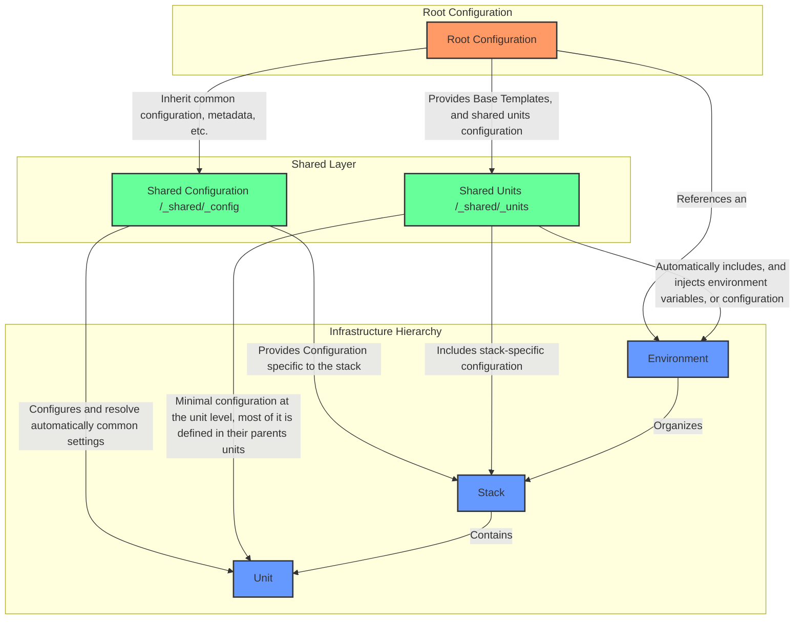

This file is a merged representation of the entire codebase, combined into a single document by Repomix.

# File Summary

## Purpose
This file contains a packed representation of the entire repository's contents.
It is designed to be easily consumable by AI systems for analysis, code review,
or other automated processes.

## File Format
The content is organized as follows:
1. This summary section
2. Repository information
3. Directory structure
4. Multiple file entries, each consisting of:
  a. A header with the file path (## File: path/to/file)
  b. The full contents of the file in a code block

## Usage Guidelines
- This file should be treated as read-only. Any changes should be made to the
  original repository files, not this packed version.
- When processing this file, use the file path to distinguish
  between different files in the repository.
- Be aware that this file may contain sensitive information. Handle it with
  the same level of security as you would the original repository.

## Notes
- Some files may have been excluded based on .gitignore rules and Repomix's configuration
- Binary files are not included in this packed representation. Please refer to the Repository Structure section for a complete list of file paths, including binary files
- Files matching patterns in .gitignore are excluded
- Files matching default ignore patterns are excluded

## Additional Info

# Directory Structure
```
.config/
  direnv/
    direnvrc
.github/
  ISSUE_TEMPLATE/
    bug_report.md
    bug_report.yml
    feature_request.yml
  workflows/
    issue-comment-created.yml
    labels-assigner.yml
    lock-threads.yml
    semantic-pr.yml
  auto-comment.yml
  CODEOWNERS
  config.yml
  dependabot.yml
  labeler.yml
  no-response.yml
  PULL_REQUEST_TEMPLATE.md
  settings.yml
  stale.yml
ci/
  ci-terragrunt/
    .gitattributes
    .gitignore
    dagger.json
    go.mod
    main.go
docs/
  aws-remote-backend-setup.md
  environment-variables.md
infra/
  terraform/
    modules/
      age-generator/
        locals.tf
        main.tf
        outputs.tf
        variables.tf
        versions.tf
      dni-generator/
        locals.tf
        main.tf
        outputs.tf
        variables.tf
        versions.tf
      lastname-generator/
        locals.tf
        main.tf
        outputs.tf
        variables.tf
        versions.tf
      name-generator/
        locals.tf
        main.tf
        outputs.tf
        variables.tf
        versions.tf
      README.md
  terragrunt/
    _shared/
      _config/
        app.hcl
        README.md
        remote_state.hcl
        tags.hcl
      _units/
        age_generator.hcl
        dni_generator.hcl
        lastname_generator.hcl
        name_generator.hcl
        README.md
      README.md
    _templates/
      .terraform-version.tpl
      layer.envrc.template
      README.md
    global/
      dni/
        age_generator/
          .terraform-version
          README.md
          terragrunt.hcl
          unit_cfg_providers.hcl
          unit_cfg_versions.hcl
        dni_generator/
          .terraform-version
          README.md
          terragrunt.hcl
          unit_cfg_providers.hcl
          unit_cfg_versions.hcl
        lastname_generator/
          .terraform-version
          README.md
          terragrunt.hcl
          unit_cfg_providers.hcl
          unit_cfg_versions.hcl
        name_generator/
          .terraform-version
          README.md
          terragrunt.hcl
          unit_cfg_providers.hcl
          unit_cfg_versions.hcl
        README.md
        stack.hcl
      default.tfvars
      env.hcl
      README.md
    config.hcl
    default.tfvars
    root.hcl
scripts/
  hooks/
    pre-commit-init.sh
  envrc-utils.sh
  justfile-utils.sh
.editorconfig
.envrc
.gitattributes
.gitignore
.pre-commit-config.yaml
.release-please-manifest.json
.shellcheckrc
.yamlfmt.yml
.yamllint.yml
CHANGELOG.md
justfile
LICENSE
README.md
release-please-config.json
```

# Files

## File: .config/direnv/direnvrc
````
# Direnv configuration for optimized performance
# This file contains settings to improve direnv performance in development environments

# Reduce direnv logging verbosity for faster startup
export DIRENV_LOG_FORMAT=""

# Optimize garbage collection
export DIRENV_WARN_TIMEOUT=100

# Exclude certain directories from watching to improve performance
export DIRENV_WATCH_EXCLUDES=".*/_build/.*:.*/.git/.*:.*/.direnv/.*"
````

## File: .github/ISSUE_TEMPLATE/bug_report.md
````markdown
---
name: Bug Report
about: Report an issue in the Terragrunt Reference Architecture
title: "[Component]: Describe the problem"
labels: bug
assignees:
---

## Problem Description

Provide a clear and concise explanation of the unexpected behavior.

## Environment Details

- Terragrunt Ref Arch Version:
- Terragrunt Version:
- Terraform Version:
- Operating System:
- Affected Component:
  - [ ] Root Configuration
  - [ ] Shared Configuration
  - [ ] Environment Configuration
  - [ ] Stack Configuration
  - [ ] Unit Configuration
  - [ ] CLI/Tooling
  - [ ] Other (specify)

## Reproduction Steps

Detailed steps to reproduce the issue:

1.
2.
3.

## Expected vs Actual Behavior

**Expected:**
Describe the expected behavior based on the architecture's design.

**Actual:**
Describe the observed unexpected behavior or error.

## Diagnostic Information

- Environment Variables:
- Configuration Files:
  - [ ] root.hcl
  - [ ] config.hcl
  - [ ] terragrunt.hcl
  - [ ] unit_cfg_providers.hcl
  - [ ] unit_cfg_versions.hcl
  - [ ] Other (specify)

Log Output:

```
[Paste relevant log output]
```

Error Message:

```
[Paste complete error message]
```

## Impact Assessment

Severity:

- [ ] Critical (workflow blocking)
- [ ] High (significant functionality impaired)
- [ ] Medium (partial functionality affected)
- [ ] Low (minor issue)

Impacted Workflows/Components:

## Additional Context

- Custom architecture modifications
- Relevant configuration details
- Supporting evidence (screenshots, logs)

## Proposed Solution

Suggested approaches or potential fixes (optional):
````

## File: .github/ISSUE_TEMPLATE/bug_report.yml
````yaml
---
name: Bug Report
description: Report an issue in the Terragrunt Reference Architecture
title: "[Bug]: "
labels: ["bug", "triage"]
body:
  - type: markdown
    attributes:
      value: |
        Thanks for helping improve the Terragrunt Reference Architecture.

  - type: dropdown
    id: component
    attributes:
      label: Affected Component
      description: Select the primary component experiencing the issue
      options:
        - Root Configuration
        - Shared Configuration
        - Environment Configuration
        - Stack Configuration
        - Unit Configuration
        - CLI/Tooling
        - Other
    validations:
      required: true

  - type: textarea
    id: description
    attributes:
      label: Problem Description
      description: Provide a clear, concise explanation of the unexpected behavior
      placeholder: What went wrong and under what circumstances?
    validations:
      required: true

  - type: input
    id: terragrunt-version
    attributes:
      label: Terragrunt Version
      placeholder: e.g., 0.45.6
    validations:
      required: true

  - type: input
    id: terraform-version
    attributes:
      label: Terraform Version
      placeholder: e.g., 1.5.3
    validations:
      required: true

  - type: textarea
    id: reproduction
    attributes:
      label: Steps to Reproduce
      description: Provide minimal, precise steps to consistently reproduce the issue
      placeholder: |
        1. Run '...'
        2. Configure '...'
        3. Observe error
    validations:
      required: true

  - type: textarea
    id: logs
    attributes:
      label: Relevant Logs
      description: Paste any error logs or command output
      render: shell
    validations:
      required: false

  - type: dropdown
    id: severity
    attributes:
      label: Issue Severity
      description: How critical is this issue?
      options:
        - Critical (Workflow Blocking)
        - High (Significant Impact)
        - Medium (Partial Functionality)
        - Low (Minor Issue)
    validations:
      required: true

  - type: textarea
    id: additional-context
    attributes:
      label: Additional Context
      description: Any other relevant information
      placeholder: Configuration details, custom modifications, etc.
    validations:
      required: false

  - type: checkboxes
    id: terms
    attributes:
      label: Contribution Guidelines
      description: By submitting this issue, you agree to follow our project's guidelines
      options:
        - label: I have searched existing issues and verified this is not a duplicate
          required: true
````

## File: .github/ISSUE_TEMPLATE/feature_request.yml
````yaml
---
name: Feature Request
description: Propose improvements for the Terragrunt Reference Architecture
title: "[Feature]: "
labels: ["enhancement", "needs-triage"]
body:
  - type: markdown
    attributes:
      value: |
        Thanks for contributing to the Terragrunt Reference Architecture.

  - type: dropdown
    id: component
    attributes:
      label: Affected Component
      description: Select the primary component this feature impacts
      options:
        - Root Configuration
        - Shared Configuration
        - Environment Configuration
        - Stack Configuration
        - Unit Configuration
        - CLI/Tooling
        - Cross-cutting Concern
    validations:
      required: true

  - type: textarea
    id: problem
    attributes:
      label: Problem Statement
      description: Describe the specific limitation or challenge in the current architecture
      placeholder: What problem are you trying to solve?
    validations:
      required: true

  - type: textarea
    id: solution
    attributes:
      label: Proposed Solution
      description: Outline your proposed feature or improvement
      placeholder: |
        - Key functionality
        - Implementation approach
        - Configuration modifications
    validations:
      required: true

  - type: textarea
    id: use-cases
    attributes:
      label: Use Cases
      description: Describe specific scenarios where this feature provides value
      placeholder: |
        1. Primary Use Case:
        2. Secondary Use Case:
    validations:
      required: false

  - type: dropdown
    id: priority
    attributes:
      label: Feature Priority
      description: How critical is this feature?
      options:
        - High (Critical for workflow)
        - Medium (Significant improvement)
        - Low (Nice to have)
    validations:
      required: true

  - type: textarea
    id: technical-considerations
    attributes:
      label: Technical Considerations
      description: Compatibility and configuration impact
      placeholder: |
        - Terragrunt version requirements
        - Potential configuration changes
        - Provider compatibility
    validations:
      required: false

  - type: textarea
    id: additional-context
    attributes:
      label: Additional Context
      description: Any supplementary information
      placeholder: Links to documentation, references, or related discussions
    validations:
      required: false

  - type: checkboxes
    id: contribution
    attributes:
      label: Contribution Details
      description: Are you willing to help implement this feature?
      options:
        - label: I'm interested in contributing to this feature
        - label: I have searched existing issues and verified this is not a duplicate
          required: true
````

## File: .github/workflows/issue-comment-created.yml
````yaml
---
name: Issue Comment Management

on:
  issue_comment:
    types: [created]

permissions:
  issues: write

jobs:
  comment-actions:
    runs-on: ubuntu-latest
    steps:
      - name: Handle Comment Commands
        uses: actions/github-script@v7
        with:
          github-token: ${{ secrets.GITHUB_TOKEN }}
          script: |
            const comment = context.payload.comment;
            const issue = context.payload.issue;
            const commentBody = comment.body.trim().toLowerCase();

            // Reopen command
            if (commentBody === '/reopen') {
              if (issue.state === 'closed') {
                await github.rest.issues.update({
                  owner: context.repo.owner,
                  repo: context.repo.repo,
                  issue_number: issue.number,
                  state: 'open'
                });
                await github.rest.issues.createComment({
                  owner: context.repo.owner,
                  repo: context.repo.repo,
                  issue_number: issue.number,
                  body: 'Issue reopened by repository maintainer.'
                });
              }
            }

            // Additional commands can be added here
````

## File: .github/workflows/labels-assigner.yml
````yaml
---
name: "Pull Request Labeler"
on:
  pull_request_target:
    types: [opened, labeled, unlabeled, synchronize]
permissions:
  contents: read
  pull-requests: write
jobs:
  labeler:
    runs-on: ubuntu-latest
    steps:
      - uses: actions/labeler@v5
        with:
          repo-token: "${{ secrets.GITHUB_TOKEN }}"
          configuration-path: .github/labeler.yml
          sync-labels: true
````

## File: .github/workflows/lock-threads.yml
````yaml
---
name: Lock Inactive Threads

on:
  schedule:
    - cron: '0 0 * * 0' # Run weekly on Sunday at midnight

permissions:
  issues: write
  pull-requests: write

jobs:
  lock:
    runs-on: ubuntu-latest
    steps:
      - uses: dessant/lock-threads@v4
        with:
          github-token: ${{ github.token }}
          issue-lock-comment: >
            This issue has been inactive for 30 days and is now locked. If you have a similar concern, please open a new issue
            with detailed information about the Terragrunt Reference Architecture. 🏗️
          issue-lock-inactive-days: '30'
          pr-lock-comment: >
            This pull request has been inactive for 30 days and is now locked. If you wish to continue this contribution,
            please open a new PR with updated changes. 🚧
          pr-lock-inactive-days: '30'
````

## File: .github/workflows/semantic-pr.yml
````yaml
---
name: Semantic Pull Request Validation

on:
  pull_request_target:
    types:
      - opened
      - edited
      - synchronize

permissions:
  pull-requests: read

jobs:
  semantic-pr:
    runs-on: ubuntu-latest
    steps:
      - uses: amannn/action-semantic-pull-request@v5
        env:
          GITHUB_TOKEN: ${{ secrets.GITHUB_TOKEN }}
        with:
          requireScope: false
          validateSingleCommit: true
          types: |
            feat
            fix
            docs
            refactor
            perf
            test
            build
            ci
            chore
            infra
            breaking
````

## File: .github/auto-comment.yml
````yaml
---
pullRequestOpened: |-
  :wave: Thanks for contributing to the Terragrunt Reference Architecture!

  Before we can merge this PR, please ensure:
  - [ ] Added/updated tests for new functionality
  - [ ] Followed Terragrunt and Terraform best practices
  - [ ] Updated documentation for new features
  - [ ] Verified configuration modularity
  - [ ] Checked performance impact on infrastructure configurations
  - [ ] Reviewed changes for security implications
  - [ ] Linked to relevant issue (if applicable)

  Terragrunt Specific Checklist:
  - [ ] Validated HCL configuration syntax
  - [ ] Tested with multiple environment configurations
  - [ ] Considered multi-stack and cross-environment scenarios
  - [ ] Ensured DRY (Don't Repeat Yourself) principles

  Thank you for improving the Terragrunt Reference Architecture! 🚀
````

## File: .github/CODEOWNERS
````
# CODEOWNERS file for Terragrunt Reference Architecture

# Default owners for everything in the repo
* @Excoriate

# Terragrunt Infrastructure
infra/terragrunt/ @Excoriate @terragrunt-maintainers

# Terraform Modules
infra/terraform/ @Excoriate @terraform-maintainers

# Documentation
*.md @Excoriate @docs-maintainers

# CI/CD Configuration
.github/ @Excoriate @ci-maintainers
````

## File: .github/config.yml
````yaml
---
# Configuration for new-issue-welcome - https://github.com/behaviorbot/new-issue-welcome
# Comment to be posted to on first time issues
newIssueWelcomeComment: >
  Thanks for opening an issue in the Terragrunt Reference Architecture! 🏗️ Please ensure you've followed our issue template
  and provided detailed information.
# Configuration for new-pr-welcome - https://github.com/behaviorbot/new-pr-welcome
# Comment to be posted to on PRs from first time contributors in your repository
newPRWelcomeComment: >
  Welcome to the Terragrunt Reference Architecture! 🚀 Thank you for your contribution. Please review our contributing guidelines
  and PR checklist.
# Configuration for first-pr-merge - https://github.com/behaviorbot/first-pr-merge
# Comment to be posted to on pull requests merged by a first time user
firstPRMergeComment: >-
  Congratulations on merging your first pull request to the Terragrunt Reference Architecture! Your contribution helps improve
  infrastructure as code practices. 🎉
````

## File: .github/dependabot.yml
````yaml
---
version: 2
updates:
  # Terraform and Terragrunt dependencies
  - package-ecosystem: "terraform"
    directory: "/infra/terragrunt"
    schedule:
      interval: "weekly"
    groups:
      terragrunt-dependencies:
        patterns:
          - "*"
    labels:
      - "dependencies"
      - "infra/terragrunt"
      - "terraform"

  # Terraform module dependencies
  - package-ecosystem: "terraform"
    directory: "/infra/terraform"
    schedule:
      interval: "weekly"
    groups:
      terraform-module-dependencies:
        patterns:
          - "*"
    labels:
      - "dependencies"
      - "infra/terraform"

  # GitHub Actions
  - package-ecosystem: "github-actions"
    directory: "/"
    schedule:
      interval: "weekly"
    groups:
      actions-dependencies:
        patterns:
          - "*"
    labels:
      - "dependencies"
      - "ci"

  # Documentation dependencies
  - package-ecosystem: "npm"
    directory: "/"
    schedule:
      interval: "monthly"
    groups:
      docs-dependencies:
        patterns:
          - "remark"
          - "markdown"
    labels:
      - "dependencies"
      - "docs"
````

## File: .github/labeler.yml
````yaml
---
# Documentation changes
docs:
  - changed-files:
      any-glob-to-any-file: ['**/*.md', 'docs/**/*']

# Terragrunt infrastructure changes
terragrunt:
  - changed-files:
      any-glob-to-any-file: ['infra/terragrunt/**/*.hcl']

# Terraform infrastructure changes
terraform:
  - changed-files:
      any-glob-to-any-file: ['infra/terraform/**/*.tf']

# CI/CD workflow changes
ci:
  - changed-files:
      any-glob-to-any-file: ['.github/**/*']

# Test changes
tests:
  - changed-files:
      any-glob-to-any-file: ['**/*_test.*']

dx:
  - changed-files:
      any-glob-to-any-file: ['justfile']

github:
  - changed-files:
      any-glob-to-any-file: ['.github/**/*']

cd:
  - changed-files:
      any-glob-to-any-file: ['@release-please-config.json', '@.release-please-manifest.json']
````

## File: .github/no-response.yml
````yaml
---
# Configuration for probot-no-response - https://github.com/probot/no-response

# Number of days of inactivity before an Issue is closed for lack of response
daysUntilClose: 21
# Label requiring a response
responseRequiredLabel: needs-info
# Comment to post when closing an Issue for lack of response. Set to `false` to disable
closeComment: >-
  This issue has been automatically closed due to lack of response. For Terragrunt Reference Architecture issues, please provide:
  - Specific configuration context - Exact Terragrunt/Terraform version - Detailed error logs or configuration snippets Feel
  free to reopen with more details. 🏗️
````

## File: .github/PULL_REQUEST_TEMPLATE.md
````markdown
## 🏗️ Terragrunt Reference Architecture PR

### What Changes

- Brief description of changes
- Key modifications or enhancements to infrastructure configuration

### Change Type (select all that apply)

- [ ] Terragrunt Configuration
- [ ] Shared Configuration
- [ ] Environment Configuration
- [ ] Terraform Module
- [ ] Documentation
- [ ] Dependency Update

### Checklist

- [ ] Followed Terragrunt best practices
- [ ] Maintained configuration modularity
- [ ] Added/updated tests
- [ ] Updated documentation
- [ ] Verified cross-environment compatibility
- [ ] Ensured DRY (Don't Repeat Yourself) principles

### Configuration Impact

- Affected stacks/environments
- Potential breaking changes
- Performance considerations

### Additional Context

- Related issues
- Configuration diffs
- Screenshots or logs (if applicable)
````

## File: .github/settings.yml
````yaml
---
repository:
  name: terragrunt-ref-arch-v3
  description: Modular Infrastructure as Code Reference Architecture with Terragrunt and Terraform
  topics: terragrunt, terraform, infrastructure-as-code, devops, cloud, iac
  default_branch: main
  allow_squash_merge: true
  allow_merge_commit: false
  allow_rebase_merge: true
  delete_branch_on_merge: true
  has_projects: false
  has_wiki: true

labels:
  - name: infra/terragrunt
    color: '#1D76DB'
    description: Terragrunt configuration and infrastructure changes
  - name: infra/terraform
    color: '#0075CA'
    description: Terraform module modifications
  - name: tool/cli
    color: '#7B42BC'
    description: CLI tool enhancements
  - name: performance
    color: '#FFC300'
    description: Performance optimization for infrastructure code
  - name: config/root
    color: '#5319E7'
    description: Root configuration changes
  - name: config/shared
    color: '#006B75'
    description: Shared configuration modifications
  - name: config/environment
    color: '#207DE5'
    description: Environment-specific configuration updates

branches:
  - name: main
    protection:
      required_pull_request_reviews:
        required_approving_review_count: 1
        dismiss_stale_reviews: true
        require_code_owner_reviews: true
      required_status_checks:
        strict: true
        contexts:
          - "lint"
          - "test"
          - "codecov/project"
      enforce_admins: false
      restrictions:
        apps: []
        teams: []
````

## File: .github/stale.yml
````yaml
---
# Number of days of inactivity before an issue becomes stale
daysUntilStale: 90
# Number of days of inactivity before a stale issue is closed
daysUntilClose: 14
# Issues with these labels will never be considered stale
exemptLabels:
  - pinned
  - security
  - infra/critical
  - infra/core-component
  - tool/core-functionality
  - config/root
  - config/shared
# Label to use when marking an issue as stale
staleLabel: stale
# Comment to post when marking an issue as stale
markComment: >
  This issue in the Terragrunt Reference Architecture has been automatically marked as stale due to 90 days of inactivity.
  It will be closed if no further activity occurs within 14 days. If this issue remains relevant, please comment to keep it
  open. 🏗️
# Comment to post when closing a stale issue
closeComment: >
  This issue has been automatically closed due to inactivity. If the issue is still relevant to the Terragrunt Reference Architecture,
  please reopen and provide updated context. Feel free to create a new issue with the most recent information about infrastructure
  configuration. 👋
````

## File: ci/ci-terragrunt/.gitattributes
````
/dagger.gen.go linguist-generated
/internal/dagger/** linguist-generated
/internal/querybuilder/** linguist-generated
/internal/telemetry/** linguist-generated
````

## File: ci/ci-terragrunt/.gitignore
````
/dagger.gen.go
/internal/dagger
/internal/querybuilder
/internal/telemetry
````

## File: ci/ci-terragrunt/dagger.json
````json
{
  "name": "terragrunt",
  "engineVersion": "v0.16.3",
  "sdk": {
    "source": "go"
  },
  "include": [
    "!../../.direnv",
    "!../../.vscode",
    "!../../.idea",
    "!../../.trunk",
    "!../../go.work",
    "!../../go.work.sum"
  ]
}
````

## File: ci/ci-terragrunt/go.mod
````
module dagger/terragrunt

go 1.23.6

require (
	github.com/99designs/gqlgen v0.17.66
	github.com/Khan/genqlient v0.8.0
	github.com/vektah/gqlparser/v2 v2.5.23
	go.opentelemetry.io/otel v1.34.0
	go.opentelemetry.io/otel/exporters/otlp/otlplog/otlploggrpc v0.8.0
	go.opentelemetry.io/otel/exporters/otlp/otlplog/otlploghttp v0.8.0
	go.opentelemetry.io/otel/exporters/otlp/otlpmetric/otlpmetricgrpc v1.32.0
	go.opentelemetry.io/otel/exporters/otlp/otlpmetric/otlpmetrichttp v1.32.0
	go.opentelemetry.io/otel/exporters/otlp/otlptrace/otlptracegrpc v1.32.0
	go.opentelemetry.io/otel/exporters/otlp/otlptrace/otlptracehttp v1.32.0
	go.opentelemetry.io/otel/log v0.8.0
	go.opentelemetry.io/otel/metric v1.34.0
	go.opentelemetry.io/otel/sdk v1.34.0
	go.opentelemetry.io/otel/sdk/log v0.8.0
	go.opentelemetry.io/otel/sdk/metric v1.34.0
	go.opentelemetry.io/otel/trace v1.34.0
	go.opentelemetry.io/proto/otlp v1.3.1
	golang.org/x/sync v0.12.0
	google.golang.org/grpc v1.71.0
)

require (
	github.com/cenkalti/backoff/v4 v4.3.0 // indirect
	github.com/go-logr/logr v1.4.2 // indirect
	github.com/go-logr/stdr v1.2.2 // indirect
	github.com/google/uuid v1.6.0 // indirect
	github.com/grpc-ecosystem/grpc-gateway/v2 v2.23.0 // indirect
	github.com/sosodev/duration v1.3.1 // indirect
	go.opentelemetry.io/auto/sdk v1.1.0 // indirect
	go.opentelemetry.io/otel/exporters/otlp/otlptrace v1.32.0 // indirect
	golang.org/x/net v0.37.0 // indirect
	golang.org/x/sys v0.31.0 // indirect
	golang.org/x/text v0.23.0 // indirect
	google.golang.org/genproto/googleapis/api v0.0.0-20250106144421-5f5ef82da422 // indirect
	google.golang.org/genproto/googleapis/rpc v0.0.0-20250115164207-1a7da9e5054f // indirect
	google.golang.org/protobuf v1.36.5 // indirect
)

replace go.opentelemetry.io/otel/exporters/otlp/otlplog/otlploggrpc => go.opentelemetry.io/otel/exporters/otlp/otlplog/otlploggrpc v0.8.0

replace go.opentelemetry.io/otel/exporters/otlp/otlplog/otlploghttp => go.opentelemetry.io/otel/exporters/otlp/otlplog/otlploghttp v0.8.0

replace go.opentelemetry.io/otel/log => go.opentelemetry.io/otel/log v0.8.0

replace go.opentelemetry.io/otel/sdk/log => go.opentelemetry.io/otel/sdk/log v0.8.0
````

## File: ci/ci-terragrunt/main.go
````go
package main

import (
	"context"
	"dagger/terragrunt/internal/dagger"
	"fmt"
	"path/filepath"
	"strings"
)

const (
	defaultTerraformVersion  = "1.7.1"
	defaultTerragruntVersion = "0.55.1"
	defaultImage             = "alpine"
	defaultImageTag          = "3.21.3"
)

// Terragrunt represents a structure that encapsulates operations related to Terragrunt,
// a tool for managing Terraform configurations. This struct can be extended with methods
// that perform various tasks such as executing commands in containers, managing directories,
// and other functionalities that facilitate the use of Terragrunt in a Dagger pipeline.
type Terragrunt struct {
	// Ctr is a Dagger container that can be used to run Terragrunt commands
	Ctr *dagger.Container
}

func New(
	// ctx is the context for the Dagger container.
	ctx context.Context,

	// tgVersion (image tag) to use from the official Terragrunt image.
	//
	// +optional
	tgVersion string,

	// tfVersion is the Terraform version to use.
	//
	// +optional
	tfVersion string,

	// Container is the custom container to use for Terragrunt operations.
	//
	// +optional
	container *dagger.Container,

	// Secrets are the secrets that will be used to run the Terragrunt commands.
	//
	// +optional
	secrets []*dagger.Secret,

	// EnvVars are the environment variables that will be used to run the Terragrunt commands.
	//
	// +optional
	envVars []string,
) (*Terragrunt, error) {
	if container != nil {
		return &Terragrunt{
			Ctr: container,
		}, nil
	}

	m := &Terragrunt{
		Ctr: dag.Container().
			From(fmt.Sprintf("%s:%s", defaultImage, defaultImageTag)),
	}

	if tgVersion == "" {
		tgVersion = defaultTerragruntVersion
	}

	if tfVersion == "" {
		tfVersion = defaultTerraformVersion
	}

	if len(secrets) > 0 {
		for _, secret := range secrets {
			secretName, secretErr := secret.Name(ctx)

			if secretErr != nil {
				return nil, fmt.Errorf("failed to get secret name: %w", secretErr)
			}

			m.Ctr = m.Ctr.WithSecretVariable(secretName, secret)
		}
	}

	if len(envVars) > 0 {
		for _, envVar := range envVars {
			parts := strings.Split(envVar, "=")

			if len(parts) != 2 {
				return nil, fmt.Errorf("invalid environment variable: %s", envVar)
			}

			m.Ctr = m.Ctr.WithEnvVariable(parts[0], parts[1])
		}
	}

	// m.Ctr = m.WithTerragrunt(tgVersion)
	// m.Ctr = m.WithTerraform(tfVersion)

	return m, nil
}

// OpenTerminal returns a terminal
//
// It returns a terminal for the container.
// Arguments:
// - None.
// Returns:
// - *Terminal: The terminal for the container.
func (m *Terragrunt) OpenTerminal() *dagger.Container {
	return m.Ctr.Terminal()
}

// WithTerraform sets the Terraform version to use and installs it.
// It takes a version string as an argument and returns a pointer to a dagger.Container.
func (m *Terragrunt) WithTerraform(version string) *dagger.Container {
	tfInstallationCmd := getTerraformInstallationCommand(version)
	return m.
		Ctr.
		WithExec([]string{tfInstallationCmd}).
		WithExec([]string{"terraform", "--version"})
}

// WithTerragrunt sets the Terragrunt version to use and installs it.
// It takes a version string as an argument and returns a pointer to a dagger.Container.
func (m *Terragrunt) WithTerragrunt(version string) *dagger.Container {
	tgInstallationCmd := getTerragruntInstallationCommand(version)
	return m.
		Ctr.
		WithExec([]string{tgInstallationCmd}).
		WithExec([]string{"terragrunt", "--version"})
}

func getTerraformInstallationCommand(version string) string {
	installDir := "/usr/local/bin"
	installPath := filepath.Join(installDir, "terraform")
	command := fmt.Sprintf(`set -ex
curl -L https://releases.hashicorp.com/terraform/%[1]s/terraform_%[1]s_linux_amd64.zip -o /tmp/terraform.zip
unzip /tmp/terraform.zip -d /tmp
mv /tmp/terraform %[2]s
chmod +x %[2]s
rm /tmp/terraform.zip`, version, installPath)

	return strings.TrimSpace(command)
}

func getTerragruntInstallationCommand(version string) string {
	installDir := "/usr/local/bin"
	installPath := filepath.Join(installDir, "terragrunt")
	command := fmt.Sprintf(`set -ex
curl -L https://github.com/gruntwork-io/terragrunt/releases/download/v%s/terragrunt_linux_amd64 -o %s
chmod +x %s`, version, installPath, installPath)

	return strings.TrimSpace(command)
}
````

## File: docs/aws-remote-backend-setup.md
````markdown
# AWS Remote Backend Setup

## Overview

This guide explains how to set up a secure AWS-based remote backend for Terraform and Terragrunt state management. A properly configured remote backend provides:

- **State Locking**: Prevents concurrent state modifications that could corrupt your infrastructure state
- **State Versioning**: Maintains a history of your state files for auditing and recovery
- **Encryption**: Ensures sensitive information in your state files is protected
- **Access Control**: Centralizes and secures access to infrastructure state

## Components

The AWS remote backend consists of two primary components:

1. **S3 Bucket**: Stores the Terraform state files
2. **DynamoDB Table**: Provides state locking to prevent concurrent modifications

## Prerequisites

- AWS CLI installed and configured with appropriate credentials
- Permissions to create and configure S3 buckets and DynamoDB tables

## Setup Instructions

### Option 1: One-Step Setup (Recommended)

The following command will create and configure all required resources with best security practices:

```bash
aws s3api create-bucket \
    --bucket terraform-state-makemyinfra \
    --region us-east-1 && \
aws s3api put-bucket-versioning \
    --bucket terraform-state-makemyinfra \
    --versioning-configuration Status=Enabled && \
aws s3api put-bucket-encryption \
    --bucket terraform-state-makemyinfra \
    --server-side-encryption-configuration '{"Rules": [{"ApplyServerSideEncryptionByDefault": {"SSEAlgorithm": "AES256"}}]}' && \
aws s3api put-public-access-block \
    --bucket terraform-state-makemyinfra \
    --public-access-block-configuration "BlockPublicAcls=true,IgnorePublicAcls=true,BlockPublicPolicy=true,RestrictPublicBuckets=true" && \
aws dynamodb create-table \
    --table-name terraform-state-makemyinfra \
    --region us-east-1 \
    --billing-mode PAY_PER_REQUEST \
    --attribute-definitions AttributeName=LockID,AttributeType=S \
    --key-schema AttributeName=LockID,KeyType=HASH
```

You may need to modify the bucket name and region to fit your requirements.

### Option 2: Step-by-Step Setup

If you prefer to understand and execute each step individually:

#### 1. Create the S3 Bucket

```bash
aws s3api create-bucket \
    --bucket terraform-state-makemyinfra \
    --region us-east-1
```

For regions other than `us-east-1`, use:

```bash
aws s3api create-bucket \
    --bucket terraform-state-makemyinfra \
    --region your-region \
    --create-bucket-configuration LocationConstraint=your-region
```

#### 2. Enable Bucket Versioning

```bash
aws s3api put-bucket-versioning \
    --bucket terraform-state-makemyinfra \
    --versioning-configuration Status=Enabled
```

#### 3. Enable Server-Side Encryption

```bash
aws s3api put-bucket-encryption \
    --bucket terraform-state-makemyinfra \
    --server-side-encryption-configuration '{"Rules": [{"ApplyServerSideEncryptionByDefault": {"SSEAlgorithm": "AES256"}}]}'
```

#### 4. Block Public Access

```bash
aws s3api put-public-access-block \
    --bucket terraform-state-makemyinfra \
    --public-access-block-configuration "BlockPublicAcls=true,IgnorePublicAcls=true,BlockPublicPolicy=true,RestrictPublicBuckets=true"
```

#### 5. Create DynamoDB Table for State Locking

```bash
aws dynamodb create-table \
    --table-name terraform-state-makemyinfra \
    --region us-east-1 \
    --billing-mode PAY_PER_REQUEST \
    --attribute-definitions AttributeName=LockID,AttributeType=S \
    --key-schema AttributeName=LockID,KeyType=HASH
```

## Configuration in Terragrunt

Once the backend is created, update your environment configuration to reference it. The reference architecture already includes functionality to use the backend specified in your environment variables.

In your `.env` or `.envrc` file:

```bash
# Remote State Configuration
TG_STACK_REMOTE_STATE_BUCKET_NAME="terraform-state-makemyinfra"
TG_STACK_REMOTE_STATE_LOCK_TABLE="terraform-state-makemyinfra"
TG_STACK_REMOTE_STATE_REGION="us-east-1"
```

## Security Best Practices

- **IAM Policies**: Restrict access to the S3 bucket and DynamoDB table to only authorized users/roles
- **Access Logging**: Enable S3 access logging to monitor bucket access
- **Lifecycle Policies**: Consider adding lifecycle policies to manage old state versions
- **HTTPS Only**: Enforce HTTPS-only communication with the S3 bucket

### Sample IAM Policy for Terraform/Terragrunt Access

```json
{
  "Version": "2012-10-17",
  "Statement": [
    {
      "Effect": "Allow",
      "Action": [
        "s3:ListBucket",
        "s3:GetObject",
        "s3:PutObject",
        "s3:DeleteObject"
      ],
      "Resource": [
        "arn:aws:s3:::terraform-state-makemyinfra",
        "arn:aws:s3:::terraform-state-makemyinfra/*"
      ]
    },
    {
      "Effect": "Allow",
      "Action": [
        "dynamodb:GetItem",
        "dynamodb:PutItem",
        "dynamodb:DeleteItem"
      ],
      "Resource": "arn:aws:dynamodb:*:*:table/terraform-state-makemyinfra"
    }
  ]
}
```

## Troubleshooting

### Common Issues

1. **Access Denied**
   - Verify AWS credentials have appropriate permissions
   - Check IAM policies attached to your user/role

2. **Bucket Already Exists**
   - S3 bucket names must be globally unique
   - Choose a different bucket name or use an existing bucket

3. **State Locking Failures**
   - Ensure DynamoDB table exists and is correctly named
   - Verify permissions include DynamoDB actions
   - Check for stale locks with `terragrunt force-unlock`

4. **Region Consistency**
   - Ensure S3 bucket and DynamoDB table are in the same AWS region
   - Verify `TG_STACK_REMOTE_STATE_REGION` matches actual resource region

## Cleanup

If you need to remove the backend infrastructure:

```bash
# First, remove all files from the bucket
aws s3 rm s3://terraform-state-makemyinfra --recursive

# Delete the bucket
aws s3api delete-bucket --bucket terraform-state-makemyinfra

# Delete the DynamoDB table
aws dynamodb delete-table --table-name terraform-state-makemyinfra
```

⚠️ **WARNING**: Deleting the remote backend will remove all Terraform state files, which could make managing existing infrastructure extremely difficult. Only do this if you're sure you want to completely reset your infrastructure management.
````

## File: docs/environment-variables.md
````markdown
# Environment Variables Management

## Overview

The Terragrunt Reference Architecture implements a simplified yet powerful environment variable management system powered by [direnv](https://direnv.net/). This architecture now uses a single root `.envrc` file with category-based organization for improved clarity and easier customization.

## Key Features

- **Category-Based Organization**: Variables grouped by functional categories
- **Secure Variable Handling**: Validation and export of environment variables
- **Flexible Customization**: Dedicated section for custom user variables
- **Visual Clarity**: Emoji-tagged sections for improved readability

## Configuration Structure

```
/
└── .envrc                      # Comprehensive root-level configuration
```

## Configuration Principles

### Organizational Structure

The root `.envrc` file is organized into the following categories:

1. **Project Metadata**: Core project information and authorship
2. **Cloud Provider Settings**: Region configuration and provider-specific settings
3. **Terraform & Terragrunt Configuration**: Tool versions and behavior settings
4. **Logging & Diagnostics**: Output verbosity and log storage
5. **Remote State Configuration**: Backend storage for Terraform state
6. **Custom Use-Case Variables**: User-defined environment variables

### Core Utility Functions

- `_safe_export`: Securely export environment variables
- `_layer_export`: Export variables with additional layer-specific logging
- `_display_exported_vars`: Display current environment configuration
- `_log`: Standardized logging mechanism
- `_layer_env_info`: Display organized layer information with descriptions

## Root .envrc (Comprehensive Configuration)

```bash
#!/usr/bin/env bash
# Terragrunt Reference Architecture - Environment Configuration
# Simplified and modular environment setup

# Exit immediately if any command fails
set -e

# Ensure PROJECT_ROOT is set reliably
PROJECT_ROOT="${PROJECT_ROOT:-$(cd "$(dirname "${BASH_SOURCE[0]}")" && pwd)}"
export PROJECT_ROOT

# Source utility functions
source "${PROJECT_ROOT}/scripts/envrc-utils.sh"

# Core initialization
_core_init

# =====================================================================
# 🔧 CUSTOMIZATION SECTION
# =====================================================================
# Configuration variables are grouped by functional categories for easier
# customization and maintenance.

# ---------------------------------------------------------------------
# 1️⃣ PROJECT METADATA
# ---------------------------------------------------------------------
# Define core project information and authorship
# ---------------------------------------------------------------------
TG_STACK_APP_AUTHOR="${TG_STACK_APP_AUTHOR:-Your Name}"
_safe_export TG_STACK_APP_AUTHOR "$TG_STACK_APP_AUTHOR"

TG_STACK_APP_PRODUCT_NAME="${TG_STACK_APP_PRODUCT_NAME:-your-app-name}"
_safe_export TG_STACK_APP_PRODUCT_NAME "$TG_STACK_APP_PRODUCT_NAME"

# ---------------------------------------------------------------------
# 2️⃣ CLOUD PROVIDER & REGION SETTINGS
# ---------------------------------------------------------------------
# Configure cloud provider-specific settings
# ---------------------------------------------------------------------
DEFAULT_REGION="${DEFAULT_REGION:-us-east-1}"
_safe_export DEFAULT_REGION "$DEFAULT_REGION"

# ---------------------------------------------------------------------
# 3️⃣ TERRAFORM & TERRAGRUNT CONFIGURATION
# ---------------------------------------------------------------------
# Control Terraform behavior and version requirements
# ---------------------------------------------------------------------
# Core Terraform Settings
TF_INPUT="${TF_INPUT:-0}"
_safe_export TF_INPUT "$TF_INPUT"

TG_STACK_TF_VERSION="${TG_STACK_TF_VERSION:-1.9.0}"
_safe_export TG_STACK_TF_VERSION "$TG_STACK_TF_VERSION"

# Terragrunt Performance Settings
TERRAGRUNT_DOWNLOAD_DIR="${TERRAGRUNT_DOWNLOAD_DIR:-${HOME}/.terragrunt-cache/$(basename "${PROJECT_ROOT}")}"
_safe_export TERRAGRUNT_DOWNLOAD_DIR "$TERRAGRUNT_DOWNLOAD_DIR"

TERRAGRUNT_CACHE_MAX_AGE="${TERRAGRUNT_CACHE_MAX_AGE:-168h}"
_safe_export TERRAGRUNT_CACHE_MAX_AGE "$TERRAGRUNT_CACHE_MAX_AGE"

# Terragrunt Behavior Settings
TERRAGRUNT_LOG_LEVEL="${TERRAGRUNT_LOG_LEVEL:-info}"
_safe_export TERRAGRUNT_LOG_LEVEL "$TERRAGRUNT_LOG_LEVEL"

TERRAGRUNT_AUTO_INIT="${TERRAGRUNT_AUTO_INIT:-true}"
_safe_export TERRAGRUNT_AUTO_INIT "$TERRAGRUNT_AUTO_INIT"

# ---------------------------------------------------------------------
# 6️⃣ CUSTOM USE-CASE VARIABLES
# ---------------------------------------------------------------------
# Add your custom environment variables below
# Examples:
# _safe_export TG_CUSTOM_VAR_1 "value1"
# _safe_export TG_CUSTOM_VAR_2 "value2"
# ---------------------------------------------------------------------
```

## Variable Customization

### Adding New Custom Variables

To add your own custom variables, locate the "CUSTOM USE-CASE VARIABLES" section in the root `.envrc` file and add your variables there:

```bash
# ---------------------------------------------------------------------
# 6️⃣ CUSTOM USE-CASE VARIABLES
# ---------------------------------------------------------------------
# Add your custom environment variables below

# Development-specific settings
_safe_export TG_DEV_DEBUG_MODE "true"
_safe_export TG_DEV_API_ENDPOINT "https://dev-api.example.com"

# Production-specific settings
_safe_export TG_PROD_RESOURCE_SCALING "high"
_safe_export TG_PROD_REPLICA_COUNT "5"
```

## Best Practices

- Use descriptive variable names with appropriate prefixes
- Group related variables together in the custom section
- Use `_safe_export` for all variable exports to ensure proper validation
- Add comments to document the purpose of custom variables
- Keep sensitive information out of version control

## Troubleshooting

### Common Issues

1. **Variables Not Loading**
   - Ensure `direnv` is installed: `which direnv`
   - Run `direnv allow` in the directory
   - Check for syntax errors in the `.envrc` file

2. **Validation Failures**
   - Verify required variables are properly defined
   - Check the output of `_validate_layer_config` in the logs

### Debugging Commands

```bash
# Show all environment variables
env

# Show variables with specific prefix
env | grep TG_

# Direnv debug mode
DIRENV_LOG_FORMAT="" direnv allow
```

## Recommended Tools

- [direnv](https://direnv.net/): Environment variable management
- [sops](https://github.com/mozilla/sops): Secrets management
````

## File: infra/terraform/modules/age-generator/locals.tf
````hcl
locals {
  # No complex local computations needed at this time
  # Ensure min_age is less than max_age
  validated_min_age = var.min_age < var.max_age ? var.min_age : var.max_age
  validated_max_age = var.max_age > var.min_age ? var.max_age : var.min_age
}
````

## File: infra/terraform/modules/age-generator/main.tf
````hcl
resource "random_integer" "age" {
  min = local.validated_min_age
  max = local.validated_max_age
}
````

## File: infra/terraform/modules/age-generator/outputs.tf
````hcl
output "generated_age" {
  description = "Generated age within specified range"
  value       = random_integer.age.result
}

output "min_age" {
  description = "Minimum age used for generation"
  value       = local.validated_min_age
}

output "max_age" {
  description = "Maximum age used for generation"
  value       = local.validated_max_age
}
````

## File: infra/terraform/modules/age-generator/variables.tf
````hcl
variable "min_age" {
  description = "Minimum age for generation"
  type        = number
  default     = 18
  validation {
    condition     = var.min_age >= 0 && var.min_age <= 100
    error_message = "Minimum age must be between 0 and 100."
  }
}

variable "max_age" {
  description = "Maximum age for generation"
  type        = number
  default     = 65
  validation {
    condition     = var.max_age >= 18 && var.max_age <= 100
    error_message = "Maximum age must be between 18 and 100."
  }
}
````

## File: infra/terraform/modules/age-generator/versions.tf
````hcl
terraform {
  required_version = ">= 1.0.0, < 2.0.0"

  required_providers {
    random = {
      source  = "hashicorp/random"
      version = "~> 3.5.1"
    }
  }
}
````

## File: infra/terraform/modules/dni-generator/locals.tf
````hcl
locals {
  # DNI control letter calculation
  dni_control_letters = ["T", "R", "W", "A", "G", "M", "Y", "F", "P", "D", "X", "B", "N", "J", "Z", "S", "Q", "V", "H", "L", "C", "K", "E"]

  # Generate a deterministic prefix based on name, lastname, and age
  name_hash = substr(md5("${var.name}${var.lastname}"), 0, 4)
  age_hash = substr(md5("${var.age}"), 0, 4)
  prefix = substr("${local.name_hash}${local.age_hash}", 0, 6)

  base_dni_number = format("%08d", random_integer.dni_number.result)
  control_letter = local.dni_control_letters[tonumber(local.base_dni_number) % 23]
  full_dni = "${local.base_dni_number}${local.control_letter}"
  full_name = "${var.name} ${var.lastname}"

  # DNI generation logic based on country
  spain_dni_prefix = ["0", "1", "2", "3", "4", "5", "6", "7", "8", "9"]
  argentina_dni_prefix = ["1", "2", "3", "4", "5", "6", "7", "8", "9"]
  mexico_dni_prefix = ["1", "2", "3", "4", "5", "6", "7", "8", "9"]

  # Select DNI prefix based on country
  available_dni_prefixes = var.country == "Spain" ? local.spain_dni_prefix : var.country == "Argentina" ? local.argentina_dni_prefix : local.mexico_dni_prefix
}
````

## File: infra/terraform/modules/dni-generator/main.tf
````hcl
resource "random_string" "dni_prefix" {
  length  = 1
  special = false
  upper   = false
  numeric = true
}

resource "random_shuffle" "dni_prefix" {
  input        = local.available_dni_prefixes
  result_count = 1
}

resource "random_integer" "dni_number" {
  min = 10000000
  max = 99999999
}
````

## File: infra/terraform/modules/dni-generator/outputs.tf
````hcl
output "dni_prefix" {
  description = "Randomly generated DNI prefix"
  value       = random_shuffle.dni_prefix.result[0]
}

output "dni_number" {
  description = "Randomly generated DNI number"
  value       = random_integer.dni_number.result
}

output "full_dni" {
  description = "Complete DNI with prefix and number"
  value       = "${random_shuffle.dni_prefix.result[0]}${random_integer.dni_number.result}"
}

output "country" {
  description = "Country of DNI generation"
  value       = var.country
}

output "full_name" {
  description = "Full name of the generated citizen"
  value       = local.full_name
}

output "age" {
  description = "Age of the generated citizen"
  value       = var.age
}
````

## File: infra/terraform/modules/dni-generator/variables.tf
````hcl
variable "prefix" {
  description = "Optional prefix for the DNI number (first digits)"
  type        = string
  default     = ""
  validation {
    condition     = can(regex("^\\d{0,8}$", var.prefix))
    error_message = "Prefix must be a string of digits with a maximum length of 8."
  }
}

variable "generate_control_letter" {
  description = "Whether to generate the control letter"
  type        = bool
  default     = true
}

variable "name" {
  description = "First name for DNI generation"
  type        = string
}

variable "lastname" {
  description = "Last name for DNI generation"
  type        = string
}

variable "age" {
  description = "Age for DNI generation"
  type        = number
}

variable "country" {
  description = "Country for DNI generation"
  type        = string
  default     = "Spain"
  validation {
    condition     = contains(["Spain", "Argentina", "Mexico"], var.country)
    error_message = "Country must be 'Spain', 'Argentina', or 'Mexico'."
  }
}

variable "tags" {
  description = "A map of tags to add to all resources"
  type        = map(string)
  default     = {}
}
````

## File: infra/terraform/modules/dni-generator/versions.tf
````hcl
terraform {
  required_version = ">= 1.0.0, < 2.0.0"

  required_providers {
    random = {
      source  = "hashicorp/random"
      version = "~> 3.5.1"
    }
  }
}
````

## File: infra/terraform/modules/lastname-generator/locals.tf
````hcl
locals {
  # Predefined lastname lists with gender-specific variations
  male_lastnames = ["Garcia", "Rodriguez", "Martinez", "Lopez", "Gonzalez"]
  female_lastnames = ["Garcia", "Rodriguez", "Martinez", "Lopez", "Gonzalez"]

  # Combine lastnames based on gender
  available_lastnames = var.gender == "male" ? local.male_lastnames : var.gender == "female" ? local.female_lastnames : concat(local.male_lastnames, local.female_lastnames)
}
````

## File: infra/terraform/modules/lastname-generator/main.tf
````hcl
resource "random_string" "lastname_suffix" {
  length  = 4
  special = false
  upper   = false
}

resource "random_shuffle" "lastname" {
  input        = local.available_lastnames
  result_count = 1
}
````

## File: infra/terraform/modules/lastname-generator/outputs.tf
````hcl
output "lastname" {
  description = "Randomly generated lastname"
  value       = random_shuffle.lastname.result[0]
}

output "full_lastname" {
  description = "Generated lastname with random suffix"
  value       = "${var.input_lastname}-${random_string.lastname_suffix.result}"
}

output "suffix" {
  description = "Generated random suffix"
  value       = random_string.lastname_suffix.result
}

output "gender" {
  description = "Gender of the generated lastname"
  value       = var.gender
}
````

## File: infra/terraform/modules/lastname-generator/variables.tf
````hcl
variable "input_lastname" {
  description = "Base lastname to concatenate with random string"
  type        = string
  validation {
    condition     = length(var.input_lastname) > 0
    error_message = "Input lastname must not be empty."
  }
}

variable "suffix_length" {
  description = "Length of the random suffix"
  type        = number
  default     = 6
  validation {
    condition     = var.suffix_length > 0 && var.suffix_length <= 16
    error_message = "Suffix length must be between 1 and 16 characters."
  }
}

variable "gender" {
  description = "Gender for lastname generation"
  type        = string
  default     = "any"
  validation {
    condition     = contains(["male", "female", "any"], var.gender)
    error_message = "Gender must be 'male', 'female', or 'any'."
  }
}
````

## File: infra/terraform/modules/lastname-generator/versions.tf
````hcl
terraform {
  required_version = ">= 1.0.0"

  required_providers {
    random = {
      source  = "hashicorp/random"
      version = "~> 3.5.1"
    }
  }
}
````

## File: infra/terraform/modules/name-generator/locals.tf
````hcl
locals {
  # Predefined name lists with gender-specific variations
  male_names = ["Juan", "Carlos", "Miguel", "Pedro", "Luis"]
  female_names = ["Maria", "Ana", "Carmen", "Sofia", "Elena"]

  # Combine names based on gender
  available_names = var.gender == "male" ? local.male_names : var.gender == "female" ? local.female_names : concat(local.male_names, local.female_names)
}
````

## File: infra/terraform/modules/name-generator/main.tf
````hcl
# Generate random suffix for the name
resource "random_string" "name_suffix" {
  length  = var.suffix_length
  special = false
  upper   = false
}

# Randomly select a name from the available names list
resource "random_shuffle" "name" {
  input        = local.available_names
  result_count = 1
}
````

## File: infra/terraform/modules/name-generator/outputs.tf
````hcl
output "name" {
  description = "Randomly generated name"
  value       = random_shuffle.name.result[0]
}

output "full_name" {
  description = "Generated name with random suffix"
  value       = "${var.input_name}-${random_string.name_suffix.result}"
}

output "suffix" {
  description = "Generated random suffix"
  value       = random_string.name_suffix.result
}

output "gender" {
  description = "Gender of the generated name"
  value       = var.gender
}
````

## File: infra/terraform/modules/name-generator/variables.tf
````hcl
variable "input_name" {
  description = "Base name to concatenate with random string"
  type        = string
  validation {
    condition     = length(var.input_name) > 0
    error_message = "Input name must not be empty."
  }
}

variable "suffix_length" {
  description = "Length of the random suffix"
  type        = number
  default     = 6
  validation {
    condition     = var.suffix_length > 0 && var.suffix_length <= 16
    error_message = "Suffix length must be between 1 and 16 characters."
  }
}

variable "gender" {
  description = "Gender for name generation"
  type        = string
  default     = "any"
  validation {
    condition     = contains(["male", "female", "any"], var.gender)
    error_message = "Gender must be 'male', 'female', or 'any'."
  }
}
````

## File: infra/terraform/modules/name-generator/versions.tf
````hcl
terraform {
  required_version = ">= 1.0.0"

  required_providers {
    random = {
      source  = "hashicorp/random"
      version = "~> 3.5.1"
    }
  }
}
````

## File: infra/terraform/modules/README.md
````markdown
# Terraform Modules

## Overview

This directory contains a collection of modular Terraform components designed to provide a flexible, reusable, and scalable infrastructure-as-code (IaC) approach within our Terragrunt-based reference architecture.

## Architecture Philosophy

The modules in this directory embody key principles of modern infrastructure design:

- **Modularity**: Each module represents a discrete, self-contained infrastructure component
- **Reusability**: Modules are crafted to be environment-agnostic and easily composable
- **Flexibility**: Supports multiple sourcing strategies for enhanced development and deployment workflows

## Module Sourcing Strategies

The architecture supports multiple module sourcing mechanisms, as demonstrated in the `terragrunt.hcl` configuration:

```hcl
locals {
  tf_module_local_path       = "${get_repo_root()}/infra/terraform/modules/dni-generator"
  tf_module_version_override = ""
  tf_module_version          = local.tf_module_version_override != "" ? local.tf_module_version_override : include.shared.locals.tf_module_version_default
  tf_module_source           = include.shared.locals.tf_module_source
}

terraform {
  source = local.tf_module_local_path != "" ? local.tf_module_local_path : format("%s?ref=%s", local.tf_module_source, local.tf_module_version)
}
```

### Sourcing Mechanisms

1. **Local Development Path**

   - During development, modules can be sourced directly from the local filesystem
   - Enables rapid iteration and testing without pushing changes to a remote repository
   - Set `tf_module_local_path` to the local module directory

2. **Version-Controlled Remote Source**

   - Modules can be sourced from a remote repository with specific version references
   - Supports consistent, reproducible infrastructure deployments
   - Version controlled through `tf_module_version`

3. **Fallback Mechanism**
   - Intelligent fallback to default module source if no local path is specified
   - Ensures flexibility across different development and deployment environments

## Module Structure

Each module typically contains:

- `main.tf`: Primary resource definitions
- `variables.tf`: Input variable declarations
- `outputs.tf`: Module output definitions
- `locals.tf`: Local value computations
- `versions.tf`: Provider and Terraform version constraints

## Best Practices

- **Minimal Complexity**: Each module should have a single, well-defined responsibility
- **Parameterization**: Maximize configurability through input variables
- **Consistent Naming**: Use clear, descriptive names that reflect the module's purpose
- **Documentation**: Maintain comprehensive inline documentation

## Example Module Usage

```hcl
module "example_generator" {
  source = "path/to/module"

  # Module-specific input variables
  name        = var.name
  environment = var.environment
}
```

## Integration with Terragrunt

Modules are seamlessly integrated with Terragrunt through:

- Shared configuration files
- Dynamic source resolution
- Environment-specific parameter injection
````

## File: infra/terragrunt/_shared/_config/app.hcl
````
// 🎯 Local Variables for Terragrunt Configuration
// This section defines local variables that will be used across different child configurations.
// These locals help maintain consistency in naming conventions and metadata throughout the architecture.
locals {
  // 📦 Product Name
  product_name = get_env("TG_STACK_APP_PRODUCT_NAME", "my-app") // The name of the project for identification purposes.
  // 📦 Product Version
  product_version = "0.0.1" // The version of the project.
}
````

## File: infra/terragrunt/_shared/_config/README.md
````markdown
# Terragrunt Shared Configuration Management 🛠️

## Overview

This directory contains centralized configuration files that provide a robust, flexible framework for managing infrastructure deployments across different environments and projects.

## Architecture Principles 🏗️

### Core Design Concepts

1. **Centralization**: Single source of truth for infrastructure configurations
2. **Flexibility**: Environment-aware, dynamically resolvable settings
3. **Traceability**: Comprehensive metadata and resource identification
4. **Consistency**: Uniform configuration management across infrastructure components

## Configuration Components 📦

### 1. Resource Tagging Strategy (`tags.hcl`)

Implements a sophisticated, multi-layered tagging mechanism:

```hcl
locals {
  # Hierarchical Tagging Approach
  global_tags = {
    ManagedBy     = "Terragrunt"
    OrchestratedBy = "Infrastructure-as-Code"
    Architecture  = "Reference"
  }

  environment_tags = {
    Environment = var.environment
    Region      = var.region
  }

  resource_tags = {
    Type    = "infrastructure-component"
    Project = local.project_name
    Version = local.project_version
  }

  # Merged tags with intelligent precedence
  all_tags = merge(
    local.global_tags,
    local.environment_tags,
    local.resource_tags
  )
}
```

#### Tagging Benefits

- **Resource Identification**: Precise, hierarchical resource tracking
- **Cost Allocation**: Granular resource categorization
- **Compliance Management**: Standardized metadata enforcement
- **Automated Governance**: Consistent resource labeling

### 2. Project Metadata (`app.hcl`)

Centralizes project-level configuration with dynamic resolution:

```hcl
locals {
  # Dynamic project metadata configuration
  project_name    = get_env("TG_STACK_APP_PRODUCT_NAME", "default-project")
  project_version = get_env("TG_STACK_APP_PRODUCT_VERSION", "0.0.0")
  environment     = get_env("TG_ENVIRONMENT", "development")

  # Computed project attributes
  project_identifier = lower(replace(local.project_name, "/[^a-zA-Z0-9]/", "-"))
}
```

#### Metadata Management Advantages

- Environment-driven configuration
- Flexible default value handling
- Normalized project identification
- Consistent metadata across infrastructure

### 3. Remote State Management (`remote_state.hcl`)

Implements a robust, secure remote state configuration strategy:

```hcl
locals {
  # Intelligent remote state configuration
  remote_state_bucket = get_env("TG_STACK_REMOTE_STATE_BUCKET_NAME", "")
  lock_table_name     = get_env("TG_STACK_REMOTE_STATE_LOCK_TABLE", "")
  state_region        = get_env("TG_STACK_REMOTE_STATE_REGION", "us-east-1")

  # State file naming strategy
  state_object_basename = get_env("TG_STACK_REMOTE_STATE_OBJECT_BASENAME", "terraform.tfstate")
  backend_filename      = get_env("TG_STACK_REMOTE_STATE_BACKEND_TF_FILENAME", "backend.tf")

  # Computed state configuration
  state_key = format(
    "%s/%s/%s/terraform.tfstate",
    local.project_identifier,
    local.environment,
    basename(get_terragrunt_dir())
  )
}
```

#### Remote State Management Benefits

- Dynamic, environment-driven configuration
- Secure, consistent state file naming
- Flexible region and bucket management
- Predictable state key generation

## Environment Variable Management 🌐

### Recommended Configuration

```bash
# Project Metadata
export TG_STACK_APP_PRODUCT_NAME="infrastructure-reference-arch"
export TG_STACK_APP_PRODUCT_VERSION="1.0.0"
export TG_ENVIRONMENT="production"

# Remote State Configuration
export TG_STACK_REMOTE_STATE_BUCKET_NAME="org-terraform-state"
export TG_STACK_REMOTE_STATE_LOCK_TABLE="terraform-state-locks"
export TG_STACK_REMOTE_STATE_REGION="us-east-1"
```

## Configuration Resolution Mechanism 🔄

### Dynamic Loading Strategy

1. Terragrunt recursively loads configurations from `_shared/_config`
2. Local variables computed using `read_terragrunt_config()`
3. Configurations merged with intelligent precedence
4. Environment variables override default values

### Inheritance and Override Patterns

- Shared configurations serve as base templates
- Module-specific configurations can extend or override shared settings
- Use `read_terragrunt_config()` for flexible configuration loading
- Implement merge strategies to control configuration inheritance

## Best Practices 🌟

1. **Naming Conventions**

   - Use lowercase, hyphen-separated project names
   - Follow semantic versioning
   - Maintain consistent naming across environments

2. **Security Considerations**

   - Never commit sensitive information
   - Use environment variables for dynamic configuration
   - Implement least-privilege access for state management

3. **Configuration Management**
   - Keep configurations DRY (Don't Repeat Yourself)
   - Document configuration purpose and usage
   - Validate configurations across different environments

## Troubleshooting 🛠️

### Common Resolution Strategies

1. **Configuration Validation**

   - Verify environment variable settings
   - Check configuration file syntax
   - Validate merge strategy implementations

2. **State Management Diagnostics**

   - Confirm S3 bucket and DynamoDB table existence
   - Validate IAM permissions
   - Check region and endpoint configurations

3. **Tagging Consistency**
   - Audit resource tags across infrastructure
   - Verify tag inheritance mechanisms
   - Implement automated tag validation
````

## File: infra/terragrunt/_shared/_config/remote_state.hcl
````
// 🌍 Terragrunt Configuration Local Variables
// This section specifies local variables utilized across various child configurations.
// These locals ensure uniformity in naming conventions and metadata throughout the infrastructure.
locals {
  // 🗄️ S3 Bucket Name for Terraform State
  bucket_name_unnormalized = get_env("TG_STACK_REMOTE_STATE_BUCKET_NAME")
  bucket_name              = lower(trimspace(local.bucket_name_unnormalized))

  // 🔒 DynamoDB Lock Table Name
  lock_table_unnormalized = get_env("TG_STACK_REMOTE_STATE_LOCK_TABLE")
  lock_table              = lower(trimspace(local.lock_table_unnormalized))

  // 🌐 AWS Region for Deployment
  region_unnormalized = get_env("TG_STACK_REMOTE_STATE_REGION", "us-east-1")
  region              = lower(trimspace(local.region_unnormalized))

  // 📦 Basename for the Terraform state object
  state_object_basename_unnormalized = get_env("TG_STACK_REMOTE_STATE_OBJECT_BASENAME", "terraform.tfstate.json")
  state_object_basename              = lower(trimspace(local.state_object_basename_unnormalized))

  // 📁 Backend Terraform File
  backend_tf_filename_unnormalized = get_env("TG_STACK_REMOTE_STATE_BACKEND_TF_FILENAME", "backend.tf")
  backend_tf_filename              = lower(trimspace(local.backend_tf_filename_unnormalized))
}
````

## File: infra/terragrunt/_shared/_config/tags.hcl
````
# ---------------------------------------------------------------------------------------------------------------------
# 🌍 COMMON TAGS CONFIGURATION
# This block establishes a standardized set of metadata tags applicable to all infrastructure resources
# managed by Terraform and orchestrated by Terragrunt within the project. Tags are key-value pairs associated
# with resources that serve multiple purposes, including identification, organization, and governance of
# resources across cloud environments. 🏗️

# Utilizing a consistent tagging strategy across all modules enhances the ability to:
# - 🔍 Identify resources, their purpose, and their lifecycle owner at a glance.
# - 💰 Implement cost allocation, reporting, and optimization strategies based on tags.
# - 🔒 Enforce security and compliance policies through tag-based resource segmentation.
# - ⚙️ Automate operations and management tasks that depend on the categorization of resources.

# This block defines a reusable set of global tags that can be incorporated into any module by including it in the
# `locals` block. Subsequently, these tags can be merged with module-specific tags and applied to resources in the
# Terraform `resource` blocks, ensuring a unified and comprehensive tagging approach across the project's infrastructure.
# ---------------------------------------------------------------------------------------------------------------------
locals {
  tags = {
    ManagedBy      = "Terraform"                                    // 🛠️ Indicates the tool used for resource provisioning.
    OrchestratedBy = "Terragrunt"                                   // 🎛️ Indicates the tool used for workflow orchestration.
    Author         = get_env("TG_STACK_APP_AUTHOR", "")             // ✍️ The author of the configuration.
    Type           = "infrastructure"                               // 📦 Categorizes the resource within the broader infrastructure ecosystem.
    Application    = get_env("TG_STACK_APP_PRODUCT_NAME", "my-app") // 📱 The application or service that the resource supports.
    # TODO: Add git-sha tag. Uncomment when ready. Ensure there's at least one commit in the repository.
    # "git-sha"      = run_cmd("--terragrunt-global-cache", "--terragrunt-quiet", "git", "rev-parse", "--short", "HEAD")
  }
}
````

## File: infra/terragrunt/_shared/_units/age_generator.hcl
````
// 🧩 Shared Unit Configuration for Age Generator Module

locals {
  # ---------------------------------------------------------------------------------------------------------------------
  # 🏗️ ENVIRONMENT CONFIGURATION ORCHESTRATION
  # ---------------------------------------------------------------------------------------------------------------------
  # Purpose: Dynamically load and aggregate environment-specific configuration files
  # This mechanism enables a flexible, layered infrastructure configuration approach
  #
  # Configuration Layers:
  # - Environment-level settings (env.hcl)
  # - Global architecture configurations
  # - Hierarchical tag management
  #
  # Key Benefits:
  # - Modular configuration management
  # - Centralized environment settings
  # - Flexible tag inheritance
  # ---------------------------------------------------------------------------------------------------------------------
  env_cfg = read_terragrunt_config(find_in_parent_folders("env.hcl"))

  # 🌐 Stack Configuration
  # Loads the stack configuration file that serves as the single source of truth
  # for stack-level settings and metadata
  stack_cfg = read_terragrunt_config(find_in_parent_folders("stack.hcl"))

  # ---------------------------------------------------------------------------------------------------------------------
  # 🌐 GLOBAL ARCHITECTURE CONFIGURATION RESOLVER
  # ---------------------------------------------------------------------------------------------------------------------
  # Purpose: Centralize and standardize infrastructure-wide configuration
  # Loads the root configuration file that serves as the single source of truth
  # for infrastructure-level settings and metadata
  #
  # Key Responsibilities:
  # - Provide global configuration context
  # - Enable consistent infrastructure metadata
  # - Support cross-module configuration sharing
  # ---------------------------------------------------------------------------------------------------------------------
  cfg = read_terragrunt_config("${find_in_parent_folders("config.hcl")}")

  # ---------------------------------------------------------------------------------------------------------------------
  # 🏷️ INTELLIGENT TAG ORCHESTRATION SYSTEM
  # ---------------------------------------------------------------------------------------------------------------------
  # Purpose: Create a sophisticated, hierarchical tag management mechanism
  # Implements a multi-layered tagging strategy that allows for:
  # - Global tag inheritance
  # - Environment-specific tag augmentation
  # - Unit-level tag customization
  #
  # Tag Hierarchy (from broadest to most specific):
  # 1. Global Architecture Tags 🌐
  # 2. Environment-Level Tags 🌍
  # 3. Unit-Specific Tags 🧩
  # 4. Stack-Level Tags 📚
  #
  # Benefits:
  # - Consistent resource identification
  # - Flexible tag management
  # - Enhanced resource tracking and compliance
  # ---------------------------------------------------------------------------------------------------------------------
  unit_tags = {
    Unit = "age-generator"
    Type = "random-generator"
  }

  # 🔗 TAG SOURCE AGGREGATION
  # Collect tags from different configuration levels
  env_tags    = local.env_cfg.locals.tags
  global_tags = local.cfg.locals.tags
  stack_tags  = local.stack_cfg.locals.tags

  # 🧩 FINAL TAG COMPOSITION
  # Merge tags with a clear precedence strategy
  # Precedence: Unit Tags > Environment Tags > Global Tags
  all_tags = merge(
    local.env_tags,
    local.unit_tags,
    local.global_tags,
    local.stack_tags
  )

  # ---------------------------------------------------------------------------------------------------------------------
  # 🔧 GIT MODULE SOURCE CONFIGURATION
  # ---------------------------------------------------------------------------------------------------------------------
  # Intelligent Terraform module source management with:
  # - Centralized default configuration
  # - Flexible repository and path selection
  # - Semantic version control
  #
  git_base_url              = "git::git@github.com:"
  tf_module_repository      = "your-org/terraform-modules.git"
  tf_module_version_default = "v0.1.0"
  tf_module_path_default    = "modules/age-generator"

  tf_module_source = format(
    "%s%s//%s",
    local.git_base_url,
    local.tf_module_repository,
    local.tf_module_path_default
  )
}

# 🔗 DEPENDENCY
# This block defines a dependency for the Terragrunt configuration.
# Dependencies allow for the management of resources that rely on
# other configurations, ensuring that they are created or updated
# in the correct order. This promotes modularity and reusability
# of infrastructure components, making it easier to manage complex
# setups. Dependencies can also include mock outputs for testing
# purposes without needing to provision the actual resources.
# dependency "cloudflare_dns_zone" {
#   config_path = find_in_parent_folders("<stack>/<unit>")
#   mock_outputs = {
#     cloudflare_zone_ids = {
#       "fake-zone-id" = "fake-zone-id"
#     }
#   }
# }

# 🚀 TERRAGRUNT INFRASTRUCTURE UNIT CONFIGURATION
# Defines the input parameters for the infrastructure unit
# Combines global configuration, metadata, and tag management
inputs = {
  min_age = 18
  max_age = 65
  tags    = local.all_tags
}
````

## File: infra/terragrunt/_shared/_units/dni_generator.hcl
````
locals {
  # ---------------------------------------------------------------------------------------------------------------------
  # 🏗️ ENVIRONMENT CONFIGURATION ORCHESTRATION
  # ---------------------------------------------------------------------------------------------------------------------
  # Purpose: Dynamically load and aggregate environment-specific configuration files
  # This mechanism enables a flexible, layered infrastructure configuration approach
  #
  # Configuration Layers:
  # - Environment-level settings (env.hcl)
  # - Global architecture configurations
  # - Hierarchical tag management
  #
  # Key Benefits:
  # - Modular configuration management
  # - Centralized environment settings
  # - Flexible tag inheritance
  # ---------------------------------------------------------------------------------------------------------------------
  env_cfg = read_terragrunt_config(find_in_parent_folders("env.hcl"))

  # 🌐 Stack Configuration
  # Loads the stack configuration file that serves as the single source of truth
  # for stack-level settings and metadata
  stack_cfg = read_terragrunt_config(find_in_parent_folders("stack.hcl"))

  # ---------------------------------------------------------------------------------------------------------------------
  # 🌐 GLOBAL ARCHITECTURE CONFIGURATION RESOLVER
  # ---------------------------------------------------------------------------------------------------------------------
  # Purpose: Centralize and standardize infrastructure-wide configuration
  # Loads the root configuration file that serves as the single source of truth
  # for infrastructure-level settings and metadata
  #
  # Key Responsibilities:
  # - Provide global configuration context
  # - Enable consistent infrastructure metadata
  # - Support cross-module configuration sharing
  # ---------------------------------------------------------------------------------------------------------------------
  cfg = read_terragrunt_config("${find_in_parent_folders("config.hcl")}")

  # ---------------------------------------------------------------------------------------------------------------------
  # 🏷️ INTELLIGENT TAG ORCHESTRATION SYSTEM
  # ---------------------------------------------------------------------------------------------------------------------
  # Purpose: Create a sophisticated, hierarchical tag management mechanism
  # Implements a multi-layered tagging strategy that allows for:
  # - Global tag inheritance
  # - Environment-specific tag augmentation
  # - Unit-level tag customization
  #
  # Tag Hierarchy (from broadest to most specific):
  # 1. Global Architecture Tags 🌐
  # 2. Environment-Level Tags 🌍
  # 3. Unit-Specific Tags 🧩
  # 4. Stack-Level Tags 📚
  #
  # Benefits:
  # - Consistent resource identification
  # - Flexible tag management
  # - Enhanced resource tracking and compliance
  # ---------------------------------------------------------------------------------------------------------------------
  unit_tags = {
    Unit = "dni-generator"
    Type = "random-generator"
  }

  # 🔗 TAG SOURCE AGGREGATION
  # Collect tags from different configuration levels
  env_tags    = local.env_cfg.locals.tags
  global_tags = local.cfg.locals.tags
  stack_tags  = local.stack_cfg.locals.tags

  # 🧩 FINAL TAG COMPOSITION
  # Merge tags with a clear precedence strategy
  # Precedence: Unit Tags > Environment Tags > Global Tags
  all_tags = merge(
    local.env_tags,
    local.unit_tags,
    local.global_tags,
    local.stack_tags
  )

  # ---------------------------------------------------------------------------------------------------------------------
  # 🔧 GIT MODULE SOURCE CONFIGURATION
  # ---------------------------------------------------------------------------------------------------------------------
  # Intelligent Terraform module source management with:
  # - Centralized default configuration
  # - Flexible repository and path selection
  # - Semantic version control
  #
  git_base_url              = "git::git@github.com:"
  tf_module_repository      = "your-org/terraform-modules.git"
  tf_module_version_default = "v0.1.0"
  tf_module_path_default    = "modules/dni-generator"

  tf_module_source = format(
    "%s%s//%s",
    local.git_base_url,
    local.tf_module_repository,
    local.tf_module_path_default
  )
}

# 🔗 DEPENDENCIES
# These blocks define dependencies for the Terragrunt configuration.
# Dependencies allow for the management of resources that rely on
# other configurations, ensuring that they are created or updated
# in the correct order. This promotes modularity and reusability
# of infrastructure components.

dependency "age_generator" {
  config_path = "${find_in_parent_folders("dni/age_generator")}"
  mock_outputs = {
    generated_age = 30
  }
}

dependency "name_generator" {
  config_path = "${find_in_parent_folders("dni/name_generator")}"
  mock_outputs = {
    full_name = "john-abc123"
  }
}

dependency "lastname_generator" {
  config_path = "${find_in_parent_folders("dni/lastname_generator")}"
  mock_outputs = {
    full_lastname = "smith-xyz789"
  }
}

dependencies {
  paths = [
    "${find_in_parent_folders("dni/age_generator")}",
    "${find_in_parent_folders("dni/name_generator")}",
    "${find_in_parent_folders("dni/lastname_generator")}"
  ]
}

# 🚀 TERRAGRUNT INFRASTRUCTURE UNIT CONFIGURATION
# Defines the input parameters for the infrastructure unit
# Combines global configuration, metadata, and tag management
inputs = {
  # Ensure all variables from variables.tf are explicitly set
  prefix                  = ""   # Default empty string
  generate_control_letter = true # Default true
  name                    = dependency.name_generator.outputs.full_name
  lastname                = dependency.lastname_generator.outputs.full_lastname

  # CRITICAL: Explicitly set the age variable
  # Use the dependency output or provide a default/mock value
  age = dependency.age_generator.outputs.generated_age

  country = "Spain" # Default country
  tags    = local.all_tags
}
````

## File: infra/terragrunt/_shared/_units/lastname_generator.hcl
````
// 🧩 Shared Unit Configuration for Lastname Generator Module

locals {
  # ---------------------------------------------------------------------------------------------------------------------
  # 🏗️ ENVIRONMENT CONFIGURATION ORCHESTRATION
  # ---------------------------------------------------------------------------------------------------------------------
  # Purpose: Dynamically load and aggregate environment-specific configuration files
  # This mechanism enables a flexible, layered infrastructure configuration approach
  #
  # Configuration Layers:
  # - Environment-level settings (env.hcl)
  # - Global architecture configurations
  # - Hierarchical tag management
  #
  # Key Benefits:
  # - Modular configuration management
  # - Centralized environment settings
  # - Flexible tag inheritance
  # ---------------------------------------------------------------------------------------------------------------------
  env_cfg = read_terragrunt_config(find_in_parent_folders("env.hcl"))

  # 🌐 Stack Configuration
  # Loads the stack configuration file that serves as the single source of truth
  # for stack-level settings and metadata
  stack_cfg = read_terragrunt_config(find_in_parent_folders("stack.hcl"))

  # ---------------------------------------------------------------------------------------------------------------------
  # 🌐 GLOBAL ARCHITECTURE CONFIGURATION RESOLVER
  # ---------------------------------------------------------------------------------------------------------------------
  # Purpose: Centralize and standardize infrastructure-wide configuration
  # Loads the root configuration file that serves as the single source of truth
  # for infrastructure-level settings and metadata
  #
  # Key Responsibilities:
  # - Provide global configuration context
  # - Enable consistent infrastructure metadata
  # - Support cross-module configuration sharing
  # ---------------------------------------------------------------------------------------------------------------------
  cfg = read_terragrunt_config("${find_in_parent_folders("config.hcl")}")

  # ---------------------------------------------------------------------------------------------------------------------
  # 🏷️ INTELLIGENT TAG ORCHESTRATION SYSTEM
  # ---------------------------------------------------------------------------------------------------------------------
  # Purpose: Create a sophisticated, hierarchical tag management mechanism
  # Implements a multi-layered tagging strategy that allows for:
  # - Global tag inheritance
  # - Environment-specific tag augmentation
  # - Unit-level tag customization
  #
  # Tag Hierarchy (from broadest to most specific):
  # 1. Global Architecture Tags 🌐
  # 2. Environment-Level Tags 🌍
  # 3. Unit-Specific Tags 🧩
  # 4. Stack-Level Tags 📚
  #
  # Benefits:
  # - Consistent resource identification
  # - Flexible tag management
  # - Enhanced resource tracking and compliance
  # ---------------------------------------------------------------------------------------------------------------------
  unit_tags = {
    Unit = "lastname-generator"
    Type = "random-generator"
  }

  # 🔗 TAG SOURCE AGGREGATION
  # Collect tags from different configuration levels
  env_tags    = local.env_cfg.locals.tags
  global_tags = local.cfg.locals.tags
  stack_tags  = local.stack_cfg.locals.tags

  # 🧩 FINAL TAG COMPOSITION
  # Merge tags with a clear precedence strategy
  # Precedence: Unit Tags > Environment Tags > Global Tags
  all_tags = merge(
    local.env_tags,
    local.unit_tags,
    local.global_tags,
    local.stack_tags
  )

  # ---------------------------------------------------------------------------------------------------------------------
  # 🔧 GIT MODULE SOURCE CONFIGURATION
  # ---------------------------------------------------------------------------------------------------------------------
  # Intelligent Terraform module source management with:
  # - Centralized default configuration
  # - Flexible repository and path selection
  # - Semantic version control
  #
  git_base_url              = "git::git@github.com:"
  tf_module_repository      = "your-org/terraform-modules.git"
  tf_module_version_default = "v0.1.0"
  tf_module_path_default    = "modules/lastname-generator"

  tf_module_source = format(
    "%s%s//%s",
    local.git_base_url,
    local.tf_module_repository,
    local.tf_module_path_default
  )
}

# 🔗 DEPENDENCY
# This block defines a dependency for the Terragrunt configuration.
# Dependencies allow for the management of resources that rely on
# other configurations, ensuring that they are created or updated
# in the correct order. This promotes modularity and reusability
# of infrastructure components, making it easier to manage complex
# setups. Dependencies can also include mock outputs for testing
# purposes without needing to provision the actual resources.
# dependency "cloudflare_dns_zone" {
#   config_path = find_in_parent_folders("<stack>/<unit>")
#   mock_outputs = {
#     cloudflare_zone_ids = {
#       "fake-zone-id" = "fake-zone-id"
#     }
#   }
# }

# 🚀 TERRAGRUNT INFRASTRUCTURE UNIT CONFIGURATION
# Defines the input parameters for the infrastructure unit
# Combines global configuration, metadata, and tag management
inputs = {
  input_lastname = "smith" # Required input
  suffix_length  = 6       # Optional, using default
  gender         = "any"   # Optional, using default
  tags           = local.all_tags
}

# Add explicit dependencies block
dependencies {
  paths = [] # No dependencies required
}
````

## File: infra/terragrunt/_shared/_units/name_generator.hcl
````
// 🧩 Shared Unit Configuration for Name Generator Module

locals {
  # ---------------------------------------------------------------------------------------------------------------------
  # 🏗️ ENVIRONMENT CONFIGURATION ORCHESTRATION
  # ---------------------------------------------------------------------------------------------------------------------
  # Purpose: Dynamically load and aggregate environment-specific configuration files
  # This mechanism enables a flexible, layered infrastructure configuration approach
  #
  # Configuration Layers:
  # - Environment-level settings (env.hcl)
  # - Global architecture configurations
  # - Hierarchical tag management
  #
  # Key Benefits:
  # - Modular configuration management
  # - Centralized environment settings
  # - Flexible tag inheritance
  # ---------------------------------------------------------------------------------------------------------------------
  env_cfg = read_terragrunt_config(find_in_parent_folders("env.hcl"))

  # 🌐 Stack Configuration
  # Loads the stack configuration file that serves as the single source of truth
  # for stack-level settings and metadata
  stack_cfg = read_terragrunt_config(find_in_parent_folders("stack.hcl"))

  # ---------------------------------------------------------------------------------------------------------------------
  # 🌐 GLOBAL ARCHITECTURE CONFIGURATION RESOLVER
  # ---------------------------------------------------------------------------------------------------------------------
  # Purpose: Centralize and standardize infrastructure-wide configuration
  # Loads the root configuration file that serves as the single source of truth
  # for infrastructure-level settings and metadata
  #
  # Key Responsibilities:
  # - Provide global configuration context
  # - Enable consistent infrastructure metadata
  # - Support cross-module configuration sharing
  # ---------------------------------------------------------------------------------------------------------------------
  cfg = read_terragrunt_config("${find_in_parent_folders("config.hcl")}")

  # ---------------------------------------------------------------------------------------------------------------------
  # 🏷️ INTELLIGENT TAG ORCHESTRATION SYSTEM
  # ---------------------------------------------------------------------------------------------------------------------
  # Purpose: Create a sophisticated, hierarchical tag management mechanism
  # Implements a multi-layered tagging strategy that allows for:
  # - Global tag inheritance
  # - Environment-specific tag augmentation
  # - Unit-level tag customization
  #
  # Tag Hierarchy (from broadest to most specific):
  # 1. Global Architecture Tags 🌐
  # 2. Environment-Level Tags 🌍
  # 3. Unit-Specific Tags 🧩
  # 4. Stack-Level Tags 📚
  #
  # Benefits:
  # - Consistent resource identification
  # - Flexible tag management
  # - Enhanced resource tracking and compliance
  # ---------------------------------------------------------------------------------------------------------------------
  unit_tags = {
    Unit = "name-generator"
    Type = "random-generator"
  }

  # 🔗 TAG SOURCE AGGREGATION
  # Collect tags from different configuration levels
  env_tags    = local.env_cfg.locals.tags
  global_tags = local.cfg.locals.tags
  stack_tags  = local.stack_cfg.locals.tags

  # 🧩 FINAL TAG COMPOSITION
  # Merge tags with a clear precedence strategy
  # Precedence: Unit Tags > Environment Tags > Global Tags
  all_tags = merge(
    local.env_tags,
    local.unit_tags,
    local.global_tags,
    local.stack_tags
  )

  # ---------------------------------------------------------------------------------------------------------------------
  # 🔧 GIT MODULE SOURCE CONFIGURATION
  # ---------------------------------------------------------------------------------------------------------------------
  # Intelligent Terraform module source management with:
  # - Centralized default configuration
  # - Flexible repository and path selection
  # - Semantic version control
  #
  git_base_url              = "git::git@github.com:"
  tf_module_repository      = "your-org/terraform-modules.git"
  tf_module_version_default = "v0.1.0"
  tf_module_path_default    = "modules/name-generator"

  tf_module_source = format(
    "%s%s//%s",
    local.git_base_url,
    local.tf_module_repository,
    local.tf_module_path_default
  )
}

# 🔗 DEPENDENCY
# This block defines a dependency for the Terragrunt configuration.
# Dependencies allow for the management of resources that rely on
# other configurations, ensuring that they are created or updated
# in the correct order. This promotes modularity and reusability
# of infrastructure components, making it easier to manage complex
# setups. Dependencies can also include mock outputs for testing
# purposes without needing to provision the actual resources.
# dependency "cloudflare_dns_zone" {
#   config_path = find_in_parent_folders("<stack>/<unit>")
#   mock_outputs = {
#     cloudflare_zone_ids = {
#       "fake-zone-id" = "fake-zone-id"
#     }
#   }
# }

# 🚀 TERRAGRUNT INFRASTRUCTURE UNIT CONFIGURATION
# Defines the input parameters for the infrastructure unit
# Combines global configuration, metadata, and tag management
inputs = {
  input_name    = "john"
  suffix_length = 6
  gender        = "any"
  tags          = local.all_tags
}
````

## File: infra/terragrunt/_shared/_units/README.md
````markdown
# Terragrunt Shared Infrastructure Units 🧩

## Overview

This directory contains shared infrastructure unit configurations that provide a modular, flexible, and standardized approach to defining infrastructure components across different environments and modules.

## Architecture Principles 🏗️

### Core Design Concepts

1. **Modularity**: Discrete, self-contained infrastructure components
2. **Flexibility**: Environment-specific customizations with consistent base configuration
3. **Traceability**: Intelligent metadata and tagging management
4. **Dependency Orchestration**: Efficient cross-module dependency management

## Configuration Strategy 📦

### 1. Module Source Management

Implements a sophisticated, flexible module sourcing mechanism:

```hcl
locals {
  # Centralized module source configuration
  git_base_url           = "git::git@github.com:"
  tf_module_repository   = "your-org/terraform-modules"
  tf_module_version_default = "v0.1.0"
  tf_module_path_default = "modules/infrastructure-component"

  # Dynamic module source generation
  tf_module_source = format(
    "%s%s//%s",
    local.git_base_url,
    local.tf_module_repository,
    local.tf_module_path_default
  )
}
```

#### Source Management Benefits

- Centralized version control
- Consistent module referencing
- Flexible versioning
- Simplified update process

### 2. Intelligent Tagging System

Multi-layered tagging strategy for comprehensive resource management:

```hcl
locals {
  # Hierarchical Tagging Approach
  global_tags = {
    ManagedBy     = "Terragrunt"
    Architecture  = "Reference"
  }

  env_tags = {
    Environment = var.environment
    Region      = var.region
  }

  unit_tags = {
    Unit = "infrastructure-component"
    Type = "generator"
  }

  # Merged tags with clear precedence
  all_tags = merge(
    local.global_tags,
    local.env_tags,
    local.unit_tags
  )
}
```

#### Tagging Advantages

- Consistent resource identification
- Flexible tag management
- Enhanced tracking capabilities
- Cost allocation support
- Clear ownership definition

### 3. Dynamic Configuration Loading

Leverages Terragrunt's advanced configuration capabilities:

```hcl
locals {
  # Hierarchical configuration resolution
  global_config = read_terragrunt_config(find_in_parent_folders("global.hcl", ""))
  env_config    = read_terragrunt_config(find_in_parent_folders("env.hcl", ""))
  stack_config  = read_terragrunt_config(find_in_parent_folders("stack.hcl", ""))
}
```

#### Configuration Management Benefits

- Hierarchical configuration control
- Environment-specific customization
- Single source of truth
- Flexible override mechanisms

### 4. Dependency Management

Robust dependency resolution and mocking:

```hcl
dependency "prerequisite_module" {
  config_path = "../dependent-module"

  mock_outputs = {
    # Provides predictable outputs for planning
    module_output = "mock-value"
  }
}
```

#### Dependency Handling Advantages

- Explicit dependency declaration
- Validation-friendly mock outputs
- Controlled module interactions
- Simplified testing workflows

## Integration Mechanism 🔗

Child Terragrunt configurations include shared units using a standardized approach:

```hcl
include "shared" {
  path           = "${get_terragrunt_dir()}/../../../_shared/_units/component.hcl"
  expose         = true
  merge_strategy = "deep"
}
```

## Best Practices 🌟

### 1. Module Management

- Use semantic versioning
- Maintain stable module interfaces
- Document breaking changes
- Implement comprehensive input validation

### 2. Configuration Design

- Maintain focused, modular units
- Follow consistent naming conventions
- Implement clear tagging strategies
- Document configuration purpose and usage

### 3. Dependency Handling

- Define explicit, clear dependencies
- Provide meaningful mock outputs
- Document inter-module relationships
- Implement defensive configuration checks

## Troubleshooting 🛠️

### Common Resolution Strategies

1. **Module Source Verification**

   - Validate git repository access
   - Confirm module path accuracy
   - Check version constraint compatibility

2. **Configuration Loading Diagnostics**

   - Verify file path correctness
   - Validate environment variable configurations
   - Check configuration syntax and structure

3. **Dependency Resolution**
   - Validate dependency paths
   - Verify mock output completeness
   - Ensure output references are correct
````

## File: infra/terragrunt/_shared/README.md
````markdown
# Terragrunt Shared Infrastructure Configuration 🏗️

## Overview

This directory provides a centralized, modular approach to managing infrastructure configurations and reusable components for Terragrunt-based deployments.

## Architecture Principles 🛠️

### Core Design Concepts

1. **Centralization**: Single source of truth for infrastructure management
2. **Modularity**: Discrete, composable infrastructure components
3. **Flexibility**: Environment-aware, dynamically resolvable configurations
4. **Traceability**: Comprehensive metadata and resource identification

## Directory Structure 📂

```
_shared/
├── _config/       # Centralized configuration management
│   ├── README.md  # Detailed configuration strategy
│   ├── tags.hcl   # Resource tagging mechanism
│   ├── app.hcl    # Project metadata configuration
│   └── remote_state.hcl  # State management configuration
│
└── _units/        # Reusable infrastructure components
    ├── README.md  # Component architecture overview
    ├── dni_generator.hcl
    ├── lastname_generator.hcl
    ├── name_generator.hcl
    └── age_generator.hcl
```

## Configuration Management 🔧

### Shared Configuration (`_config/`)

Provides centralized, environment-aware configuration management:

- **Resource Tagging**: Implement consistent, hierarchical resource identification
- **Project Metadata**: Dynamic, environment-driven project configuration
- **Remote State Management**: Secure, flexible state storage strategies

**Detailed Documentation**: [\_config/README.md](_config/README.md)

### Infrastructure Units (`_units/`)

Offers modular, reusable infrastructure components:

- **Generator Components**: Discrete infrastructure building blocks
- **Dynamic Configuration**: Flexible, environment-specific customization
- **Intelligent Dependency Management**: Robust cross-module interactions

**Detailed Documentation**: [\_units/README.md](_units/README.md)

## Key Benefits 🌟

- **Consistent Configuration**: Uniform infrastructure management
- **Environment Flexibility**: Adaptable to different deployment contexts
- **Enhanced Traceability**: Comprehensive resource metadata
- **Simplified Maintenance**: Centralized, modular approach

## Getting Started 🚀

1. Review configuration strategies in `_config/README.md`
2. Explore available infrastructure units in `_units/README.md`
3. Set up required environment variables
4. Customize configurations for your specific infrastructure needs
````

## File: infra/terragrunt/_templates/.terraform-version.tpl
````
# Terraform Version File Generation Disabled
# To enable version file generation, set TG_STACK_FLAG_ENABLE_TERRAFORM_VERSION_FILE_OVERRIDE to "true"
# Current setting prevents automatic version file creation
````

## File: infra/terragrunt/_templates/layer.envrc.template
````
#!/usr/bin/env bash
# Layer-specific Environment Configuration Template
# Inherits from parent .envrc and provides layer-specific overrides

# Source parent .envrc for inheritance
source_up || true

# Source the shared utility functions
source "${PROJECT_ROOT}/scripts/envrc-utils.sh"

# =====================================================================
# LAYER VARIABLES - CUSTOMIZE THESE VALUES
# =====================================================================

# Define the layer name (change this to match your layer)
LAYER_NAME="MY_LAYER"

# Main layer initialization
_layer_init() {
  _layer_log "INFO" "Initializing $LAYER_NAME layer variables" "$LAYER_NAME"

  # ---------------------------------------------------------------------
  # Layer Identification
  # ---------------------------------------------------------------------
  _layer_export TG_LAYER "my-layer" "$LAYER_NAME"

  # ---------------------------------------------------------------------
  # AWS Configuration
  # ---------------------------------------------------------------------
  _layer_export AWS_PROFILE "my-profile" "$LAYER_NAME"
  # Use the global AWS_REGION by default, or override it here
  # _layer_export AWS_REGION "us-west-2" "$LAYER_NAME"

  # ---------------------------------------------------------------------
  # Resource Configuration
  # ---------------------------------------------------------------------
  _layer_export TG_RESOURCE_SUFFIX "my-suffix" "$LAYER_NAME"
  _layer_export TG_INSTANCE_TYPE "t3.micro" "$LAYER_NAME"

  # ---------------------------------------------------------------------
  # Logging and Debugging Options
  # ---------------------------------------------------------------------
  _layer_export TERRAGRUNT_LOG_LEVEL "info" "$LAYER_NAME"
  _layer_export TF_LOG "INFO" "$LAYER_NAME"

  # ---------------------------------------------------------------------
  # CUSTOM LAYER VARIABLES - ADD YOUR OWN BELOW
  # ---------------------------------------------------------------------
  # Example:
  # _layer_export TG_CUSTOM_VAR "custom-value" "$LAYER_NAME"
}

# Execute layer initialization
_layer_init

# Display layer information
_layer_env_info "$LAYER_NAME" \
  "TG_LAYER:Layer Name" \
  "AWS_PROFILE:AWS Profile" \
  "TG_RESOURCE_SUFFIX:Resource Suffix" \
  "TG_INSTANCE_TYPE:Instance Type" \
  "TERRAGRUNT_LOG_LEVEL:Terragrunt Log Level"
````

## File: infra/terragrunt/_templates/README.md
````markdown
# Infrastructure Templates 🧩

## Overview

This directory contains template files used across the infrastructure deployment pipeline, providing standardized configurations and version management.

## Current Templates

### `.terraform-version.tpl`

A version constraint template for Terraform, ensuring consistent tooling across different environments and team members.

#### Usage Example

```hcl
# Terraform version constraint
terraform {
  required_version = file("${path_relative_to_include()}/../_templates/.terraform-version.tpl")
}
```

## Purpose

- **Standardization**: Maintain consistent configuration across projects
- **Version Control**: Centralize version management for critical tools
- **Flexibility**: Easy to update and propagate changes

This template can be used in the `generate` block of a Terragrunt configuration file to ensure that the correct version of Terraform is used. See [root.hcl](../root.hcl) for an example.

# Environment Configuration Templates

This directory contains templates for environment configuration files that can be used across the project.

## Layer-Agnostic Environment Configuration

The environment configuration system is designed to be:

1. **Reusable** - Common functions are extracted to shared utility scripts
2. **Flexible** - Not tied to specific environment naming conventions
3. **Hierarchical** - Each layer inherits from its parent
4. **Self-documenting** - Includes clear documentation and logging

## Available Templates

- `layer.envrc.template` - Template for layer-specific `.envrc` files

## How to Use

1. Copy the template to your new layer directory:
   ```bash
   cp _templates/layer.envrc.template your/new/layer/.envrc
   ```

2. Customize the layer name and variables:
   ```bash
   # Change this to match your layer
   LAYER_NAME="YOUR_LAYER_NAME"
   ```

3. Add your layer-specific variables using the `_layer_export` function:
   ```bash
   _layer_export YOUR_VAR "your-value" "$LAYER_NAME"
   ```

4. Update the layer information display:
   ```bash
   _layer_env_info "$LAYER_NAME" \
     "YOUR_VAR:Description of YOUR_VAR" \
     "ANOTHER_VAR:Description of ANOTHER_VAR"
   ```

## Inheritance

Each `.envrc` file automatically inherits from its parent directory's `.envrc` file through the `source_up` directive. This creates a hierarchical configuration where:

1. Root `.envrc` sets global defaults
2. Each layer can override or extend these defaults
3. Nested layers inherit from their parent layers

## Utility Functions

The shared utility script (`scripts/envrc-utils.sh`) provides several helpful functions:

- `_layer_export` - Export a variable with layer-specific logging
- `_layer_log` - Log a message with layer-specific prefix
- `_layer_env_info` - Display layer environment information
- `_validate_layer_config` - Validate required variables for a layer

## Example Layer Structure

```
project/
├── .envrc                  # Root environment variables
├── scripts/
│   └── envrc-utils.sh      # Shared utility functions
└── infra/
    └── terragrunt/
        ├── .envrc          # Terragrunt-specific variables
        ├── dev/
        │   └── .envrc      # Development layer variables
        ├── staging/
        │   └── .envrc      # Staging layer variables
        └── prod/
            └── .envrc      # Production layer variables
```

Each layer can be named according to your specific needs - the system is not tied to specific environment names.
````

## File: infra/terragrunt/global/dni/age_generator/.terraform-version
````
1.9.8
````

## File: infra/terragrunt/global/dni/age_generator/README.md
````markdown
# Infrastructure Unit Configuration 🛠️

## Overview

This Terragrunt unit demonstrates a dynamic provider and version management system implemented in the infrastructure. It provides a flexible, modular approach to configuring infrastructure components.

## 📁 File Structure

```
dns-zone/
├── unit_cfg_providers.hcl  # Provider configurations (optional)
├── unit_cfg_versions.hcl   # Version constraints (optional)
├── terragrunt.hcl          # Unit-specific Terragrunt configuration
└── README.md              # This documentation
```

## 🔌 Provider Configuration Management

### Dynamic Configuration System

The unit implements a flexible provider configuration mechanism:

1. **Local Provider Configuration** (`unit_cfg_providers.hcl`):

   - Defines provider-specific settings
   - Credentials sourced from environment variables
   - Supports multiple provider configurations

2. **Version Management** (`unit_cfg_versions.hcl`):
   - Specifies provider version constraints
   - Ensures consistent provider versions across deployments

## 🔄 Configuration Loading Strategy

### Intelligent Configuration Resolution

The system employs a robust configuration loading approach:

1. **Primary Configuration**:

   - Prioritizes unit-specific provider configurations
   - Dynamically loads provider settings from `unit_cfg_providers.hcl`
   - Applies version constraints from `unit_cfg_versions.hcl`

2. **Fallback Mechanism**:
   - Provides safe default configurations when specific files are missing
   - Includes a null provider to prevent initialization errors
   - Maintains infrastructure deployment capabilities

## 🛠️ Configuration Examples

### Basic Provider Setup

```hcl
# unit_cfg_providers.hcl
locals {
  providers = [
    <<-EOF
    provider "example" {
      # Provider-specific configuration
      credential = var.provider_credential
    }
    EOF
  ]
}

# unit_cfg_versions.hcl
locals {
  versions = [
    <<-EOF
    terraform {
      required_providers {
        example = {
          source  = "example/provider"
          version = "~> 1.0"
        }
      }
    }
    EOF
  ]
}
```

## 🔒 Security Considerations

- Never commit sensitive credentials in configuration files
- Use environment variables for credential management
- Follow the principle of least privilege
- Implement secure credential rotation strategies

## 🤝 Contributing Guidelines

When modifying the unit:

1. Update provider configurations in `unit_cfg_providers.hcl`
2. Modify version constraints in `unit_cfg_versions.hcl`
3. Validate changes using `terragrunt plan`
4. Ensure no sensitive information is exposed

## 🌐 Environment Variable Management

### Provider Credential Setup

```bash
# Generic provider credential example
export TG_STACK_PROVIDER_EXAMPLE_CREDENTIAL="your-secure-credential"
```

## 🔍 Troubleshooting

### Common Configuration Issues

1. **Provider Configuration Errors**

   - Verify environment variable names
   - Check credential formatting
   - Ensure correct provider source and version

2. **Version Constraint Problems**
   - Validate version syntax
   - Confirm provider compatibility
   - Check for version conflicts

## 📚 Related Documentation

- [Terragrunt Documentation](https://terragrunt.gruntwork.io/docs/)
- [Terraform Provider Development](https://developer.hashicorp.com/terraform/plugin/best-practices)

## Conclusion

This configuration approach provides a flexible, secure, and maintainable method for managing infrastructure providers across different deployment units.

## 🌳 Configuration Hierarchy and Inheritance

### Infrastructure Configuration Layers

The unit's configuration follows a multi-layered approach:

1. **Root Configuration** (`@root.hcl`):

   - Provides global infrastructure management logic
   - Implements dynamic provider and version generation
   - Manages shared configuration loading
   - Defines core Terragrunt generation rules

2. **Shared Configurations** (`@_shared/_config`):

   - Centralize common infrastructure metadata
   - Define reusable locals and configuration patterns
   - Provide baseline settings for remote state, tagging, and application metadata

3. **Unit Configuration** (`@terragrunt.hcl`):
   - Specific to this infrastructure unit
   - Inherits and extends root and shared configurations
   - Defines unit-specific resource modules and dependencies

### Configuration Flow

```
Root Config (@root.hcl)
│
├── Shared Configs (@_shared/_config)
│   ├── app.hcl
│   ├── remote_state.hcl
│   └── tags.hcl
│
└── Unit Config (@terragrunt.hcl)
    ├── unit_cfg_providers.hcl
    └── unit_cfg_versions.hcl
```

### Inheritance Mechanism

- **Provider Configuration**:

  - Root configuration dynamically loads provider settings from unit-level `unit_cfg_providers.hcl`
  - Fallback to null provider if no configuration is found

- **Version Management**:

  - Root configuration reads version constraints from `unit_cfg_versions.hcl`
  - Generates `versions.tf` with unit-specific or default constraints

- **Shared Metadata**:
  - Unit inherits common tags, remote state configuration, and application metadata
  - Allows for consistent resource management across infrastructure

### Configuration Precedence

1. Unit-specific configurations take highest priority
2. Shared configurations provide default values
3. Root configuration manages dynamic generation and fallback mechanisms

### Best Practices

- Keep unit configurations minimal and focused
- Leverage shared configurations for common settings
- Use environment variables for sensitive or environment-specific configurations
- Maintain clear separation of concerns between configuration layers
````

## File: infra/terragrunt/global/dni/age_generator/terragrunt.hcl
````
# 🌐 Root Terragrunt Configuration Inclusion
# This block imports the common configuration from the parent directory's terragrunt.hcl file.
# It enables consistent configuration sharing across multiple Terragrunt modules, ensuring that
# all modules can access shared settings and parameters defined at the root level.
include "root" {
  path           = find_in_parent_folders("root.hcl")
  merge_strategy = "deep"
}

# 🧩 Shared Units Configuration
# This block imports standardized component configuration from the shared components directory.
# It is important to note that any modifications should be made in the shared component configuration file
# located at: `_shared/_components/quota-generator.hcl`. This ensures that changes are reflected
# across all modules that utilize this shared configuration.
include "shared" {
  path           = "${get_terragrunt_dir()}/../../../_shared/_units/age_generator.hcl"
  expose         = true
  merge_strategy = "deep"
}

locals {
  # 🔧 Terraform Module Source Resolution
  # ---------------------------------------------------------------------------------------------------------------------
  # Intelligent Terraform module source management with:
  # - Local path testing support
  # - Version override capability
  # - Fallback to default version
  # - Dynamic source path computation
  #
  # Resolution Strategy:
  # 1. If local_path is provided, use it for local testing
  # 2. If version_override is set, use that version
  # 3. Otherwise, fall back to the default version from shared configuration
  #
  # Enables flexible module sourcing for:
  # - Local development and testing
  # - Precise version control
  # - Consistent module referencing across infrastructure
  # ---------------------------------------------------------------------------------------------------------------------
  tf_module_local_path       = "${get_repo_root()}/infra/terraform/modules/age-generator"
  tf_module_version_override = ""
  tf_module_version          = local.tf_module_version_override != "" ? local.tf_module_version_override : include.shared.locals.tf_module_version_default
  tf_module_source           = include.shared.locals.tf_module_source
}

# 🚀 Terraform Source Configuration
# Dynamically resolves the Terraform module source based on:
# - Local testing path (if provided)
# - Shared module source
# - Specific version reference
terraform {
  source = local.tf_module_local_path != "" ? local.tf_module_local_path : format("%s?ref=%s", local.tf_module_source, local.tf_module_version)
}

# 📦 Inputs Configuration
# Provides an empty inputs block to satisfy Terragrunt configuration requirements
# Actual inputs are managed in the shared configuration
inputs = {}
````

## File: infra/terragrunt/global/dni/age_generator/unit_cfg_providers.hcl
````
locals {
  # 🌐 PROVIDER CREDENTIAL MANAGEMENT
  # Purpose: Securely handle and normalize provider credentials
  #
  # Key Features:
  # - Environment variable-based credential retrieval
  # - Automatic normalization (lowercase, trimmed)
  # - Flexible error handling for missing credentials

  # 🔑 Raw Credential Retrieval
  # Captures original, unmodified environment variable values
  # TODO: Add environment variable retrieval, or specific credential retrieval for your provider
  # provider_credential_unnormalized = get_env("TG_STACK_PROVIDER_CREDENTIAL", "")

  # 🧼 Credential Normalization
  # Applies consistent formatting to credentials
  # - Converts to lowercase
  # - Removes leading/trailing whitespaces
  # - Handles empty input gracefully
  # TODO: Add normalization logic, and uncomment the following block
  # provider_credential = local.provider_credential_unnormalized != "" ? lower(trimspace(local.provider_credential_unnormalized)) : ""

  # 📋 Provider Configuration
  # Centralizes provider-specific settings and credentials
  # provider_config = {
  #   credential = local.provider_credential
  # }

  # 🎲 RANDOM PROVIDER CONFIGURATION
  # Purpose: Configure the Random provider for generating random values
  #
  # Key Features:
  # - No credentials required
  # - Simple provider configuration
  # - Used for generating random values in a deterministic way

  # ⚙️ Provider configuration for Terragrunt
  # Generates the provider block with normalized credentials
  providers = [
    <<-EOF
provider "random" {
}
    EOF
  ]
}
````

## File: infra/terragrunt/global/dni/age_generator/unit_cfg_versions.hcl
````
locals {
  # 📦 Versions configuration for Terragrunt
  # Specifies required provider version and source
  # TODO: Add version constraints, and uncomment the following block according to your unit's requirements
  versions = [
    <<-EOF
terraform {
  required_providers {
    random = {
      source  = "hashicorp/random"
      version = "~> 3.6.0"
    }
  }
}
    EOF
  ]
}
````

## File: infra/terragrunt/global/dni/dni_generator/.terraform-version
````
1.9.8
````

## File: infra/terragrunt/global/dni/dni_generator/README.md
````markdown
# Infrastructure Unit Configuration 🛠️

## Overview

This Terragrunt unit demonstrates a dynamic provider and version management system implemented in the infrastructure. It provides a flexible, modular approach to configuring infrastructure components.

## 📁 File Structure

```
dns-zone/
├── unit_cfg_providers.hcl  # Provider configurations (optional)
├── unit_cfg_versions.hcl   # Version constraints (optional)
├── terragrunt.hcl          # Unit-specific Terragrunt configuration
└── README.md              # This documentation
```

## 🔌 Provider Configuration Management

### Dynamic Configuration System

The unit implements a flexible provider configuration mechanism:

1. **Local Provider Configuration** (`unit_cfg_providers.hcl`):

   - Defines provider-specific settings
   - Credentials sourced from environment variables
   - Supports multiple provider configurations

2. **Version Management** (`unit_cfg_versions.hcl`):
   - Specifies provider version constraints
   - Ensures consistent provider versions across deployments

## 🔄 Configuration Loading Strategy

### Intelligent Configuration Resolution

The system employs a robust configuration loading approach:

1. **Primary Configuration**:

   - Prioritizes unit-specific provider configurations
   - Dynamically loads provider settings from `unit_cfg_providers.hcl`
   - Applies version constraints from `unit_cfg_versions.hcl`

2. **Fallback Mechanism**:
   - Provides safe default configurations when specific files are missing
   - Includes a null provider to prevent initialization errors
   - Maintains infrastructure deployment capabilities

## 🛠️ Configuration Examples

### Basic Provider Setup

```hcl
# unit_cfg_providers.hcl
locals {
  providers = [
    <<-EOF
    provider "example" {
      # Provider-specific configuration
      credential = var.provider_credential
    }
    EOF
  ]
}

# unit_cfg_versions.hcl
locals {
  versions = [
    <<-EOF
    terraform {
      required_providers {
        example = {
          source  = "example/provider"
          version = "~> 1.0"
        }
      }
    }
    EOF
  ]
}
```

## 🔒 Security Considerations

- Never commit sensitive credentials in configuration files
- Use environment variables for credential management
- Follow the principle of least privilege
- Implement secure credential rotation strategies

## 🤝 Contributing Guidelines

When modifying the unit:

1. Update provider configurations in `unit_cfg_providers.hcl`
2. Modify version constraints in `unit_cfg_versions.hcl`
3. Validate changes using `terragrunt plan`
4. Ensure no sensitive information is exposed

## 🌐 Environment Variable Management

### Provider Credential Setup

```bash
# Generic provider credential example
export TG_STACK_PROVIDER_EXAMPLE_CREDENTIAL="your-secure-credential"
```

## 🔍 Troubleshooting

### Common Configuration Issues

1. **Provider Configuration Errors**

   - Verify environment variable names
   - Check credential formatting
   - Ensure correct provider source and version

2. **Version Constraint Problems**
   - Validate version syntax
   - Confirm provider compatibility
   - Check for version conflicts

## 📚 Related Documentation

- [Terragrunt Documentation](https://terragrunt.gruntwork.io/docs/)
- [Terraform Provider Development](https://developer.hashicorp.com/terraform/plugin/best-practices)

## Conclusion

This configuration approach provides a flexible, secure, and maintainable method for managing infrastructure providers across different deployment units.

## 🌳 Configuration Hierarchy and Inheritance

### Infrastructure Configuration Layers

The unit's configuration follows a multi-layered approach:

1. **Root Configuration** (`@root.hcl`):

   - Provides global infrastructure management logic
   - Implements dynamic provider and version generation
   - Manages shared configuration loading
   - Defines core Terragrunt generation rules

2. **Shared Configurations** (`@_shared/_config`):

   - Centralize common infrastructure metadata
   - Define reusable locals and configuration patterns
   - Provide baseline settings for remote state, tagging, and application metadata

3. **Unit Configuration** (`@terragrunt.hcl`):
   - Specific to this infrastructure unit
   - Inherits and extends root and shared configurations
   - Defines unit-specific resource modules and dependencies

### Configuration Flow

```
Root Config (@root.hcl)
│
├── Shared Configs (@_shared/_config)
│   ├── app.hcl
│   ├── remote_state.hcl
│   └── tags.hcl
│
└── Unit Config (@terragrunt.hcl)
    ├── unit_cfg_providers.hcl
    └── unit_cfg_versions.hcl
```

### Inheritance Mechanism

- **Provider Configuration**:

  - Root configuration dynamically loads provider settings from unit-level `unit_cfg_providers.hcl`
  - Fallback to null provider if no configuration is found

- **Version Management**:

  - Root configuration reads version constraints from `unit_cfg_versions.hcl`
  - Generates `versions.tf` with unit-specific or default constraints

- **Shared Metadata**:
  - Unit inherits common tags, remote state configuration, and application metadata
  - Allows for consistent resource management across infrastructure

### Configuration Precedence

1. Unit-specific configurations take highest priority
2. Shared configurations provide default values
3. Root configuration manages dynamic generation and fallback mechanisms

### Best Practices

- Keep unit configurations minimal and focused
- Leverage shared configurations for common settings
- Use environment variables for sensitive or environment-specific configurations
- Maintain clear separation of concerns between configuration layers
````

## File: infra/terragrunt/global/dni/dni_generator/terragrunt.hcl
````
# 🌐 Root Terragrunt Configuration Inclusion
# This block imports the common configuration from the parent directory's terragrunt.hcl file.
# It enables consistent configuration sharing across multiple Terragrunt modules, ensuring that
# all modules can access shared settings and parameters defined at the root level.
include "root" {
  path           = find_in_parent_folders("root.hcl")
  merge_strategy = "deep"
}

# 🧩 Shared Units Configuration
# This block imports standardized component configuration from the shared components directory.
# It is important to note that any modifications should be made in the shared component configuration file
# located at: `_shared/_components/quota-generator.hcl`. This ensures that changes are reflected
# across all modules that utilize this shared configuration.
include "shared" {
  path           = "${get_terragrunt_dir()}/../../../_shared/_units/dni_generator.hcl"
  expose         = true
  merge_strategy = "deep"
}

locals {
  # 🔧 Terraform Module Source Resolution
  # ---------------------------------------------------------------------------------------------------------------------
  # Intelligent Terraform module source management with:
  # - Local path testing support
  # - Version override capability
  # - Fallback to default version
  # - Dynamic source path computation
  #
  # Resolution Strategy:
  # 1. If local_path is provided, use it for local testing
  # 2. If version_override is set, use that version
  # 3. Otherwise, fall back to the default version from shared configuration
  #
  # Enables flexible module sourcing for:
  # - Local development and testing
  # - Precise version control
  # - Consistent module referencing across infrastructure
  # ---------------------------------------------------------------------------------------------------------------------
  tf_module_local_path       = "${get_repo_root()}/infra/terraform/modules/dni-generator"
  tf_module_version_override = ""
  tf_module_version          = local.tf_module_version_override != "" ? local.tf_module_version_override : include.shared.locals.tf_module_version_default
  tf_module_source           = include.shared.locals.tf_module_source
}

# 🚀 Terraform Source Configuration
# Dynamically resolves the Terraform module source based on:
# - Local testing path (if provided)
# - Shared module source
# - Specific version reference
terraform {
  source = local.tf_module_local_path != "" ? local.tf_module_local_path : format("%s?ref=%s", local.tf_module_source, local.tf_module_version)
}

# 📦 Inputs Configuration
# Provides an empty inputs block to satisfy Terragrunt configuration requirements
# Actual inputs are managed in the shared configuration
inputs = {}
````

## File: infra/terragrunt/global/dni/dni_generator/unit_cfg_providers.hcl
````
locals {
  # 🌐 PROVIDER CREDENTIAL MANAGEMENT
  # Purpose: Securely handle and normalize provider credentials
  #
  # Key Features:
  # - Environment variable-based credential retrieval
  # - Automatic normalization (lowercase, trimmed)
  # - Flexible error handling for missing credentials

  # 🔑 Raw Credential Retrieval
  # Captures original, unmodified environment variable values
  # TODO: Add environment variable retrieval, or specific credential retrieval for your provider
  # provider_credential_unnormalized = get_env("TG_STACK_PROVIDER_CREDENTIAL", "")

  # 🧼 Credential Normalization
  # Applies consistent formatting to credentials
  # - Converts to lowercase
  # - Removes leading/trailing whitespaces
  # - Handles empty input gracefully
  # TODO: Add normalization logic, and uncomment the following block
  # provider_credential = local.provider_credential_unnormalized != "" ? lower(trimspace(local.provider_credential_unnormalized)) : ""

  # 📋 Provider Configuration
  # Centralizes provider-specific settings and credentials
  # provider_config = {
  #   credential = local.provider_credential
  # }

  # 🎲 RANDOM PROVIDER CONFIGURATION
  # Purpose: Configure the Random provider for generating random values
  #
  # Key Features:
  # - No credentials required
  # - Simple provider configuration
  # - Used for generating random values in a deterministic way

  # ⚙️ Provider configuration for Terragrunt
  # Generates the provider block with normalized credentials
  providers = [
    <<-EOF
provider "random" {
}
    EOF
  ]
}
````

## File: infra/terragrunt/global/dni/dni_generator/unit_cfg_versions.hcl
````
locals {
  # 📦 Versions configuration for Terragrunt
  # Specifies required provider version and source
  # TODO: Add version constraints, and uncomment the following block according to your unit's requirements
  versions = [
    <<-EOF
terraform {
  required_providers {
    random = {
      source  = "hashicorp/random"
      version = "~> 3.6.0"
    }
  }
}
    EOF
  ]
}
````

## File: infra/terragrunt/global/dni/lastname_generator/.terraform-version
````
1.9.8
````

## File: infra/terragrunt/global/dni/lastname_generator/README.md
````markdown
# Infrastructure Unit Configuration 🛠️

## Overview

This Terragrunt unit demonstrates a dynamic provider and version management system implemented in the infrastructure. It provides a flexible, modular approach to configuring infrastructure components.

## 📁 File Structure

```
dns-zone/
├── unit_cfg_providers.hcl  # Provider configurations (optional)
├── unit_cfg_versions.hcl   # Version constraints (optional)
├── terragrunt.hcl          # Unit-specific Terragrunt configuration
└── README.md              # This documentation
```

## 🔌 Provider Configuration Management

### Dynamic Configuration System

The unit implements a flexible provider configuration mechanism:

1. **Local Provider Configuration** (`unit_cfg_providers.hcl`):

   - Defines provider-specific settings
   - Credentials sourced from environment variables
   - Supports multiple provider configurations

2. **Version Management** (`unit_cfg_versions.hcl`):
   - Specifies provider version constraints
   - Ensures consistent provider versions across deployments

## 🔄 Configuration Loading Strategy

### Intelligent Configuration Resolution

The system employs a robust configuration loading approach:

1. **Primary Configuration**:

   - Prioritizes unit-specific provider configurations
   - Dynamically loads provider settings from `unit_cfg_providers.hcl`
   - Applies version constraints from `unit_cfg_versions.hcl`

2. **Fallback Mechanism**:
   - Provides safe default configurations when specific files are missing
   - Includes a null provider to prevent initialization errors
   - Maintains infrastructure deployment capabilities

## 🛠️ Configuration Examples

### Basic Provider Setup

```hcl
# unit_cfg_providers.hcl
locals {
  providers = [
    <<-EOF
    provider "example" {
      # Provider-specific configuration
      credential = var.provider_credential
    }
    EOF
  ]
}

# unit_cfg_versions.hcl
locals {
  versions = [
    <<-EOF
    terraform {
      required_providers {
        example = {
          source  = "example/provider"
          version = "~> 1.0"
        }
      }
    }
    EOF
  ]
}
```

## 🔒 Security Considerations

- Never commit sensitive credentials in configuration files
- Use environment variables for credential management
- Follow the principle of least privilege
- Implement secure credential rotation strategies

## 🤝 Contributing Guidelines

When modifying the unit:

1. Update provider configurations in `unit_cfg_providers.hcl`
2. Modify version constraints in `unit_cfg_versions.hcl`
3. Validate changes using `terragrunt plan`
4. Ensure no sensitive information is exposed

## 🌐 Environment Variable Management

### Provider Credential Setup

```bash
# Generic provider credential example
export TG_STACK_PROVIDER_EXAMPLE_CREDENTIAL="your-secure-credential"
```

## 🔍 Troubleshooting

### Common Configuration Issues

1. **Provider Configuration Errors**

   - Verify environment variable names
   - Check credential formatting
   - Ensure correct provider source and version

2. **Version Constraint Problems**
   - Validate version syntax
   - Confirm provider compatibility
   - Check for version conflicts

## 📚 Related Documentation

- [Terragrunt Documentation](https://terragrunt.gruntwork.io/docs/)
- [Terraform Provider Development](https://developer.hashicorp.com/terraform/plugin/best-practices)

## Conclusion

This configuration approach provides a flexible, secure, and maintainable method for managing infrastructure providers across different deployment units.

## 🌳 Configuration Hierarchy and Inheritance

### Infrastructure Configuration Layers

The unit's configuration follows a multi-layered approach:

1. **Root Configuration** (`@root.hcl`):

   - Provides global infrastructure management logic
   - Implements dynamic provider and version generation
   - Manages shared configuration loading
   - Defines core Terragrunt generation rules

2. **Shared Configurations** (`@_shared/_config`):

   - Centralize common infrastructure metadata
   - Define reusable locals and configuration patterns
   - Provide baseline settings for remote state, tagging, and application metadata

3. **Unit Configuration** (`@terragrunt.hcl`):
   - Specific to this infrastructure unit
   - Inherits and extends root and shared configurations
   - Defines unit-specific resource modules and dependencies

### Configuration Flow

```
Root Config (@root.hcl)
│
├── Shared Configs (@_shared/_config)
│   ├── app.hcl
│   ├── remote_state.hcl
│   └── tags.hcl
│
└── Unit Config (@terragrunt.hcl)
    ├── unit_cfg_providers.hcl
    └── unit_cfg_versions.hcl
```

### Inheritance Mechanism

- **Provider Configuration**:

  - Root configuration dynamically loads provider settings from unit-level `unit_cfg_providers.hcl`
  - Fallback to null provider if no configuration is found

- **Version Management**:

  - Root configuration reads version constraints from `unit_cfg_versions.hcl`
  - Generates `versions.tf` with unit-specific or default constraints

- **Shared Metadata**:
  - Unit inherits common tags, remote state configuration, and application metadata
  - Allows for consistent resource management across infrastructure

### Configuration Precedence

1. Unit-specific configurations take highest priority
2. Shared configurations provide default values
3. Root configuration manages dynamic generation and fallback mechanisms

### Best Practices

- Keep unit configurations minimal and focused
- Leverage shared configurations for common settings
- Use environment variables for sensitive or environment-specific configurations
- Maintain clear separation of concerns between configuration layers
````

## File: infra/terragrunt/global/dni/lastname_generator/terragrunt.hcl
````
# 🌐 Root Terragrunt Configuration Inclusion
# This block imports the common configuration from the parent directory's terragrunt.hcl file.
# It enables consistent configuration sharing across multiple Terragrunt modules, ensuring that
# all modules can access shared settings and parameters defined at the root level.
include "root" {
  path           = find_in_parent_folders("root.hcl")
  merge_strategy = "deep"
}

# 🧩 Shared Units Configuration
# This block imports standardized component configuration from the shared components directory.
# It is important to note that any modifications should be made in the shared component configuration file
# located at: `_shared/_components/quota-generator.hcl`. This ensures that changes are reflected
# across all modules that utilize this shared configuration.
include "shared" {
  path           = "${get_terragrunt_dir()}/../../../_shared/_units/lastname_generator.hcl"
  expose         = true
  merge_strategy = "deep"
}

locals {
  # 🔧 Terraform Module Source Resolution
  # ---------------------------------------------------------------------------------------------------------------------
  # Intelligent Terraform module source management with:
  # - Local path testing support
  # - Version override capability
  # - Fallback to default version
  # - Dynamic source path computation
  #
  # Resolution Strategy:
  # 1. If local_path is provided, use it for local testing
  # 2. If version_override is set, use that version
  # 3. Otherwise, fall back to the default version from shared configuration
  #
  # Enables flexible module sourcing for:
  # - Local development and testing
  # - Precise version control
  # - Consistent module referencing across infrastructure
  # ---------------------------------------------------------------------------------------------------------------------
  tf_module_local_path       = "${get_repo_root()}/infra/terraform/modules/lastname-generator"
  tf_module_version_override = ""
  tf_module_version          = local.tf_module_version_override != "" ? local.tf_module_version_override : include.shared.locals.tf_module_version_default
  tf_module_source           = include.shared.locals.tf_module_source
}

# 🚀 Terraform Source Configuration
# Dynamically resolves the Terraform module source based on:
# - Local testing path (if provided)
# - Shared module source
# - Specific version reference
terraform {
  source = local.tf_module_local_path != "" ? local.tf_module_local_path : format("%s?ref=%s", local.tf_module_source, local.tf_module_version)
}

# 📦 Inputs Configuration
# Provides an empty inputs block to satisfy Terragrunt configuration requirements
# Actual inputs are managed in the shared configuration
inputs = {}
````

## File: infra/terragrunt/global/dni/lastname_generator/unit_cfg_providers.hcl
````
locals {
  # 🌐 PROVIDER CREDENTIAL MANAGEMENT
  # Purpose: Securely handle and normalize provider credentials
  #
  # Key Features:
  # - Environment variable-based credential retrieval
  # - Automatic normalization (lowercase, trimmed)
  # - Flexible error handling for missing credentials

  # 🔑 Raw Credential Retrieval
  # Captures original, unmodified environment variable values
  # TODO: Add environment variable retrieval, or specific credential retrieval for your provider
  # provider_credential_unnormalized = get_env("TG_STACK_PROVIDER_CREDENTIAL", "")

  # 🧼 Credential Normalization
  # Applies consistent formatting to credentials
  # - Converts to lowercase
  # - Removes leading/trailing whitespaces
  # - Handles empty input gracefully
  # TODO: Add normalization logic, and uncomment the following block
  # provider_credential = local.provider_credential_unnormalized != "" ? lower(trimspace(local.provider_credential_unnormalized)) : ""

  # 📋 Provider Configuration
  # Centralizes provider-specific settings and credentials
  # provider_config = {
  #   credential = local.provider_credential
  # }

  # 🎲 RANDOM PROVIDER CONFIGURATION
  # Purpose: Configure the Random provider for generating random values
  #
  # Key Features:
  # - No credentials required
  # - Simple provider configuration
  # - Used for generating random values in a deterministic way

  # ⚙️ Provider configuration for Terragrunt
  # Generates the provider block with normalized credentials
  providers = [
    <<-EOF
provider "random" {
}
    EOF
  ]
}
````

## File: infra/terragrunt/global/dni/lastname_generator/unit_cfg_versions.hcl
````
locals {
  # 📦 Versions configuration for Terragrunt
  # Specifies required provider version and source
  # TODO: Add version constraints, and uncomment the following block according to your unit's requirements
  versions = [
    <<-EOF
terraform {
  required_providers {
    random = {
      source  = "hashicorp/random"
      version = "~> 3.6.0"
    }
  }
}
    EOF
  ]
}
````

## File: infra/terragrunt/global/dni/name_generator/.terraform-version
````
1.9.8
````

## File: infra/terragrunt/global/dni/name_generator/README.md
````markdown
# Infrastructure Unit Configuration 🛠️

## Overview

This Terragrunt unit demonstrates a dynamic provider and version management system implemented in the infrastructure. It provides a flexible, modular approach to configuring infrastructure components.

## 📁 File Structure

```
dns-zone/
├── unit_cfg_providers.hcl  # Provider configurations (optional)
├── unit_cfg_versions.hcl   # Version constraints (optional)
├── terragrunt.hcl          # Unit-specific Terragrunt configuration
└── README.md              # This documentation
```

## 🔌 Provider Configuration Management

### Dynamic Configuration System

The unit implements a flexible provider configuration mechanism:

1. **Local Provider Configuration** (`unit_cfg_providers.hcl`):

   - Defines provider-specific settings
   - Credentials sourced from environment variables
   - Supports multiple provider configurations

2. **Version Management** (`unit_cfg_versions.hcl`):
   - Specifies provider version constraints
   - Ensures consistent provider versions across deployments

## 🔄 Configuration Loading Strategy

### Intelligent Configuration Resolution

The system employs a robust configuration loading approach:

1. **Primary Configuration**:

   - Prioritizes unit-specific provider configurations
   - Dynamically loads provider settings from `unit_cfg_providers.hcl`
   - Applies version constraints from `unit_cfg_versions.hcl`

2. **Fallback Mechanism**:
   - Provides safe default configurations when specific files are missing
   - Includes a null provider to prevent initialization errors
   - Maintains infrastructure deployment capabilities

## 🛠️ Configuration Examples

### Basic Provider Setup

```hcl
# unit_cfg_providers.hcl
locals {
  providers = [
    <<-EOF
    provider "example" {
      # Provider-specific configuration
      credential = var.provider_credential
    }
    EOF
  ]
}

# unit_cfg_versions.hcl
locals {
  versions = [
    <<-EOF
    terraform {
      required_providers {
        example = {
          source  = "example/provider"
          version = "~> 1.0"
        }
      }
    }
    EOF
  ]
}
```

## 🔒 Security Considerations

- Never commit sensitive credentials in configuration files
- Use environment variables for credential management
- Follow the principle of least privilege
- Implement secure credential rotation strategies

## 🤝 Contributing Guidelines

When modifying the unit:

1. Update provider configurations in `unit_cfg_providers.hcl`
2. Modify version constraints in `unit_cfg_versions.hcl`
3. Validate changes using `terragrunt plan`
4. Ensure no sensitive information is exposed

## 🌐 Environment Variable Management

### Provider Credential Setup

```bash
# Generic provider credential example
export TG_STACK_PROVIDER_EXAMPLE_CREDENTIAL="your-secure-credential"
```

## 🔍 Troubleshooting

### Common Configuration Issues

1. **Provider Configuration Errors**

   - Verify environment variable names
   - Check credential formatting
   - Ensure correct provider source and version

2. **Version Constraint Problems**
   - Validate version syntax
   - Confirm provider compatibility
   - Check for version conflicts

## 📚 Related Documentation

- [Terragrunt Documentation](https://terragrunt.gruntwork.io/docs/)
- [Terraform Provider Development](https://developer.hashicorp.com/terraform/plugin/best-practices)

## Conclusion

This configuration approach provides a flexible, secure, and maintainable method for managing infrastructure providers across different deployment units.

## 🌳 Configuration Hierarchy and Inheritance

### Infrastructure Configuration Layers

The unit's configuration follows a multi-layered approach:

1. **Root Configuration** (`@root.hcl`):

   - Provides global infrastructure management logic
   - Implements dynamic provider and version generation
   - Manages shared configuration loading
   - Defines core Terragrunt generation rules

2. **Shared Configurations** (`@_shared/_config`):

   - Centralize common infrastructure metadata
   - Define reusable locals and configuration patterns
   - Provide baseline settings for remote state, tagging, and application metadata

3. **Unit Configuration** (`@terragrunt.hcl`):
   - Specific to this infrastructure unit
   - Inherits and extends root and shared configurations
   - Defines unit-specific resource modules and dependencies

### Configuration Flow

```
Root Config (@root.hcl)
│
├── Shared Configs (@_shared/_config)
│   ├── app.hcl
│   ├── remote_state.hcl
│   └── tags.hcl
│
└── Unit Config (@terragrunt.hcl)
    ├── unit_cfg_providers.hcl
    └── unit_cfg_versions.hcl
```

### Inheritance Mechanism

- **Provider Configuration**:

  - Root configuration dynamically loads provider settings from unit-level `unit_cfg_providers.hcl`
  - Fallback to null provider if no configuration is found

- **Version Management**:

  - Root configuration reads version constraints from `unit_cfg_versions.hcl`
  - Generates `versions.tf` with unit-specific or default constraints

- **Shared Metadata**:
  - Unit inherits common tags, remote state configuration, and application metadata
  - Allows for consistent resource management across infrastructure

### Configuration Precedence

1. Unit-specific configurations take highest priority
2. Shared configurations provide default values
3. Root configuration manages dynamic generation and fallback mechanisms

### Best Practices

- Keep unit configurations minimal and focused
- Leverage shared configurations for common settings
- Use environment variables for sensitive or environment-specific configurations
- Maintain clear separation of concerns between configuration layers
````

## File: infra/terragrunt/global/dni/name_generator/terragrunt.hcl
````
# 🌐 Root Terragrunt Configuration Inclusion
# This block imports the common configuration from the parent directory's terragrunt.hcl file.
# It enables consistent configuration sharing across multiple Terragrunt modules, ensuring that
# all modules can access shared settings and parameters defined at the root level.
include "root" {
  path           = find_in_parent_folders("root.hcl")
  merge_strategy = "deep"
}

# 🧩 Shared Units Configuration
# This block imports standardized component configuration from the shared components directory.
# It is important to note that any modifications should be made in the shared component configuration file
# located at: `_shared/_components/quota-generator.hcl`. This ensures that changes are reflected
# across all modules that utilize this shared configuration.
include "shared" {
  path           = "${get_terragrunt_dir()}/../../../_shared/_units/name_generator.hcl"
  expose         = true
  merge_strategy = "deep"
}

locals {
  # 🔧 Terraform Module Source Resolution
  # ---------------------------------------------------------------------------------------------------------------------
  # Intelligent Terraform module source management with:
  # - Local path testing support
  # - Version override capability
  # - Fallback to default version
  # - Dynamic source path computation
  #
  # Resolution Strategy:
  # 1. If local_path is provided, use it for local testing
  # 2. If version_override is set, use that version
  # 3. Otherwise, fall back to the default version from shared configuration
  #
  # Enables flexible module sourcing for:
  # - Local development and testing
  # - Precise version control
  # - Consistent module referencing across infrastructure
  # ---------------------------------------------------------------------------------------------------------------------
  tf_module_local_path       = "${get_repo_root()}/infra/terraform/modules/name-generator"
  tf_module_version_override = ""
  tf_module_version          = local.tf_module_version_override != "" ? local.tf_module_version_override : include.shared.locals.tf_module_version_default
  tf_module_source           = include.shared.locals.tf_module_source
}

# 🚀 Terraform Source Configuration
# Dynamically resolves the Terraform module source based on:
# - Local testing path (if provided)
# - Shared module source
# - Specific version reference
terraform {
  source = local.tf_module_local_path != "" ? local.tf_module_local_path : format("%s?ref=%s", local.tf_module_source, local.tf_module_version)
}

# 📦 Inputs Configuration
# Provides an empty inputs block to satisfy Terragrunt configuration requirements
# Actual inputs are managed in the shared configuration
inputs = {}
````

## File: infra/terragrunt/global/dni/name_generator/unit_cfg_providers.hcl
````
locals {
  # 🌐 PROVIDER CREDENTIAL MANAGEMENT
  # Purpose: Securely handle and normalize provider credentials
  #
  # Key Features:
  # - Environment variable-based credential retrieval
  # - Automatic normalization (lowercase, trimmed)
  # - Flexible error handling for missing credentials

  # 🔑 Raw Credential Retrieval
  # Captures original, unmodified environment variable values
  # TODO: Add environment variable retrieval, or specific credential retrieval for your provider
  # provider_credential_unnormalized = get_env("TG_STACK_PROVIDER_CREDENTIAL", "")

  # 🧼 Credential Normalization
  # Applies consistent formatting to credentials
  # - Converts to lowercase
  # - Removes leading/trailing whitespaces
  # - Handles empty input gracefully
  # TODO: Add normalization logic, and uncomment the following block
  # provider_credential = local.provider_credential_unnormalized != "" ? lower(trimspace(local.provider_credential_unnormalized)) : ""

  # 📋 Provider Configuration
  # Centralizes provider-specific settings and credentials
  # provider_config = {
  #   credential = local.provider_credential
  # }

  # 🎲 RANDOM PROVIDER CONFIGURATION
  # Purpose: Configure the Random provider for generating random values
  #
  # Key Features:
  # - No credentials required
  # - Simple provider configuration
  # - Used for generating random values in a deterministic way

  # ⚙️ Provider configuration for Terragrunt
  # Generates the provider block with normalized credentials
  providers = [
    <<-EOF
provider "random" {
}
    EOF
  ]
}
````

## File: infra/terragrunt/global/dni/name_generator/unit_cfg_versions.hcl
````
locals {
  # 📦 Versions configuration for Terragrunt
  # Specifies required provider version and source
  # TODO: Add version constraints, and uncomment the following block according to your unit's requirements
  versions = [
    <<-EOF
terraform {
  required_providers {
    random = {
      source  = "hashicorp/random"
      version = "~> 3.6.0"
    }
  }
}
    EOF
  ]
}
````

## File: infra/terragrunt/global/dni/README.md
````markdown
# Infrastructure Stack: Modular Component Architecture 🧩

## Overview

This stack represents a reference implementation of a sophisticated, modular approach to infrastructure component design, demonstrating key principles of scalable and flexible infrastructure management.

## Architectural Principles 🏗️

### Core Design Concepts

1. **Modularity**: Discrete, composable infrastructure units
2. **Separation of Concerns**: Each component focuses on a specific, well-defined responsibility
3. **Reusability**: Standardized, interchangeable design patterns
4. **Flexibility**: Adaptable to diverse use cases and requirements

## Stack Structure 📂

```
stack/
├── stack.hcl           # Stack-level configuration manifest
├── unit-a/        # Primary orchestration component
├── unit-b/        # Specialized functional module
├── unit-c/        # Supporting infrastructure unit
└── unit-d/        # Auxiliary generation or transformation module
```

## Stack Configuration (`stack.hcl`) 🔧

### Purpose

Defines stack-level metadata, configuration strategies, and shared infrastructure settings.

### Configuration Philosophy

- **Centralized Metadata Management**
- **Consistent Tagging Strategies**
- **Environment-Agnostic Design**

## Component Architecture 🤖

### Component Design Principles

1. **Single Responsibility**

   - Each component solves a specific problem
   - Clear, well-defined input and output interfaces
   - Minimal dependencies on other components

2. **Standardized Interaction**

   - Consistent communication protocols
   - Well-defined contract interfaces
   - Predictable behavior and error handling

3. **Independent Scalability**
   - Components can be scaled independently
   - Support for horizontal and vertical scaling strategies
   - Minimal performance overhead between components

## Configuration Strategies 🛠️

### Flexible Component Parameters

- Seed-based reproducibility
- Configurable output constraints
- Extensible generation and transformation logic

### Metadata Management

- Comprehensive logging mechanisms
- Traceability of component interactions
- Detailed operational metadata
````

## File: infra/terragrunt/global/dni/stack.hcl
````
// 🌐 Stack Configuration Manifest
//
// This file defines stack-specific configurations and metadata for the DNS infrastructure.
// It serves as a central point for stack-level settings that can be referenced across
// different Terragrunt and Terraform modules within the DNS domain.
//
// 🔍 Purpose:
// - Define stack-specific variables and metadata
// - Provide consistent tagging strategy for DNS-related resources
// - Enable stack-level customizations and grouping
//
// 💡 Configuration Guidelines:
// - Modify values to match specific DNS infrastructure requirements
// - Ensure consistency across different DNS-related components
// - Use meaningful, descriptive names and tags

locals {
  // 🏷️ Stack Naming Convention
  // - Use descriptive, lowercase names that represent the stack's primary function
  // - Recommended format: [domain-type-purpose]
  //
  // 💡 Tip: Stack name should clearly indicate its infrastructure domain and purpose
  stack_name = "dni"

  // 🌐 Stack Description
  // Provides a human-readable description of the stack's purpose and scope
  stack_description = "DNI generation"

  // 📛 Stack-Level Tagging Strategy
  //
  // Tags provide crucial metadata for:
  // - Resource identification
  // - Logical grouping
  // - Infrastructure organization
  // - Compliance and management tracking
  //
  // 🔍 Best Practices:
  // - Extend environment-level tags with stack-specific metadata
  // - Use clear, descriptive tag values
  // - Consider additional context-specific tags
  tags = {
    // Stack-specific tags
    Stack   = "dni"
    Domain  = "myapp.com"
    Purpose = "DNI generation"
  }

  // 🔧 Stack Configuration Flags
  // Enable or disable specific stack-wide configurations
  stack_config = {
  }
}
````

## File: infra/terragrunt/global/default.tfvars
````hcl
# 🌐 Global Default Terraform Variables
#
# Purpose: Provide baseline configuration defaults for infrastructure
#
# 🔍 Dynamic Variable Loading Mechanism:
# - Automatically loaded by Terragrunt during apply, plan, destroy commands
# - Can be overridden by environment or region-specific .tfvars files
# - Serves as a fallback configuration for infrastructure components
#
# 💡 Usage in root.hcl:
# - Dynamically included via extra_arguments "optional_vars"
# - Supports flexible, hierarchical configuration management
# - Enables environment-agnostic default settings
````

## File: infra/terragrunt/global/env.hcl
````
// 🌍 Environment Configuration Manifest
//
// This file defines environment-specific configurations and metadata.
// It serves as a central point for environment-level settings that can be
// referenced across different Terragrunt and Terraform modules.
//
// 🔍 Purpose:
// - Define environment-specific variables
// - Provide consistent tagging strategy
// - Enable environment-level customizations
//
// 💡 Configuration Guidelines:
// - Modify values to match your specific environment requirements
// - Ensure consistency across different infrastructure components
// - Use meaningful, descriptive names for environments

// 🌍 Define local variables for the environment
locals {
  // 🏷️ Environment Naming Convention
  // - Use descriptive, lowercase names
  // - Recommended formats:
  //   * Development: "dev"
  //   * Staging: "staging"
  //   * Production: "prod"
  //   * Global/Shared: "global"
  //
  // 💡 Tip: Consistent naming helps in resource identification and management
  environment_name = "global"

  // 🌐 Short Environment Identifier
  // - Useful for resource naming, tagging, and quick reference
  // - Should match the full environment name or be a clear abbreviation
  environment = "global"

  // 📛 Resource Tagging Strategy
  //
  // Tags provide crucial metadata for:
  // - Resource identification
  // - Cost allocation
  // - Access management
  // - Compliance tracking
  //
  // 🔍 Best Practices:
  // - Keep tags consistent across all resources
  // - Use clear, descriptive tag values
  // - Consider adding more tags like:
  //   * Project
  //   * ManagedBy
  //   * Owner
  //   * CostCenter
  tags = {
    // Primary environment identifier
    // TODO: Add more tags
    Environment = local.environment_name
  }
}
````

## File: infra/terragrunt/global/README.md
````markdown
# Environment Architecture Framework 🌐

## Overview

This directory represents a standardized approach to environment configuration in infrastructure-as-code, providing a flexible, modular framework for managing complex infrastructure deployments across different contexts and environments.

## Architectural Principles 🏗️

### Core Design Concepts

1. **Hierarchical Configuration**: Multi-level configuration management
2. **Environment Abstraction**: Consistent, context-independent infrastructure definition
3. **Dynamic Configuration**: Adaptive, context-aware settings
4. **Metadata Enrichment**: Comprehensive resource identification and tracking

## Reference Architecture Structure 📂

```
environment/
├── env.hcl           # Environment-level configuration manifest
├── .envrc            # Environment variable management
├── default.tfvars    # Baseline variable configurations
└── stack-name/       # Infrastructure stack
    ├── stack.hcl     # Stack-specific configuration
    └── units/        # Modular infrastructure components
        ├── unit-a/
        ├── unit-b/
        └── unit-c/
```

## Configuration Files Deep Dive 🔍

### 1. Environment Configuration Manifest (`env.hcl`) 🏷️

#### Purpose

A centralized configuration file that defines environment-specific settings, metadata, and tagging strategies.

#### Key Components

- **Environment Naming**: Standardized identification
- **Tagging Strategy**: Consistent resource metadata
- **Naming Conventions**: Structured resource identification

#### Example Configuration

```hcl
locals {
  # Environment Identification
  environment_name = "dev"  # dev, staging, prod, global
  environment      = "dev"  # Short identifier

  # Resource Tagging Strategy
  tags = {
    Environment = local.environment_name
    ManagedBy   = "Terragrunt"
    Project     = "Infrastructure"
  }
}
```

#### Best Practices

- Use lowercase, descriptive environment names
- Maintain consistent tagging across all resources
- Include metadata that aids in resource management

### 2. Environment Variable Management (`.envrc`) 🌍

#### Purpose

A bash script that provides robust environment variable management, logging, and configuration detection.

#### Key Features

- **Dynamic .env File Loading**: Searches for and loads `.env` files
- **Environment Root Detection**: Identifies infrastructure configuration roots
- **Secure Variable Export**: Safely exports and logs environment variables
- **Configuration Validation**: Ensures critical variables are defined

#### Core Functions

- `_env_init()`: Initializes environment configuration
- `_load_env_dotenv()`: Loads environment variables from `.env` files
- `_env_export()`: Securely exports environment-specific variables
- `_validate_env_config()`: Validates critical configuration settings

#### Example Usage

```bash
# Automatically sets environment variables
# Logs configuration details
# Provides flexible, secure configuration management
```

#### Best Practices

- Never commit sensitive information
- Use environment-specific `.env` files
- Implement least-privilege access controls

### 3. Default Terraform Variables (`default.tfvars`) 📋

#### Purpose

Provides baseline configuration defaults for infrastructure components.

#### Key Characteristics

- Automatically loaded by Terragrunt
- Serves as a fallback configuration
- Can be overridden by environment-specific `.tfvars` files

#### Configuration Strategy

- Define default values for infrastructure components
- Enable flexible, hierarchical configuration management
- Support environment-agnostic default settings
````

## File: infra/terragrunt/config.hcl
````
// 🌐 Terragrunt Global Configuration
// Centralized infrastructure configuration management system that orchestrates shared settings,
// provider management, and global variables across the entire infrastructure ecosystem.
// This configuration serves as the single source of truth for infrastructure-wide settings.

locals {
  // 📂 Shared Configuration Loading
  // Standardizes and centralizes configuration across infrastructure units by reading
  // configuration files from a predefined shared directory. This approach enables modular
  // and reusable infrastructure settings, ensuring consistency and reducing duplication.
  // When adding new shared configurations, maintain the established directory structure.
  # shared_config_app = read_terragrunt_config("${get_parent_terragrunt_dir()}/_shared/_config/app.hcl")
  shared_config_app          = read_terragrunt_config("${get_terragrunt_dir()}/_shared/_config/app.hcl")
  shared_config_remote_state = read_terragrunt_config("${get_terragrunt_dir()}/_shared/_config/remote_state.hcl")
  shared_config_tags         = read_terragrunt_config("${get_terragrunt_dir()}/_shared/_config/tags.hcl")

  // 🔌 Provider Configuration Management
  // Safely read provider configurations if they exist
  unit_cfg_providers = try(
    read_terragrunt_config("${get_original_terragrunt_dir()}/unit_cfg_providers.hcl"),
    {
      locals = {
        providers = []
      }
    }
  )

  unit_cfg_versions = try(
    read_terragrunt_config("${get_original_terragrunt_dir()}/unit_cfg_versions.hcl"),
    {
      locals = {
        versions = []
      }
    }
  )

  // 🛡️ Provider Configuration Override
  // Flag to control provider file generation
  // When set to "true", forces provider file generation even if no providers are defined
  // When set to "false", prevents provider file generation if no providers are found
  // Default behavior (null/unset) allows generation based on configuration presence
  enable_providers_override = get_env("TG_STACK_FLAG_ENABLE_PROVIDERS_OVERRIDE", "true")

  // 🌐 Dynamic Provider Configuration
  shared_config_providers = local.unit_cfg_providers.locals

  // 🔌 Provider Configuration Management
  // Flag to control version file generation
  // When set to "true", forces version file generation even if no versions are defined
  // When set to "false", prevents version file generation if no versions are found
  // Default behavior (null/unset) allows generation based on configuration presence
  enable_versions_override = get_env("TG_STACK_FLAG_ENABLE_VERSIONS_OVERRIDE", "true")
  generate_versions_file   = length(local.unit_cfg_versions.locals.versions) > 0 && (local.enable_versions_override == "true" || local.enable_versions_override == null) ? true : false
  generate_providers_file  = length(local.shared_config_providers.providers) > 0 && (local.enable_providers_override == "true" || local.enable_providers_override == null) ? true : false

  // 🔍 Configuration Extraction
  // Simplifies access to nested configuration structures by creating direct references
  // to local blocks in shared configuration files. This approach reduces complex nested
  // access and provides a clean, straightforward way to retrieve configuration values.
  // Helps maintain readability and reduces the chance of configuration access errors.
  cfg_app          = local.shared_config_app.locals
  cfg_remote_state = local.shared_config_remote_state.locals
  cfg_tags         = local.shared_config_tags.locals

  // 🏷️ Global Resource Tagging
  // Implements consistent resource identification and management through a centralized
  // tagging strategy. These tags enable cost tracking, compliance monitoring, and
  // comprehensive resource management across the entire infrastructure.
  // Ensure all tags are meaningful, descriptive, and follow organizational standards.
  tags = local.cfg_tags.tags

  // 🔖 Project Metadata Management
  // Maintains consistent project identification across infrastructure by providing
  // a single source of truth for project-level metadata. This ensures that project
  // name and version are consistently applied throughout all infrastructure components.
  // Update these values in the shared app configuration file to propagate changes.
  product_name    = local.cfg_app.product_name
  product_version = local.cfg_app.product_version

  // 🌍 Runtime Environment Configuration
  // Provides flexible, environment-driven configuration with sensible defaults to
  // support multi-environment deployments. Allows runtime configuration flexibility
  // through environment variables, enabling easy environment-specific customizations.
  // Use environment variables to override default settings when needed.
  deployment_region_unnormalized = get_env("TG_STACK_REGION", "us-east-1")
  deployment_region              = lower(trimspace(local.deployment_region_unnormalized))

  // 💾 Remote State Management
  // Configures and standardizes Terraform state storage by centralizing remote state
  // configuration. Ensures consistent state management across all infrastructure units,
  // providing a reliable and predictable approach to tracking infrastructure changes.
  // Modify remote state settings in the remote_state.hcl configuration file as your
  // infrastructure requirements evolve.
  bucket_name           = local.cfg_remote_state.bucket_name
  lock_table            = local.cfg_remote_state.lock_table
  region                = local.cfg_remote_state.region
  state_object_basename = local.cfg_remote_state.state_object_basename
  backend_tf_filename   = local.cfg_remote_state.backend_tf_filename

  // 📦 Terraform Version Management
  // Centralized configuration for Terraform version control and file generation.
  // These settings control both the enforced version and the generation of .terraform-version files.
  terraform_version_disabled_comments = <<-EOT
# Terraform Version File Generation Disabled
# To enable version file generation, set TG_STACK_FLAG_ENABLE_TERRAFORM_VERSION_FILE_OVERRIDE to "true"
# And, set TG_STACK_TF_VERSION to the desired Terraform version
# Current setting prevents automatic version file creation
    EOT

  // 🔒 Version Enforcement Configuration
  // To modify the enforced Terraform version:
  // 1. Set TG_STACK_TF_VERSION environment variable, or
  // 2. Update the default version here (currently "1.9.0")
  tf_version_enforced_unnormalised = get_env("TG_STACK_TF_VERSION", "1.9.0")
  tf_version_enforced              = lower(trimspace(local.tf_version_enforced_unnormalised))

  // 🎛️ Version File Generation Control
  // To enable .terraform-version file generation:
  // 1. Set TG_STACK_FLAG_ENABLE_TERRAFORM_VERSION_FILE_OVERRIDE to "true"
  // 2. Default is "false" to prevent automatic generation
  // When enabled: Creates .terraform-version with tf_version_enforced
  // When disabled: Creates file with instructions (see terraform_version_disabled_comments)
  enable_terraform_version_file_override = get_env("TG_STACK_FLAG_ENABLE_TERRAFORM_VERSION_FILE_OVERRIDE", "false")
}
````

## File: infra/terragrunt/default.tfvars
````hcl
# 🌐 Global Default Terraform Variables
#
# Purpose: Provide baseline configuration defaults for infrastructure
#
# 🔍 Dynamic Variable Loading Mechanism:
# - Automatically loaded by Terragrunt during apply, plan, destroy commands
# - Can be overridden by environment or region-specific .tfvars files
# - Serves as a fallback configuration for infrastructure components
#
# 💡 Usage in root.hcl:
# - Dynamically included via extra_arguments "optional_vars"
# - Supports flexible, hierarchical configuration management
# - Enables environment-agnostic default settings
````

## File: infra/terragrunt/root.hcl
````
locals {
  // 🔧 Configuration File Loading
  // Centralizes infrastructure configuration by reading global and environment-specific config files.
  // This mechanism allows for modular and flexible infrastructure management across different environments.
  // When adding new configuration sources, ensure they follow the established path and naming conventions.
  # cfg = read_terragrunt_config("${get_parent_terragrunt_dir()}/config.hcl")
  cfg       = read_terragrunt_config("${find_in_parent_folders("config.hcl")}")
  env_cfg   = read_terragrunt_config("${get_terragrunt_dir()}/../../env.hcl")
  stack_cfg = read_terragrunt_config("${get_terragrunt_dir()}/../stack.hcl")

  // 🌍 Deployment Context Extraction
  // Captures critical runtime environment details like deployment region and environment name.
  // These variables enable dynamic configuration and support multi-environment infrastructure strategies.
  // Modify environment-specific configurations in the respective env.hcl files.
  deployment_region        = local.cfg.locals.deployment_region
  deployment_environment   = local.env_cfg.locals.environment_name
  deployment_stack         = local.stack_cfg.locals.stack_name
  path_relative_to_include = path_relative_to_include()

  // 🎯 Current Infrastructure Unit Identification
  // Dynamically determines the specific infrastructure unit being processed using Terragrunt's path resolution.
  // This approach allows for unit-specific configurations and operations without hardcoding unit names.
  // Ensure your directory structure maintains the expected hierarchy for accurate unit identification.
  current_unit = basename(local.path_relative_to_include)

  // 🗂️ Deployment Group and State Management
  // Generates a consistent, predictable state folder structure that supports complex infrastructure hierarchies.
  // Creates unique identifiers by combining product name and deployment group with a flat naming convention.
  // When restructuring infrastructure, maintain the logical relationship between product name and deployment paths.
  deployment_group = replace(local.path_relative_to_include, "/", "-")
  terraform_state_folder_flat = replace(
    format("%s-%s",
      local.cfg.locals.product_name,
      local.deployment_group
    ),
    "/",
    "-"
  )

  // 🔑 Remote State Key Path Generation
  // Constructs a standardized, hierarchical key for Terraform remote state that reflects the infrastructure's logical structure.
  // Format: <product_name>/<environment>/<unit-path>-<state_object_basename>
  // Example: myapp/global/dns-dns_zone-terraform.tfstate.json
  remote_state_key_path = join("/", [
    local.cfg.locals.product_name,
    local.deployment_environment,
    format("%s-%s",
      replace(trimprefix(local.path_relative_to_include, "${local.deployment_environment}/"), "/", "-"),
      local.cfg.locals.state_object_basename
    )
  ])

  // 🔌 Dynamic Provider Loading
  // Enables flexible, unit-specific provider configuration by dynamically loading provider settings.
  // Supports multi-provider setups and allows granular control over provider registration for different infrastructure units.
  // To add a new provider, update the shared provider configuration files and register the unit appropriately.
  dynamic_providers = try(
    local.cfg.locals.unit_cfg_providers.locals.providers != null
    ? local.cfg.locals.unit_cfg_providers.locals.providers
    : [],
    []
  )

  // 📦 Dynamic Versions Configuration
  // Manages Terraform provider version constraints dynamically, ensuring compatibility across different infrastructure units.
  // Loads version configurations specific to registered units, preventing version conflicts.
  // When introducing new providers or updating versions, modify the corresponding provider configuration files.
  dynamic_versions = try(
    local.cfg.locals.unit_cfg_versions.locals.versions != null
    ? local.cfg.locals.unit_cfg_versions.locals.versions
    : [],
    []
  )

  // 🛡️ Fallback Provider Configuration
  // Ensures every infrastructure unit has a valid provider configuration by supplying a default 'null' provider.
  // Prevents configuration errors when no unit-specific providers are defined.
  // Serves as a safety mechanism to maintain infrastructure deployment capabilities.
  fallback_providers = [
    <<-EOF
# Default provider for units without specific provider configuration
provider "null" {}
    EOF
  ]

  // 🏷️ Fallback Versions Configuration
  // Provides a minimal Terraform versions configuration as a last resort for infrastructure units.
  // Prevents initialization errors by guaranteeing a valid versions block.
  // Can be extended to include more default provider version constraints if needed.
  fallback_versions = [
    <<-EOF
# Default versions block for units without specific version configuration
terraform {
  required_providers {
    null = {
      source = "hashicorp/null"
      version = "~> 3.2"
    }
  }
}
    EOF
  ]

  // 🔬 Provider and Versions Resolution
  // Implements an intelligent selection mechanism for provider and version configurations.
  // Prioritizes unit-specific dynamic configurations while maintaining a robust fallback strategy.
  // Ensures flexibility and reliability in infrastructure provisioning.
  final_providers = length(local.dynamic_providers) > 0 ? local.dynamic_providers : local.fallback_providers

  final_versions = length(local.dynamic_versions) > 0 ? local.dynamic_versions : local.fallback_versions

  // 📢 Deployment Information Logging
  // Provides visibility into the current Terragrunt execution context by outputting critical deployment details.
  // Helps in debugging and tracking infrastructure changes during execution.
  // Can be extended to include additional diagnostic information if needed.
  echo_line_separator                      = run_cmd("sh", "-c", "echo '================================================================================'")
  echo_current_unit                        = run_cmd("sh", "-c", "echo '🏗️  Current Unit: ${local.current_unit}'")
  echo_product_name                        = run_cmd("sh", "-c", "echo '📦  Product Name: ${local.cfg.locals.product_name}'")
  echo_product_version                     = run_cmd("sh", "-c", "echo '🔧  Product Version: ${local.cfg.locals.product_version}'")
  echo_deployment_group                    = run_cmd("sh", "-c", "echo '📦  Deployment Group: ${local.deployment_group}'")
  echo_deployment_region                   = run_cmd("sh", "-c", "echo '🌍  Deployment Region: ${local.deployment_region}'")
  echo_deployment_stack                    = run_cmd("sh", "-c", "echo '🏞️  Deployment Stack: ${local.deployment_stack}'")
  echo_environment_name                    = run_cmd("sh", "-c", "echo '🏞️  Environment Name: ${local.deployment_environment}'")
  echo_remote_state_key_path               = run_cmd("sh", "-c", "echo '🔑  Remote State Key Path: ${local.remote_state_key_path}'")
  echo_is_using_providers_then_true        = run_cmd("sh", "-c", "echo '🔌  Is Using Providers: ${length(local.dynamic_providers) > 0 ? "true" : "false"}'")
  echo_is_overwriting_versionstf_then_true = run_cmd("sh", "-c", "echo '🔧  Is Overwriting Versions: ${length(local.dynamic_versions) > 0 ? "true" : "false"}'")

  // 📢 State Information
  echo_state_bucket_name = run_cmd("sh", "-c", "echo '🗄️  State Bucket Name: ${local.cfg.locals.bucket_name}'")
  echo_state_lock_table  = run_cmd("sh", "-c", "echo '🔒  State Lock Table: ${local.cfg.locals.lock_table}'")
}

terraform {
  // 🔧 Flexible Variable File Handling
  // Terragrunt makes it easy to manage different configuration files across environments.
  // We can seamlessly include global, environment-specific, and region-specific variable files.
  // This approach lets you customize your infrastructure settings without duplicating code.
  extra_arguments "optional_vars" {
    commands = [
      "apply",
      "destroy",
      "plan",
    ]

    optional_var_files = [
      // 📁 Global Default Variables
      // Start with a base configuration that applies everywhere
      "default.tfvars",

      // 🌍 Environment-Specific Tweaks
      // Override or extend global settings for specific environments
      "${local.deployment_environment}/default.tfvars",

      // 🗺️ Region-Specific Customizations
      // Fine-tune configurations for different regions
      "${local.deployment_region}.tfvars",
    ]
  }
}

// 💾 Smart Remote State Management
// Keep your Terraform state secure, organized, and easily accessible.
// We use S3 as a centralized backend with built-in encryption and tagging.
remote_state {
  backend = "s3"
  generate = {
    path      = local.cfg.locals.backend_tf_filename
    if_exists = "overwrite"
  }

  config = {
    disable_bucket_update = true
    encrypt               = true

    region         = local.cfg.locals.region
    bucket         = local.cfg.locals.bucket_name
    dynamodb_table = local.cfg.locals.lock_table

    key = local.remote_state_key_path

    s3_bucket_tags      = local.cfg.locals.tags
    dynamodb_table_tags = local.cfg.locals.tags
  }
}

// 🚀 Dynamic Provider Configuration
// This block generates provider settings dynamically for each infrastructure unit.
// By doing so, it allows for a more flexible and manageable configuration of providers,
// adapting to the specific needs of each unit without hardcoding values.
// The 'path' specifies where the generated provider configuration will be saved.
// The 'if_exists' condition checks if the generation of the provider file is enabled;
// if so, it will overwrite any existing file, otherwise it will skip the generation.
// The 'contents' field constructs the provider configuration by joining the list of
// shared provider configurations, ensuring that only relevant settings are included.
generate "providers" {
  path      = "providers.tf"
  if_exists = local.cfg.locals.generate_providers_file ? "overwrite" : "skip"
  contents  = local.cfg.locals.generate_providers_file ? join("\n", local.cfg.locals.shared_config_providers.providers) : ""
}

// 🏗️ Intelligent Version Management
// Dynamically handle provider versions across different infrastructure units.
// Ensures compatibility and makes version updates a breeze.
generate "versions" {
  path      = "versions.tf"
  if_exists = local.cfg.locals.generate_versions_file ? "overwrite" : "skip"
  contents  = local.cfg.locals.generate_versions_file ? join("\n", local.cfg.locals.unit_cfg_versions.locals.versions) : ""
}

// 🔧 Terraform Version Enforcement
// Automatically create a .terraform-version file to keep everyone on the same page.
// Control which Terraform version is used across your infrastructure.
generate "terraform_version" {
  path      = ".terraform-version"
  if_exists = "overwrite_terragrunt"
  contents  = local.cfg.locals.enable_terraform_version_file_override == "true" ? local.cfg.locals.tf_version_enforced : local.cfg.locals.terraform_version_disabled_comments
}
````

## File: scripts/hooks/pre-commit-init.sh
````bash
#!/usr/bin/env bash
# shellcheck disable=SC2317

# Pre-Commit Hook Management Script
#
# This script provides functionality to manage pre-commit hooks for the repository.
# It follows Google's Bash Style Guide and provides reliable hook management.

# Strict error handling
set -euo pipefail

# Logging function with timestamp and color
log() {
    local -r level="${1}"
    local -r message="${2}"
    local -r timestamp=$(date "+%Y-%m-%d %H:%M:%S")
    local color=""

    case "${level}" in
        INFO)    color="\033[0;32m" ;;  # Green
        WARNING) color="\033[0;33m" ;;  # Yellow
        ERROR)   color="\033[0;31m" ;;  # Red
        *)       color="\033[0m" ;;     # Default
    esac

    # shellcheck disable=SC2059
    printf "${color}[${level}] ${timestamp}: ${message}\033[0m\n" >&2
}

# Ensure pre-commit is installed
ensure_pre_commit_installed() {
    if ! command -v pre-commit &> /dev/null; then
        log ERROR "pre-commit is not installed. Installing via pip..."
        if ! pip3 install pre-commit; then
            log ERROR "Failed to install pre-commit. Please install manually."
            return 1
        fi
    fi
    log INFO "pre-commit is installed and ready."
}

# Verify hook installation
verify_hook_installation() {
    local hook_types=("pre-commit" "pre-push")
    local git_dir
    git_dir=$(git rev-parse --git-dir)

    for hook_type in "${hook_types[@]}"; do
        if [ ! -f "${git_dir}/hooks/${hook_type}" ]; then
            log ERROR "Hook ${hook_type} not installed correctly"
            return 1
        fi
    done

    log INFO "All Git hooks verified successfully"
}

# Install pre-commit hooks
# Exposed function 1: Initialize repository hooks
pc_init() {
    ensure_pre_commit_installed

    log INFO "Updating pre-commit hooks to the latest version..."
    if ! pre-commit autoupdate; then
        log WARNING "Failed to update pre-commit hooks to the latest version. Continuing with existing hooks."
    fi

    log INFO "Installing pre-commit hooks..."
    if ! pre-commit install; then
        log ERROR "Failed to install pre-commit hooks"
        return 1
    fi

    if ! pre-commit install --hook-type pre-commit; then
        log ERROR "Failed to install pre-commit hooks for commit stage"
        return 1
    fi

    if ! pre-commit install --hook-type pre-push; then
        log ERROR "Failed to install pre-commit hooks for pre-push stage"
        return 1
    fi

    # Verify hook installation
    if ! verify_hook_installation; then
        log ERROR "Hook verification failed. Please check your Git configuration."
        return 1
    fi

    # Configure Git to always run hooks
    if ! git config --global core.hooksPath .git/hooks; then
        log WARNING "Could not set global hooks path. Hooks might not run automatically."
    fi

    log INFO "All pre-commit hooks installed and verified successfully"
}

# Run pre-commit hooks on all files
# Exposed function 2: Run hooks across all files
pc_run() {
    log INFO "Running pre-commit hooks on all files..."
    if ! pre-commit run --all-files; then
        log ERROR "Pre-commit hooks failed on some files"
        return 1
    fi
    log INFO "Pre-commit hooks completed successfully"
}

# Main function for script execution
main() {
    local command="${1:-}"

    case "${command}" in
        init)
            pc_init
            ;;
        run)
            pc_run
            ;;
        *)
            log ERROR "Invalid command. Use 'init' or 'run'."
            exit 1
            ;;
    esac
}

# Allow sourcing for function access or direct script execution
if [[ "${BASH_SOURCE[0]}" == "${0}" ]]; then
    main "$@"
fi
````

## File: scripts/envrc-utils.sh
````bash
#!/usr/bin/env bash
# =============================================================================
# Terragrunt Reference Architecture - Environment Utilities
# =============================================================================
# Common shell functions for .envrc files across the project
# This file contains reusable functions that can be sourced by any .envrc file

# =============================================================================
# CORE LOGGING FUNCTIONS
# =============================================================================

# Simple logging function with timestamp and log level
# Usage: _log "INFO" "Your message here"
_log() {
  local log_level="${1:-INFO}"
  local message="${2}"
  local timestamp
  timestamp="$(date +"%Y-%m-%d %H:%M:%S")"
  echo "[${log_level}] ${timestamp} - ${message}" >&2
}

# Layer-specific logging with prefix
# Usage: _layer_log "INFO" "Your message" "LAYER_NAME"
_layer_log() {
  local log_level="${1:-INFO}"
  local message="${2}"
  local prefix="${3:-}"

  if [[ -n "${prefix}" ]]; then
    _log "${log_level}" "[${prefix}] ${message}"
  else
    _log "${log_level}" "${message}"
  fi
}

# =============================================================================
# ENVIRONMENT VARIABLE MANAGEMENT
# =============================================================================

# Secure environment variable export with validation
# Usage: _safe_export "VARIABLE_NAME" "variable_value"
_safe_export() {
  local var_name="${1}"
  local var_value="${2}"
  local caller_info="${3:-unknown}"

  # Validate variable name
  if [[ ! "${var_name}" =~ ^[A-Z][A-Z0-9_]*$ ]]; then
    _log "ERROR" "Invalid environment variable name: ${var_name}. Must be uppercase and start with a letter."
    return 1
  fi

  # Check for empty values
  if [[ -z "${var_value// }" ]]; then
    _log "WARN" "Attempted to export empty or whitespace-only value for '${var_name}'"
    return 1
  fi

  # Sanitize and export
  var_value="$(echo "${var_value}" | xargs)"
  export "${var_name}"="${var_value}"
  _log "TRACK" "${var_name} = [REDACTED] (set from ${caller_info})"
}

# Layer-specific variable export with custom logging
# Usage: _layer_export "VARIABLE_NAME" "variable_value" "LAYER_NAME"
_layer_export() {
  local var_name="${1}"
  local var_value="${2}"
  local layer_name="${3:-}"

  # Use the existing _safe_export with caller information
  _safe_export "${var_name}" "${var_value}" "$(caller | awk '{print $2}')"

  if [[ -n "${layer_name}" ]]; then
    _layer_log "TRACK" "${layer_name} config: ${var_name} = [REDACTED]" "${layer_name}"
  fi
}

# =============================================================================
# PROJECT STRUCTURE DETECTION
# =============================================================================

# Project root detection
# Sets PROJECT_ROOT environment variable
_detect_project_root() {
  local current_dir="${PWD}"
  local root_markers=(".git" "justfile")

  while [ "${current_dir}" != "/" ]; do
    for marker in "${root_markers[@]}"; do
      if [ -e "${current_dir}/${marker}" ]; then
        _safe_export PROJECT_ROOT "${current_dir}"
        _log "INFO" "Project root detected: ${current_dir}"
        return 0
      fi
    done
    current_dir="$(dirname "${current_dir}")"
  done

  _safe_export PROJECT_ROOT "${PWD}"
  _log "WARN" "No specific project root marker found. Using current directory."
}

# Terragrunt root detection
# Sets TERRAGRUNT_ROOT environment variable
_detect_terragrunt_root() {
  local current_dir="${PWD}"
  local terragrunt_markers=(
    "terragrunt.hcl"
    "root.hcl"
    "config.hcl"
  )

  while [ "${current_dir}" != "/" ]; do
    for marker in "${terragrunt_markers[@]}"; do
      if [ -e "${current_dir}/${marker}" ]; then
        _layer_export TERRAGRUNT_ROOT "${current_dir}" "TERRAGRUNT"
        _layer_log "INFO" "Terragrunt root detected: ${current_dir}" "TERRAGRUNT"
        return 0
      fi
    done
    current_dir="$(dirname "${current_dir}")"
  done

  _layer_export TERRAGRUNT_ROOT "${PWD}" "TERRAGRUNT"
  _layer_log "WARN" "No specific Terragrunt root marker found. Using current directory." "TERRAGRUNT"
}

# =============================================================================
# LAYER CONFIGURATION FUNCTIONS
# =============================================================================

# Validate configuration for a specific layer
# Usage: _validate_layer_config "LAYER_NAME" "VAR1" "VAR2" ...
_validate_layer_config() {
  local layer_name="${1}"
  shift
  local required_vars=("$@")
  local missing_vars=()

  for var in "${required_vars[@]}"; do
    # Use indirect expansion safely
    if [[ -z "${!var:-}" ]]; then
      missing_vars+=("${var}")
    fi
  done

  if [[ ${#missing_vars[@]} -gt 0 ]]; then
    _layer_log "ERROR" "Missing critical configurations:" "${layer_name}"
    printf '%s\n' "${missing_vars[@]}"
    return 1
  fi

  _layer_log "INFO" "Configuration validated successfully" "${layer_name}"
}

# Display layer environment information
# Usage: _layer_env_info "LAYER_NAME" "VAR1:Description" "VAR2:Description" ...
_layer_env_info() {
  local layer_name="${1}"
  shift
  local var_descriptions=("$@")

  _layer_log "INFO" "🔹 ${layer_name} Layer Environment Initialized" "${layer_name}"

  for var_desc in "${var_descriptions[@]}"; do
    IFS=':' read -r var_name var_description <<< "${var_desc}"
    # Use indirect expansion safely
    if [[ -n "${!var_name:-}" ]]; then
      local display_value="${!var_name}"
      # Mask sensitive values if needed
      if [[ "${var_name}" == *"SECRET"* || "${var_name}" == *"PASSWORD"* || "${var_name}" == *"KEY"* ]]; then
        display_value="[REDACTED]"
      fi
      _layer_log "INFO" "${var_description:-${var_name}}: ${display_value}" "${layer_name}"
    fi
  done
}

# =============================================================================
# HELPER FUNCTIONS FOR ENVIRONMENT INITIALIZATION
# =============================================================================

# Initialize core environment
_core_init() {
  # Detect project root
  _detect_project_root

  # Set up basic environment variables
  _log "INFO" "Initializing core environment"
}

# Initialize Terragrunt environment
_terragrunt_init() {
  # Detect Terragrunt root
  _detect_terragrunt_root

  _layer_log "INFO" "Initializing Terragrunt environment" "TERRAGRUNT"
}

# =============================================================================
# USAGE EXAMPLES
# =============================================================================
#
# In root .envrc:
#   source "${PWD}/scripts/envrc-utils.sh"
#   _core_init
#   _safe_export VARIABLE_NAME "value"
#
# In any layer .envrc:
#   source_up || true
#   source "${PROJECT_ROOT}/scripts/envrc-utils.sh"
#
#   # Define layer name (can be any name that makes sense for your structure)
#   LAYER_NAME="MY_LAYER"
#
#   # Initialize layer variables
#   _layer_export VAR_NAME "value" "$LAYER_NAME"
#
#   # Display layer information
#   _layer_env_info "$LAYER_NAME" \
#     "VAR_NAME:Description of VAR_NAME" \
#     "ANOTHER_VAR:Description of ANOTHER_VAR"

# Display all exported variables with optional filtering
# Usage: _display_exported_vars [FILTER_PREFIX]
_display_exported_vars() {
  local filter_prefix="${1:-}"
  local exported_vars=()

  # Collect exported variables
  while IFS='=' read -r var value; do
    # Only include variables that match the optional prefix
    if [[ -z "${filter_prefix}" ]] || [[ "${var}" == "${filter_prefix}"* ]]; then
      # Mask sensitive values if needed
      if [[ "${var}" == *"SECRET"* || "${var}" == *"PASSWORD"* || "${var}" == *"KEY"* || "${var}" == *"TOKEN"* ]]; then
        value="[REDACTED]"
      fi
      exported_vars+=("${var}: ${value}")
    fi
  done < <(env | grep -E '^[A-Z_]+=' | sort)

  # Display header and variables
  if [[ ${#exported_vars[@]} -gt 0 ]]; then
    _log "INFO" "Exported Environment Variables:"
    printf '%s\n' "${exported_vars[@]}" >&2
  else
    _log "WARN" "No exported variables found$([ -n "${filter_prefix}" ] && echo " with prefix '${filter_prefix}'")"
  fi
}

# Shellcheck directives for sourcing and shell compatibility
# shellcheck shell=bash
# shellcheck disable=SC2155
true
````

## File: scripts/justfile-utils.sh
````bash
#!/usr/bin/env bash
# =============================================================================
# Terragrunt Reference Architecture - Justfile Utilities
# =============================================================================
# Utility functions for use with Justfile recipes
# This file contains functions that can be called from Justfile to keep
# recipes clean and maintainable

# =============================================================================
# CORE LOGGING FUNCTIONS
# =============================================================================

# Simple logging function with timestamp and level
# Usage: log_message "INFO" "Your message here"
log_message() {
  local log_level="${1:-INFO}"
  local message="$2"
  local timestamp
  timestamp=$(date +"%Y-%m-%d %H:%M:%S")
  echo "[${log_level}] ${timestamp} - ${message}" >&2
}

# =============================================================================
# TERRAGRUNT UTILITIES
# =============================================================================

# Format Terragrunt HCL files
# Usage: terragrunt_format "/path/to/terragrunt/dir" "check" "diff" "exclude_pattern"
terragrunt_format() {
  local terragrunt_dir="$1"
  local check_mode="$2"
  local diff_mode="$3"
  local exclude_pattern="$4"

  log_message "INFO" "🔍 Advanced Terragrunt HCL Formatting"

  # Validate inputs
  if [[ ! -d "${terragrunt_dir}" ]]; then
    log_message "ERROR" "Terragrunt directory does not exist: ${terragrunt_dir}"
    return 1
  fi

  # Set up the command base
  local cmd="terragrunt hclfmt"

  # Add options based on parameters
  if [[ "${check_mode}" == "true" ]]; then
    cmd="${cmd} --check"
    log_message "INFO" "ℹ️ Running in check-only mode (no changes will be made)"
  fi

  if [[ "${diff_mode}" == "true" ]]; then
    cmd="${cmd} --diff"
    log_message "INFO" "ℹ️ Showing diffs between original and formatted files"
  fi

  # Change to the terragrunt directory
  cd "${terragrunt_dir}" || {
    log_message "ERROR" "Failed to change to directory: ${terragrunt_dir}"
    return 1
  }

  # Find all HCL files
  local all_hcl_files
  all_hcl_files=$(find . -name "*.hcl" || true)

  # Always exclude .terragrunt-cache
  if [[ -z "${exclude_pattern}" ]]; then
    exclude_pattern=".terragrunt-cache"
  elif [[ ! "${exclude_pattern}" =~ (^|,)\.terragrunt-cache(,|$) ]]; then
    exclude_pattern="${exclude_pattern},.terragrunt-cache"
  fi

  # Apply exclude patterns if specified
  local hcl_files="${all_hcl_files}"
  if [[ -n "${exclude_pattern}" ]]; then
    log_message "INFO" "ℹ️ Excluding patterns: ${exclude_pattern}"
    local temp_file
    temp_file=$(mktemp)
    echo "${all_hcl_files}" > "${temp_file}"

    IFS=',' read -ra exclude_patterns <<< "${exclude_pattern}"
    for pattern in "${exclude_patterns[@]}"; do
      log_message "DEBUG" "Excluding pattern: ${pattern}"
      # Use grep to filter out lines containing the pattern
      grep -v "${pattern}" "${temp_file}" > "${temp_file}.new"
      mv "${temp_file}.new" "${temp_file}"
    done

    hcl_files=$(cat "${temp_file}")
    rm "${temp_file}"

    # Log excluded files count
    local excluded_count
    excluded_count=$(($(echo "${all_hcl_files}" | wc -l) - $(echo "${hcl_files}" | wc -l)))
    log_message "INFO" "Excluded ${excluded_count} files matching patterns: ${exclude_pattern}"
  fi

  # Count total HCL files for reporting
  local total_files
  total_files=$(echo "${hcl_files}" | grep -c -v '^$')
  log_message "INFO" "📊 Found ${total_files} HCL files in ${terragrunt_dir}"

  # Exit early if no files found
  if [[ "${total_files}" -eq 0 ]]; then
    log_message "WARN" "No HCL files found to process"
    return 0
  fi

  # Process each file individually
  local formatted_count=0
  local failed_count=0
  local unchanged_count=0

  log_message "INFO" "🔄 Formatting HCL files..."
  while IFS= read -r file; do
    if [[ -z "${file}" ]]; then
      continue
    fi

    echo "  Processing: ${file}"
    if ${cmd} --file "${file}" 2>/dev/null; then
      if grep -q "was updated" <<< "$(terragrunt hclfmt --check --file "${file}" 2>&1)"; then
        formatted_count=$((formatted_count+1))
        echo "    ✅ File updated: ${file}"
      else
        unchanged_count=$((unchanged_count+1))
        echo "    ℹ️ Already formatted: ${file}"
      fi
    else
      failed_count=$((failed_count+1))
      echo "    ❌ Failed to format: ${file}"
    fi
  done <<< "${hcl_files}"

  # Show success message with stats
  echo ""
  log_message "INFO" "📊 Formatting Statistics:"
  echo "   - Total files processed: ${total_files}"
  if [[ "${check_mode}" != "true" ]]; then
    echo "   - Files updated: ${formatted_count}"
  fi
  echo "   - Files already formatted: ${unchanged_count}"
  echo "   - Files failed: ${failed_count}"

  if [[ "${check_mode}" == "true" ]]; then
    log_message "INFO" "✅ HCL format check completed"
  else
    log_message "INFO" "✅ HCL formatting completed"
  fi

  return 0
}

# =============================================================================
# Command-line interface when script is executed directly
# =============================================================================

# Execute terraform_format when script is called directly
if [[ "${BASH_SOURCE[0]}" == "${0}" ]]; then
  # Default values
  terragrunt_dir="${1:-.}"
  check_mode="${2:-false}"
  diff_mode="${3:-false}"
  exclude_pattern="${4:-}"

  terragrunt_format "${terragrunt_dir}" "${check_mode}" "${diff_mode}" "${exclude_pattern}"
fi

# Shellcheck directives for sourcing and shell compatibility
# shellcheck shell=bash
# shellcheck disable=SC2155
true
````

## File: .editorconfig
````
root = true

[*]
charset = utf-8
end_of_line = lf
insert_final_newline = true
trim_trailing_whitespace = true
max_line_length = 120

# Documentation
[*.{md,txt,xml}]
trim_trailing_whitespace = false
max_line_length = 100

# Infrastructure as Code
[*.{tf,hcl,tfvars,terragrunt.hcl}]
indent_style = space
indent_size = 2

# Shell and Script Files
[*.{sh,bash,zsh,shellcheckrc}]
indent_style = space
indent_size = 2
max_line_length = 100

# Configuration Files
[{.envrc,config/direnv/direnvrc,justfile,*.config}]
indent_style = space
indent_size = 2

# Go Files
[*.go]
indent_style = tab
indent_size = 4

# JSON and Data Files
[*.{json,template,tpl}]
indent_style = space
indent_size = 2

# YAML Files
[*.{yml,yaml}]
indent_style = space
indent_size = 2

# Version and Metadata Files
[*.{version,.terraform-version}]
indent_style = space
indent_size = 2

# Makefiles (use tabs)
[{Makefile,*.mk}]
indent_style = tab
indent_size = 4

# Markdown (special handling)
[*.md]
trim_trailing_whitespace = false
max_line_length = 100
````

## File: .envrc
````
#!/usr/bin/env bash
# Terragrunt Reference Architecture - Environment Configuration
# Simplified and modular environment setup

# Exit immediately if any command fails
set -e

# Ensure PROJECT_ROOT is set reliably
PROJECT_ROOT="${PROJECT_ROOT:-$(cd "$(dirname "${BASH_SOURCE[0]}")" && pwd)}"
export PROJECT_ROOT

# Source utility functions
# shellcheck source=./scripts/envrc-utils.sh
source "${PROJECT_ROOT}/scripts/envrc-utils.sh"

# Core initialization
_core_init

# =====================================================================
# 🔧 CUSTOMIZATION SECTION
# =====================================================================
# Configuration variables are grouped by functional categories for easier
# customization and maintenance.

# ---------------------------------------------------------------------
# 1️⃣ PROJECT METADATA
# ---------------------------------------------------------------------
# Define core project information and authorship
# ---------------------------------------------------------------------
TG_STACK_APP_AUTHOR="${TG_STACK_APP_AUTHOR:-Your Name}"
_safe_export TG_STACK_APP_AUTHOR "${TG_STACK_APP_AUTHOR}"

TG_STACK_APP_PRODUCT_NAME="${TG_STACK_APP_PRODUCT_NAME:-your-app-name}"
_safe_export TG_STACK_APP_PRODUCT_NAME "${TG_STACK_APP_PRODUCT_NAME}"

# ---------------------------------------------------------------------
# 2️⃣ CLOUD PROVIDER & REGION SETTINGS
# ---------------------------------------------------------------------
# Configure cloud provider-specific settings
# ---------------------------------------------------------------------
DEFAULT_REGION="${DEFAULT_REGION:-us-east-1}"
_safe_export DEFAULT_REGION "${DEFAULT_REGION}"

# ---------------------------------------------------------------------
# 3️⃣ TERRAFORM & TERRAGRUNT CONFIGURATION
# ---------------------------------------------------------------------
# Control Terraform behavior and version requirements
# ---------------------------------------------------------------------
# Core Terraform Settings
# The following uses the new recommended environment variables
# instead of the deprecated ones

# Replace deprecated TF_INPUT with TG_NON_INTERACTIVE
TG_NON_INTERACTIVE="${TG_NON_INTERACTIVE:-true}"
_safe_export TG_NON_INTERACTIVE "${TG_NON_INTERACTIVE}"

TG_STACK_TF_VERSION="${TG_STACK_TF_VERSION:-1.9.0}"
_safe_export TG_STACK_TF_VERSION "${TG_STACK_TF_VERSION}"

# Terragrunt Performance Settings
TERRAGRUNT_DOWNLOAD_DIR="${TERRAGRUNT_DOWNLOAD_DIR:-${HOME}/.terragrunt-cache/$(basename "${PROJECT_ROOT}")}"
_safe_export TERRAGRUNT_DOWNLOAD_DIR "${TERRAGRUNT_DOWNLOAD_DIR}"

TERRAGRUNT_CACHE_MAX_AGE="${TERRAGRUNT_CACHE_MAX_AGE:-168h}"
_safe_export TERRAGRUNT_CACHE_MAX_AGE "${TERRAGRUNT_CACHE_MAX_AGE}"

# Terragrunt Behavior Settings
# Replace deprecated TERRAGRUNT_LOG_LEVEL with TG_LOG_LEVEL
TG_LOG_LEVEL="${TG_LOG_LEVEL:-info}"
_safe_export TG_LOG_LEVEL "${TG_LOG_LEVEL}"

TERRAGRUNT_DISABLE_CONSOLE_OUTPUT="${TERRAGRUNT_DISABLE_CONSOLE_OUTPUT:-false}"
_safe_export TERRAGRUNT_DISABLE_CONSOLE_OUTPUT "${TERRAGRUNT_DISABLE_CONSOLE_OUTPUT}"

# Replace deprecated TERRAGRUNT_AUTO_INIT with TG_NO_AUTO_INIT
# Note: The logic is inverted, so we use false when auto-init is desired
TG_NO_AUTO_INIT="${TG_NO_AUTO_INIT:-false}"
_safe_export TG_NO_AUTO_INIT "${TG_NO_AUTO_INIT}"

# Replace deprecated TERRAGRUNT_AUTO_RETRY with TG_NO_AUTO_RETRY
# Note: The logic is inverted, so we use false when auto-retry is desired
TG_NO_AUTO_RETRY="${TG_NO_AUTO_RETRY:-false}"
_safe_export TG_NO_AUTO_RETRY "${TG_NO_AUTO_RETRY}"

# ---------------------------------------------------------------------
# 4️⃣ LOGGING & DIAGNOSTICS
# ---------------------------------------------------------------------
# Configure output verbosity and log storage
# ---------------------------------------------------------------------
LOG_LEVEL="${LOG_LEVEL:-info}"
_safe_export LOG_LEVEL "${LOG_LEVEL}"

LOG_DIR_PATH="${HOME}/.logs/${TG_STACK_APP_PRODUCT_NAME}"
# Ensure log directory exists
mkdir -p "${LOG_DIR_PATH}" 2>/dev/null || true
_safe_export LOG_DIR "${LOG_DIR_PATH}"

# ---------------------------------------------------------------------
# 5️⃣ REMOTE STATE CONFIGURATION
# ---------------------------------------------------------------------
# Define backend storage for Terraform state
# ---------------------------------------------------------------------
# Placeholder values - MUST be replaced in actual configuration
_safe_export TG_STACK_REMOTE_STATE_BUCKET_NAME "terraform-state-makemyinfra"
_safe_export TG_STACK_REMOTE_STATE_LOCK_TABLE "terraform-state-makemyinfra"

# ---------------------------------------------------------------------
# 6️⃣ CUSTOM USE-CASE VARIABLES
# ---------------------------------------------------------------------
# Add your custom environment variables below
# Examples:
# _safe_export TG_CUSTOM_VAR_1 "value1"
# _safe_export TG_CUSTOM_VAR_2 "value2"
# ---------------------------------------------------------------------

# Tool Availability Check
_validate_layer_config "CORE" \
  "DEFAULT_REGION" \
  "TG_STACK_APP_PRODUCT_NAME"

# Final initialization log
_log "INFO" "Environment for ${TG_STACK_APP_PRODUCT_NAME} initialized successfully"

# Display layer information for core Terragrunt settings
_layer_env_info "TERRAGRUNT" \
  "TERRAGRUNT_DOWNLOAD_DIR:Terragrunt Download Directory" \
  "TG_LOG_LEVEL:Terragrunt Log Level" \
  "TG_NO_AUTO_INIT:Disable Auto Initialize" \
  "TG_NO_AUTO_RETRY:Disable Auto Retry"

# Display all exported environment variables
_display_exported_vars ""
````

## File: .gitattributes
````
# Auto detect text files and perform LF normalization
* text=auto eol=lf

# Documentation
*.md text diff=markdown
*.txt text
*.xml text

# Infrastructure as Code
*.tf text diff=terraform
*.tfvars text diff=terraform
*.hcl text diff=hcl
*.terragrunt.hcl text diff=hcl
*.terragrunt-module-manifest text
*.terragrunt-source-manifest text
*.terragrunt-source-version text

# Shell and Script Files
*.sh text diff=bash
*.bash text diff=bash
*.zsh text diff=bash
.shellcheckrc text
justfile text

# Configuration Files
*.config text
.editorconfig text
.envrc text
config/direnv/direnvrc text

# Go Files
*.go text diff=golang
go.mod text diff=golang
go.sum text diff=golang

# JSON and Data Files
*.json text
*.template text
*.tpl text

# Version and Metadata Files
*.version text
.terraform-version text

# Binary and Compiled Files
*.exe binary
*.dll binary
*.so binary
*.dylib binary
*.tfstate binary

# Ignore specific files in export
.github export-ignore
.gitignore export-ignore
.golangci.yml export-ignore
.pre-commit-config.yaml export-ignore
````

## File: .gitignore
````
# See https://help.github.com/articles/ignoring-files/ for more about ignoring files.

# dependencies
node_modules
.pnp
.pnp.js

# Others
.AI*
.aider*
.cursorrules
.cursor*

# testing
coverage

# next.js
.next/
out/
next-env.d.ts

# expo
.expo/
dist/

# production
build

# misc
.DS_Store
*.pem

# debug
npm-debug.log*
yarn-debug.log*
yarn-error.log*
.pnpm-debug.log*

# local env files
.env
.env*.local

# vercel
.vercel

# typescript
*.tsbuildinfo

# turbo
.turbo

# react-email
.react-email
packages/email/public
!packages/email/public/.gitkeep
!packages/email/.react-email/.gitkeep

# Storybook
storybook-static
tailwind.css
.aider*
.AI*
.cursor*
.DS_Store

# Go
*.exe
*.exe~
*.dll
*.so
*.dylib
*.test
*.out
go.sum
vendor/
bin/
tmp/

# Rust
target/
Cargo.lock
*.rs.bk

# Terragrunt
.terragrunt-cache/
*.tfstate
*.tfstate.backup
.terraform/
.terraform.lock.hcl

# Terraform
*.tfplan
crash.log
crash.*.log

tools/infractl/target/*
**/*.exe
**/*.exe~
**/*.dll
**/*.so
**/*.dylib
**/*.out

.infractl-cache
.infractl-cache/*
infra/.infractl-cache
infra/.infractl-cache/*
tools/infractl/target/infractl
tools/infractl/infractl

# Nix and direnv
.direnv/
.direnv.d/
result
result-*
.nix-shell-inputs/
````

## File: .pre-commit-config.yaml
````yaml
---
repos:
  - repo: https://github.com/pre-commit/pre-commit-hooks
    rev: v4.6.0 # Updated rev for potentially newer hooks
    hooks:
      - id: trailing-whitespace
      - id: end-of-file-fixer
        exclude: &readme_excludes >
          (?x)^(
            infra/terraform/modules/.*/README\.md|
            infra/terragrunt/.*/README\.md|
            docs/.*\.md|
            README\.md|
            CHANGELOG\.md
          )$
      - id: check-yaml
      - id: check-added-large-files
      - id: check-merge-conflict
      - id: check-executables-have-shebangs
      - id: check-shebang-scripts-are-executable
      - id: check-symlinks
      - id: detect-aws-credentials
        args:
          - '--allow-missing-credentials'
      - id: check-json
        exclude: &json_excludes >
          (?x)^(
            \.release-please-manifest\.json|
            release-please-config\.json|
            ci/ci-terragrunt/dagger\.json
          )$
      - id: pretty-format-json
        exclude: *json_excludes

  - repo: https://github.com/google/yamlfmt
    rev: v0.16.0 # Keep existing or update if needed
    hooks:
      - id: yamlfmt
        args: [--conf, .yamlfmt.yml] # Point to the root config file

  - repo: https://github.com/adrienverge/yamllint
    rev: v1.35.1 # Keep existing or update if needed
    hooks:
      - id: yamllint
        name: YAML Lint
        # Removed args: ['-c=.yamllint.yml'] as file doesn't exist
        exclude: *readme_excludes # Exclude markdown files often containing YAML examples

  - repo: https://github.com/gruntwork-io/pre-commit
    rev: v0.1.25 # Keep existing or update if needed
    hooks:
      - id: shellcheck
      - id: terraform-fmt
      - id: terragrunt-hclfmt
      - id: terraform-validate
        # Optional: Add args to target specific directories if needed
        # args: ['--hook-config=--path-to-module=infra/terraform/modules']

  - repo: https://github.com/igorshubovych/markdownlint-cli
    rev: v0.41.0 # Use a recent version
    hooks:
      - id: markdownlint
        name: Markdown Lint
        args: [--fix] # Auto-fix issues where possible
        exclude: *readme_excludes # Exclude generated/vendored docs if any
````

## File: .release-please-manifest.json
````json
{
  ".": "1.5.0"
}
````

## File: .shellcheckrc
````
# ShellCheck configuration file
# https://github.com/koalaman/shellcheck/wiki/Ignore

# Specify shell dialect
shell=bash

# Disable specific warnings
# SC2155: Declare and assign separately to avoid masking return values
# We're intentionally using compact variable declarations in some cases
disable=SC2155

# SC2250: Prefer putting braces around variable references
# This is a style warning that's redundant with require-variable-braces
disable=SC2250

# Enable optional checks
# require-variable-braces: Suggest putting braces around all variable references
# quote-safe-variables: Suggest quoting variables without metacharacters
# check-unassigned-uppercase: Warn when uppercase variables are unassigned
# deprecate-which: Suggest 'command -v' instead of 'which'
enable=require-variable-braces
enable=quote-safe-variables
enable=check-unassigned-uppercase
enable=deprecate-which

# Set severity level (error, warning, info, style)
severity=warning

# External sources
# Allow sourcing of external files
external-sources=true
````

## File: .yamlfmt.yml
````yaml
---
# yamlfmt configuration file
# Comprehensive configuration to align with yamllint rules

# Basic formatting rules
formatter:
  # Indent with 2 spaces for GitHub Actions workflows
  indent: 2

  # Line length configuration
  max_line_length: 120

  # Sequence and document handling
  include_document_start: true
  retain_line_breaks: true
  canonical_lists: true

# File matching
include:
  - '*.yaml'
  - '*.yml'

# Ignore patterns
exclude:
  - 'vendor/**'
  - 'node_modules/**'
  - 'dist/**'

# Specific formatting rules
rules:
  # Braces and brackets spacing
  braces:
    max_spaces_inside: 1
  brackets:
    max_spaces_inside: 1

  # Empty line control
  empty_lines:
    max: 2
    max_start: 0
    max_end: 0

  # Truthy values handling
  truthy:
    allowed_values: ['true', 'false', 'yes', 'no']

  # Trailing whitespace and line endings
  trailing_whitespace: true
  line_ending: unix

  # Comments formatting
  comments:
    min_spaces_from_content: 1
    require_starting_space: true

  # Indentation rules
  indentation:
    indent_sequences: true
    check_multi_line_strings: true

  # Workflow-specific rules
  workflow:
    # Ensure consistent indentation for GitHub Actions workflows
    indent_workflow_steps: true
    # Normalize truthy values
    normalize_truthy: true
````

## File: .yamllint.yml
````yaml
---
# yamllint configuration file
# Flexible configuration for various YAML files, with special handling for GitHub Actions

extends: default

rules:
  # # Indentation rules with more flexibility
  # indentation:
  #   # Allow 2 spaces for indentation
  #   spaces: 2
  #   indent-sequences: true
  #   check-multi-line-strings: true

  # Line length with some exceptions
  line-length:
    max: 250
    level: warning
    # Allow longer lines in specific files or sections
    allow-non-breakable-words: true
    allow-non-breakable-inline-mappings: true
    ignore:
      - '.github/workflows/*.yaml'
      - '.github/workflows/*.yml'

  # Truthy values handling
  truthy:
    allowed-values: ['true', 'false', 'yes', 'no']
    check-keys: false # More lenient for workflow files

  # Comments formatting
  comments:
    min-spaces-from-content: 1
    require-starting-space: true

  # Empty line control
  empty-lines:
    max: 2
    max-start: 0
    max-end: 0

  # Braces and brackets
  braces:
    max-spaces-inside: 1
    level: warning
  brackets:
    max-spaces-inside: 1
    level: warning

# Ignore patterns
ignore: |
  vendor/
  node_modules/
  dist/
  .github/stale.yml
  .pre-commit-config.yaml
  **/.terraform-docs.yml

# Specific overrides for GitHub Actions workflows
overrides:
  - files:
      - '.github/workflows/*.yml'
      - '.github/workflows/*.yaml'
    rules:
      # Even more flexible indentation for workflow files
      indentation:
        spaces: 2
      # Slightly more relaxed line length for workflow files
      line-length:
        max: 140
        level: warning
      # More lenient truthy checks
      truthy:
        level: warning
````

## File: CHANGELOG.md
````markdown
# Changelog

## [1.5.0](https://github.com/Excoriate/terragrunt-ref-arch-v3/compare/v1.4.0...v1.5.0) (2025-01-29)


### Features

* Enhance PR labeling with new configuration options ([#2](https://github.com/Excoriate/terragrunt-ref-arch-v3/issues/2)) ([2abaeda](https://github.com/Excoriate/terragrunt-ref-arch-v3/commit/2abaeda3c11d9efedea5cfa3b05311987b8c689b))
* first commit ([0633503](https://github.com/Excoriate/terragrunt-ref-arch-v3/commit/0633503b4e96f14016630f383c501e1d07bf8392))
* Update release-please configuration ([#7](https://github.com/Excoriate/terragrunt-ref-arch-v3/issues/7)) ([d5366c5](https://github.com/Excoriate/terragrunt-ref-arch-v3/commit/d5366c56a9446261c81a51ca7992b36f09ffc527))


### Bug Fixes

* Update release-please configuration for Terraform and Terragrunt ([#3](https://github.com/Excoriate/terragrunt-ref-arch-v3/issues/3)) ([a044369](https://github.com/Excoriate/terragrunt-ref-arch-v3/commit/a0443693fabdd4c987a1cbe45b1d0e736b9e554f))

## [1.4.0](https://github.com/Excoriate/terragrunt-ref-arch-v3/compare/v1.3.0...v1.4.0) (2025-01-23)


### Features

* Enhance PR labeling with new configuration options ([#2](https://github.com/Excoriate/terragrunt-ref-arch-v3/issues/2)) ([2abaeda](https://github.com/Excoriate/terragrunt-ref-arch-v3/commit/2abaeda3c11d9efedea5cfa3b05311987b8c689b))
* first commit ([0633503](https://github.com/Excoriate/terragrunt-ref-arch-v3/commit/0633503b4e96f14016630f383c501e1d07bf8392))
* Update release-please configuration ([#7](https://github.com/Excoriate/terragrunt-ref-arch-v3/issues/7)) ([d5366c5](https://github.com/Excoriate/terragrunt-ref-arch-v3/commit/d5366c56a9446261c81a51ca7992b36f09ffc527))


### Bug Fixes

* Update release-please configuration for Terraform and Terragrunt ([#3](https://github.com/Excoriate/terragrunt-ref-arch-v3/issues/3)) ([a044369](https://github.com/Excoriate/terragrunt-ref-arch-v3/commit/a0443693fabdd4c987a1cbe45b1d0e736b9e554f))

## [1.3.0](https://github.com/Excoriate/terragrunt-ref-arch-v3/compare/v1.2.0...v1.3.0) (2025-01-23)


### Features

* Enhance PR labeling with new configuration options ([#2](https://github.com/Excoriate/terragrunt-ref-arch-v3/issues/2)) ([2abaeda](https://github.com/Excoriate/terragrunt-ref-arch-v3/commit/2abaeda3c11d9efedea5cfa3b05311987b8c689b))
* first commit ([0633503](https://github.com/Excoriate/terragrunt-ref-arch-v3/commit/0633503b4e96f14016630f383c501e1d07bf8392))
* Update release-please configuration ([#7](https://github.com/Excoriate/terragrunt-ref-arch-v3/issues/7)) ([d5366c5](https://github.com/Excoriate/terragrunt-ref-arch-v3/commit/d5366c56a9446261c81a51ca7992b36f09ffc527))


### Bug Fixes

* Update release-please configuration for Terraform and Terragrunt ([#3](https://github.com/Excoriate/terragrunt-ref-arch-v3/issues/3)) ([a044369](https://github.com/Excoriate/terragrunt-ref-arch-v3/commit/a0443693fabdd4c987a1cbe45b1d0e736b9e554f))

## [1.2.0](https://github.com/Excoriate/terragrunt-ref-arch-v3/compare/v1.1.0...v1.2.0) (2025-01-23)


### Features

* Enhance PR labeling with new configuration options ([#2](https://github.com/Excoriate/terragrunt-ref-arch-v3/issues/2)) ([2abaeda](https://github.com/Excoriate/terragrunt-ref-arch-v3/commit/2abaeda3c11d9efedea5cfa3b05311987b8c689b))
* first commit ([0633503](https://github.com/Excoriate/terragrunt-ref-arch-v3/commit/0633503b4e96f14016630f383c501e1d07bf8392))


### Bug Fixes

* Update release-please configuration for Terraform and Terragrunt ([#3](https://github.com/Excoriate/terragrunt-ref-arch-v3/issues/3)) ([a044369](https://github.com/Excoriate/terragrunt-ref-arch-v3/commit/a0443693fabdd4c987a1cbe45b1d0e736b9e554f))

## [1.1.0](https://github.com/Excoriate/terragrunt-ref-arch-v3/compare/v1.0.0...v1.1.0) (2025-01-23)


### Features

* Enhance PR labeling with new configuration options ([#2](https://github.com/Excoriate/terragrunt-ref-arch-v3/issues/2)) ([2abaeda](https://github.com/Excoriate/terragrunt-ref-arch-v3/commit/2abaeda3c11d9efedea5cfa3b05311987b8c689b))
* first commit ([0633503](https://github.com/Excoriate/terragrunt-ref-arch-v3/commit/0633503b4e96f14016630f383c501e1d07bf8392))


### Bug Fixes

* Update release-please configuration for Terraform and Terragrunt ([#3](https://github.com/Excoriate/terragrunt-ref-arch-v3/issues/3)) ([a044369](https://github.com/Excoriate/terragrunt-ref-arch-v3/commit/a0443693fabdd4c987a1cbe45b1d0e736b9e554f))

## 1.0.0 (2025-01-23)


### Features

* Enhance PR labeling with new configuration options ([#2](https://github.com/Excoriate/terragrunt-ref-arch-v3/issues/2)) ([2abaeda](https://github.com/Excoriate/terragrunt-ref-arch-v3/commit/2abaeda3c11d9efedea5cfa3b05311987b8c689b))
* first commit ([0633503](https://github.com/Excoriate/terragrunt-ref-arch-v3/commit/0633503b4e96f14016630f383c501e1d07bf8392))


### Bug Fixes

* Update release-please configuration for Terraform and Terragrunt ([#3](https://github.com/Excoriate/terragrunt-ref-arch-v3/issues/3)) ([a044369](https://github.com/Excoriate/terragrunt-ref-arch-v3/commit/a0443693fabdd4c987a1cbe45b1d0e736b9e554f))
````

## File: justfile
````
# 🏗️ Terragrunt Reference Architecture - Justfile
# This Justfile provides a streamlined interface for managing Terragrunt-based infrastructure
# Designed to simplify complex infrastructure workflows and provide consistent, reproducible deployments

# 📍 Path configurations
# Centralize path management to ensure consistent directory references across recipes
TERRAGRUNT_DIR := "./infra/terragrunt"

# 🐚 Shell configuration
# Use bash with strict error handling to prevent silent failures
# -u: Treat unset variables as an error
# -e: Exit immediately if a command exits with a non-zero status
set shell := ["bash", "-uce"]
set dotenv-load

# 📋 Default recipe: List all available commands
# Provides a quick overview of available infrastructure management commands
default:
    @just --list

# 🗑️ Clean macOS system files
# Removes .DS_Store files that can cause unnecessary version control noise
# Helps maintain a clean repository across different operating systems
clean-ds:
    @echo "🧹 Cleaning .DS_Store files"
    @find . -name '.DS_Store' -type f -delete

# 🔧 Install pre-commit hooks in local environment for code consistency
hooks-install:
    @echo "🧰 Installing pre-commit hooks locally..."
    @./scripts/hooks/pre-commit-init.sh init

# 🕵️ Run pre-commit hooks across all files in Nix environment
hooks-run-nix:
    @echo "🔍 Running pre-commit hooks from .pre-commit-config.yaml in Nix environment..."
    @nix develop . --impure --extra-experimental-features nix-command --extra-experimental-features flakes --command pre-commit run --all-files

# 🕵️ Run pre-commit hooks across all files in local environment
hooks-run:
    @echo "🔍 Running pre-commit hooks from .pre-commit-config.yaml..."
    @./scripts/hooks/pre-commit-init.sh run

# 🧹 Terragrunt and Terraform cache cleanup
# Removes cached Terragrunt and Terraform directories to ensure clean state
# Useful for troubleshooting and preventing stale cache-related issues
tg-clean:
    @echo "🧹 Cleaning Terragrunt cache for all environments and .terraform directories"
    @cd infra/terragrunt && find . -type d -name ".terragrunt-cache" -exec rm -rf {} +
    @cd infra/terragrunt && find . -type d -name ".terraform" -exec rm -rf {} +

# 🧹 Terragrunt format, run hclfmt on all Terragrunt files
# Example: `just tg-format check=true diff=true exclude=".terragrunt-cache,modules"`
tg-format check="false" diff="false" exclude="":
    @echo "🔍 Running Terragrunt HCL formatting via utility script"
    @./scripts/justfile-utils.sh "{{TERRAGRUNT_DIR}}" "{{check}}" "{{diff}}" "{{exclude}}"

tg_env := "global"
tg_stack := "dni"
tg_unit := "dni_generator"

# 🚀 Run Terragrunt on a specific infrastructure unit
# Flexible recipe for running Terragrunt commands on individual units
# Example: `just tg-run cmd=init`
tg-run cmd="init":
    @cd infra/terragrunt/{{tg_env}}/{{tg_stack}}/{{tg_unit}} && terragrunt {{cmd}}

# 🌐 Run Terragrunt plan across all units in a stack
# Provides a comprehensive view of potential infrastructure changes
# Useful for pre-deployment validation and impact assessment
tg-run-all-plan :
    @cd infra/terragrunt/{{tg_env}}/{{tg_stack}} && terragrunt run-all plan

# 🚀 Apply infrastructure changes across all units in a stack
# Automated, non-interactive deployment of infrastructure
# Includes auto-approval to streamline deployment processes
tg-run-all-apply :
    @cd infra/terragrunt/{{tg_env}}/{{tg_stack}} && terragrunt run-all apply --auto-approve --terragrunt-non-interactive

# 💥 Destroy infrastructure across all units in a stack
# Provides a safe, controlled method for infrastructure teardown
# Non-interactive with auto-approval for scripting and automation
tg-run-all-destroy:
    @cd infra/terragrunt/{{tg_env}}/{{tg_stack}} && terragrunt run-all destroy --terragrunt-non-interactive --auto-approve

# 🛠️ Allow direnv to run
# Ensures that direnv is allowed to run in the current directory
# Useful for managing environment variables and configurations
allow-direnv:
    @echo "🔒 Allow direnv to run..."
    @direnv allow

# 🔄 Reload direnv environment
# Manually reload the direnv environment when needed
reload-env:
    @echo "🔄 Manually reloading direnv environment..."
    @direnv reload

# 🧹 Clean direnv cache
# Removes the direnv cache to force a fresh environment build
# Useful when experiencing issues with the development environment
clean-direnv:
    @echo "🧹 Cleaning direnv cache..."
    @rm -rf .direnv
    @direnv allow
    @echo "✅ direnv cache cleaned. Environment will rebuild on next shell activation."

# 🔍 Run Dagger CI for terragrunt
[working-directory:'ci/ci-terragrunt']
ci-dagger-tg fn="open-terminal":
    @echo "🔍 Running Dagger CI for terragrunt"
    @echo "🔍 Building the dagger module"
    @dagger develop
    @echo "🔍 Inspecting the available functions"
    @dagger functions
    @echo "🔍 Running the function"
    @dagger call {{fn}}
````

## File: LICENSE
````
MIT License

Copyright (c) 2021-2024 Alex Torres

Permission is hereby granted, free of charge, to any person obtaining a copy
of this software and associated documentation files (the "Software"), to deal
in the Software without restriction, including without limitation the rights
to use, copy, modify, merge, publish, distribute, sublicense, and/or sell
copies of the Software, and to permit persons to whom the Software is
furnished to do so, subject to the following conditions:

The above copyright notice and this permission notice shall be included in all
copies or substantial portions of the Software.

THE SOFTWARE IS PROVIDED "AS IS", WITHOUT WARRANTY OF ANY KIND, EXPRESS OR
IMPLIED, INCLUDING BUT NOT LIMITED TO THE WARRANTIES OF MERCHANTABILITY,
FITNESS FOR A PARTICULAR PURPOSE AND NONINFRINGEMENT. IN NO EVENT SHALL THE
AUTHORS OR COPYRIGHT HOLDERS BE LIABLE FOR ANY CLAIM, DAMAGES OR OTHER
LIABILITY, WHETHER IN AN ACTION OF CONTRACT, TORT OR OTHERWISE, ARISING FROM,
OUT OF OR IN CONNECTION WITH THE SOFTWARE OR THE USE OR OTHER DEALINGS IN THE
SOFTWARE.
````

## File: README.md
````markdown
# Terragrunt Reference Architecture V3 🏗️

## 🌐 Overview

A cutting-edge, production-grade infrastructure management framework (or, just a reference architecture for infrrastructure-at-scale, with [Terragrunt](https://terragrunt.gruntwork.io/)) designed to be modular, flexible, and scalable. It's very opinionated, and it came from years of experience building infrastructure at scale. Use it, adapt it to your needs, and make it your own.

## ✨ Key Features

| Feature                                   | Description                                                                                                                                                                                                                                                                                                        |
| ----------------------------------------- | ------------------------------------------------------------------------------------------------------------------------------------------------------------------------------------------------------------------------------------------------------------------------------------------------------------------ |
| 🧩 Modular Architecture                   | Discrete, composable infrastructure units, that can inherit from shared unit's configurations, and from their parents in the hierarchy (stacks, or environments)                                                                                                                                                   |
| 🌈 Highly Hierarchical Flexible Overrides | Designed to support multiple environments (the most common abstraction), where each environment can hold many stacks, and each stack can hold many units                                                                                                                                                           |
| 🚀 Multi-Provider Compatibility           | Support for diverse cloud and infrastructure providers. Dynamically set providers, versions and overrides. It passes the control of the providers, and versions (if applicable) to the units, which are the smallest components of the architecture that deals directly with the terraform abstractions (modules). |
| 🔧 Dynamic Environment Configuration      | Hierarchical, secure, and extensible environment variable management with recursive `.envrc` file inheritance, secure variable export with validation, automatic inheritance and override mechanisms, and comprehensive logging and tracing of environment setup                                                  |
| 🧼 Clean Code Configuration               | Strict separation of configuration logic, with clear distinctions between global settings, provider management, and Terragrunt generation rules in `config.hcl` and `root.hcl`. Implements comprehensive commenting and modular configuration design.                                                              |

## 📐 Architecture Overview

### Hierarchical Infrastructure Organization



### Project Structure

The project structure follows the pattern:

- **Environment**: A collection of stacks, and units. The most logical approach to organise the infrastructure is to group the infrastructure by environment.
  - **Stack**: A collection of units.
    - **Unit**: A collection of terraform modules.

> **NOTE**: Each layer is fully flexible, and can be changed to fit the needs of your project, or particular domain. E.g.: instead of environment, you could use a different layer to group the infrastructure by region, or by application.

The project structure is as follows:

```
infra/terragrunt
├── README.md
├── _shared
│   ├── _config
│   │   ├── README.md
│   │   ├── app.hcl
│   │   ├── remote_state.hcl
│   │   └── tags.hcl
│   └── _units
│       ├── README.md
│       ├── <unit>.hcl
│       ├── <unit-2>.hcl
├── _templates
├── config.hcl
├── default.tfvars
├── <environment>
│   ├── default.tfvars
│   ├── <stack>
│   │   ├── <unit>
│   │   │   ├── README.md
│   │   │   ├── terragrunt.hcl
│   │   │   ├── unit_cfg_providers.hcl
│   │   │   └── unit_cfg_versions.hcl
│   │   ├── <unit-2>
│   │   │   ├── README.md
│   │   │   ├── terragrunt.hcl
│   │   │   ├── unit_cfg_providers.hcl
│   │   │   └── unit_cfg_versions.hcl
│   │   └── stack.hcl
│   └── env.hcl
└── root.hcl
```

## Cool things inside? 🌟

### 🔐 Environment Variable Management with `.envrc`

A sophisticated, secure environment variable management system powered by [direnv](https://direnv.net/). It works by recursively loading environment variables through a hierarchical structure of `.envrc` files:

- `.envrc` in the root directory: Sets global defaults and core environment variables
- `infra/terragrunt/.envrc`: Terragrunt-specific configuration that inherits from the root
- `infra/terragrunt/<environment>/.envrc`: Environment-specific variables (dev, staging, prod)
- `infra/terragrunt/<environment>/<stack>/.envrc`: Stack-specific variables (optional)

Each `.envrc` file inherits from its parent using `source_up` and can override or extend variables as needed. This creates a clean, hierarchical configuration that's easy to manage and customize.

> **NOTE**: Environment variables defined in child directories will override those from parent directories, allowing for precise customization at each level.

### 🔧 Environment Setup

To set up your environment:

1. Install [direnv](https://direnv.net/) if you haven't already
2. Run `just setup-env` to create a basic `.envrc` file if needed
3. Edit the `.envrc` files at different levels to customize your environment
4. Run `direnv allow` in each directory to apply changes

Each `.envrc` file is organized into clear sections:

- **HELPER FUNCTIONS**: Utility functions for logging, validation, and secure variable export
- **ENVIRONMENT VARIABLES**: Customizable variables organized by category
- **CUSTOM ENVIRONMENT VARIABLES**: Section for adding your own project-specific variables

### 🔧 Dynamic Environment Variable Management

A sophisticated environment variable management system powered by [direnv](https://direnv.net/).

#### Key Features
- Hierarchical inheritance of variables across project layers
- Secure validation and export of environment variables
- Flexible configuration across different environments

#### Supported Environment Variables

For a comprehensive list of supported environment variables, their descriptions, and customization levels, please refer to the [Environment Variables Documentation](docs/environment-variables.md).

| Category | Variable Name | Description | Default Value | Customization Level |
| -------- | ------------- | ----------- | ------------- | ------------------- |
| **Terragrunt Flags** | `TG_STACK_FLAG_ENABLE_PROVIDERS_OVERRIDE` | Controls provider file generation | `"true"` | Global/Unit |
| | `TG_STACK_FLAG_ENABLE_VERSIONS_OVERRIDE` | Controls version file generation | `"true"` | Global/Unit |
| | `TG_STACK_FLAG_ENABLE_TERRAFORM_VERSION_FILE_OVERRIDE` | Controls .terraform-version file generation | `"false"` | Global |
| **Deployment Configuration** | `TG_STACK_REGION` | Deployment AWS region | `"us-east-1"` | Global/Environment |
| **Terraform Version** | `TG_STACK_TF_VERSION` | Enforced Terraform version | `"1.9.0"` | Global |
| **Provider Credentials** | `TG_STACK_PROVIDER_CREDENTIAL` | Provider authentication credentials | `""` (empty) | Unit-specific |
| **Application Metadata** | `TG_STACK_APP_PRODUCT_NAME` | Project/application name | `"my-app"` | Global |
| | `TG_STACK_APP_PRODUCT_VERSION` | Project/application version | `"0.0.0"` | Global |
| | `TG_STACK_APP_AUTHOR` | Configuration author | `""` (empty) | Global |
| **Environment** | `TG_ENVIRONMENT` | Current environment | `"development"` | Environment-specific |
| **Remote State** | `TG_STACK_REMOTE_STATE_BUCKET_NAME` | S3 bucket for remote state | `""` (empty) | Global |
| | `TG_STACK_REMOTE_STATE_LOCK_TABLE` | DynamoDB lock table | `""` (empty) | Global |
| | `TG_STACK_REMOTE_STATE_REGION` | Remote state storage region | `"us-east-1"` | Global |
| | `TG_STACK_REMOTE_STATE_OBJECT_BASENAME` | Remote state file basename | `"terraform.tfstate.json"` | Global |
| | `TG_STACK_REMOTE_STATE_BACKEND_TF_FILENAME` | Backend configuration filename | `"backend.tf"` | Global |
| **Terragrunt Configuration** | `TERRAGRUNT_DOWNLOAD_DIR` | Terragrunt cache directory | `"${HOME}/.terragrunt-cache/$(basename "$PROJECT_ROOT")"` | Global |
| | `TERRAGRUNT_CACHE_MAX_AGE` | Terragrunt cache expiration | `"168h"` (7 days) | Global |
| | `TERRAGRUNT_LOG_LEVEL` | Terragrunt logging verbosity | `"info"` | Global |
| | `TERRAGRUNT_DISABLE_CONSOLE_OUTPUT` | Console output control | `"false"` | Global |
| | `TERRAGRUNT_AUTO_INIT` | Automatic Terragrunt initialization | `"true"` | Global |
| | `TERRAGRUNT_AUTO_RETRY` | Automatic retry on failure | `"true"` | Global |
| **Terraform Configuration** | `TF_INPUT` | Disable interactive Terraform input | `"0"` | Global |
| **Project-wide Variables** | `PROJECT_ROOT` | Project root directory | Current directory | Global |
| | `DEFAULT_REGION` | Default AWS region | `"us-east-1"` | Global |
| **Locale Settings** | `LANG` | Language setting | `"en_US.UTF-8"` | Global |
| | `LC_ALL` | Locale setting | `"en_US.UTF-8"` | Global |
| **Debugging & Logging** | `DIRENV_LOG_FORMAT` | Direnv log format | `"[direnv] %s"` | Global |

#### Quick Environment Setup

1. Install [direnv](https://direnv.net/)
2. Run `just setup-env` to create initial configuration
3. Edit `.envrc` files to customize your environment
4. Run `direnv allow` to load variables

> **Pro Tip**: Each `.envrc` file includes a section for custom environment variables where you can add project-specific settings.

For more detailed information, consult the [Environment Variables Documentation](docs/environment-variables.md).

### 🔧 Dynamic Provider and Version Management

Normally, using Terragrunt and depending on what type of Terraform modules your units are using, you might want to skip the generation, override if it was generated by terragrunt or just override these files from the terraform modules being used:

- `providers.tf`
- `versions.tf`

For that, this reference architecture support a very flexible approach to manage these scenarios, based on the following principle: the **unit** which interacts directly with the terraform (modules) interface is the one that defines the providers and versions (if applicable). At the unit level, a certain terraform module might require several providers, and versions, and at the same time, another terraform module might require a different set of providers and versions. This flexibility is achieved by using the `unit_cfg_providers.hcl` and `unit_cfg_versions.hcl` files, which are located in the unit directory.

At minimum, an unit in this architecture will have 4 files. Let's take a look at the following example:

```text
infra/terragrunt/global/dni/dni_generator
├── README.md
├── terragrunt.hcl
├── unit_cfg_providers.hcl
└── unit_cfg_versions.hcl
```

If a given unit requires a specific provider, and version, it will be defined in the `unit_cfg_providers.hcl` and `unit_cfg_versions.hcl` files. From there, the credentials (if applicable) and the providers, and versions shape can be defined in a reliable, and secure way. See the [unit_cfg_providers.hcl](infra/terragrunt/global/dni/dni_generator/unit_cfg_providers.hcl) and [unit_cfg_versions.hcl](infra/terragrunt/global/dni/dni_generator/unit_cfg_versions.hcl) files for a more real-world example.
When the providers, and versions are defined, they are reliably read automatically by terragrunt (the [config.hcl](infra/terragrunt/config.hcl) file) and used to generate the `providers.tf` and `versions.tf` files if the following conditions are met:

#### Providers Dynamic Generation

The `providers.tf` file is generated dynamically by terragrunt, and it's generated based on the following conditions:

- The `unit_cfg_providers.hcl` file is present in the unit directory (e.g.: `infra/terragrunt/<environment></environment>/<stack>/<unit>/unit_cfg_providers.hcl`)
- The `unit_cfg_providers.hcl` file is not empty.
- The `TG_STACK_FLAG_ENABLE_PROVIDERS_OVERRIDE` feature flag is set to `true` (default behavior)

#### Versions Dynamic Generation

The `versions.tf` file is generated dynamically by terragrunt, and it's generated based on the following conditions:

- The `unit_cfg_versions.hcl` file is present in the unit directory (e.g.: `infra/terragrunt/<environment></environment>/<stack>/<unit>/unit_cfg_versions.hcl`)
- The `unit_cfg_versions.hcl` file is not empty.
- The `TG_STACK_FLAG_ENABLE_VERSIONS_OVERRIDE` feature flag is set to `true` (default behavior)

### 🔄 AWS Remote State Backend

This reference architecture uses AWS S3 and DynamoDB for secure, scalable remote state management. A properly configured remote backend provides state locking, versioning, encryption, and access control.

#### Setting Up Remote Backend

The architecture requires an S3 bucket and DynamoDB table for storing and locking Terraform state. See our [AWS Remote Backend Setup Guide](docs/aws-remote-backend-setup.md) for detailed instructions on:

- Creating a secure S3 bucket with proper versioning and encryption
- Configuring a DynamoDB table for state locking
- Setting up appropriate security measures
- Configuring your environment to use the remote backend

Once configured, update your environment variables to reference your backend:

```bash
TG_STACK_REMOTE_STATE_BUCKET_NAME="your-state-bucket"
TG_STACK_REMOTE_STATE_LOCK_TABLE="your-lock-table"
```

## 📚 Documentation

Dive deep into our architecture with our detailed documentation:

1. [Infrastructure Configuration Management](infra/terragrunt/README.md)

   - Configuration strategies
   - Environment variable management
   - Best practices

2. [Shared Components Guide](infra/terragrunt/_shared/README.md)

   - Reusable configuration modules
   - Centralized resource management
   - Standardization techniques

3. [Stack Architecture Principles](infra/terragrunt/global/dni/README.md)

   - Modular stack design
   - Component interaction patterns
   - Scalability considerations

4. [AWS Remote Backend Setup](docs/aws-remote-backend-setup.md)

   - S3 state storage configuration
   - DynamoDB state locking
   - Security best practices
   - Troubleshooting guidance

## 🚀 Getting Started

### Prerequisites

- [Terragrunt](https://terragrunt.gruntwork.io/)
- [Terraform](https://www.terraform.io/)
- [direnv](https://direnv.net/) (required for environment management)
- (Optional) [JustFile](https://github.com/casey/just)

### Environment Setup

1. Install direnv: Follow the [installation instructions](https://direnv.net/docs/installation.html) for your platform
2. Run `just setup-env` to create a basic `.envrc` file if needed
3. Edit the `.envrc` files at different levels to customize your environment
4. Run `direnv allow` in each directory to apply changes

### Running Terragrunt commands

This reference architecture already includes a stack implementation that simulates a DNI generation (showing the most common case, where units are orchestrated in an specific order, with dependencies between them, etc.), a `dni-generator` module that requires a `age-generator` module, `name-generator` module, and `lastname-generator` module. See the [terraform/modules](infra/terraform/modules/README.md) directory for more details.

Run a Terragrunt command on a specific unit:

```bash
# Run a Terragrunt command on a specific unit:
just tg-run global dni dni_generator plan

# or just tg-run since these are the default values.
just tg-run
```

Or, in this particular scenario, you can run the entire stack, and leave [Terragrunt](https://terragrunt.gruntwork.io/) to handle the dependencies between the units, ordering the execution of the units in the correct order, etc.:

```bash
# Running terragrunt run-all plan, in the environment 'global', and stack 'dni'
just tg-run-all-plan global dni

```

More recipes are available in the [justfile](justfile) file.

### Quick Setup

1. Clone the repository
2. Install prerequisites (Terraform, Terragrunt, direnv)
3. Run `just setup-env` to create your environment configuration
4. Run `direnv allow` to load environment variables
5. Review documentation and customize configurations

## 🤝 Contributing

Contributions are welcome! Please follow our guidelines:

## 📄 License

[MIT License](LICENSE)

## 📞 Contact

For questions, support, or collaboration:

- Open an [Issue](https://github.com/your-org/terragrunt-ref-arch-v3/issues)
- Just reach out to me on [Linkedin](https://www.linkedin.com/in/alextorresruiz/)
````

## File: release-please-config.json
````json
{
  "$schema": "https://raw.githubusercontent.com/googleapis/release-please/main/schemas/config.json",
  "packages": {
    ".": {
      "bump-minor-pre-major": true,
      "bump-patch-for-minor-pre-major": true,
      "changelog-path": "CHANGELOG.md",
      "changelog-sections": [
        {
          "section": "Features",
          "type": "feat"
        },
        {
          "section": "Bug Fixes",
          "type": "fix"
        },
        {
          "section": "Other",
          "type": "chore"
        },
        {
          "section": "Docs",
          "type": "docs"
        },
        {
          "section": "Performance",
          "type": "perf"
        },
        {
          "hidden": true,
          "section": "Build",
          "type": "build"
        },
        {
          "section": "Dependency Updates",
          "type": "deps"
        },
        {
          "hidden": true,
          "section": "CI",
          "type": "ci"
        },
        {
          "section": "Refactoring",
          "type": "refactor"
        },
        {
          "hidden": true,
          "section": "Reverts",
          "type": "revert"
        },
        {
          "hidden": true,
          "section": "Styling",
          "type": "style"
        },
        {
          "hidden": true,
          "section": "Tests",
          "type": "test"
        }
      ],
      "draft": false,
      "extra-files": [
        "README.md"
      ],
      "prerelease": false,
      "release-type": "simple"
    }
  }
}
````
